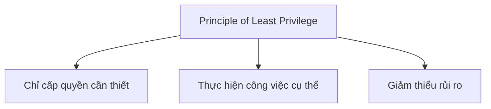
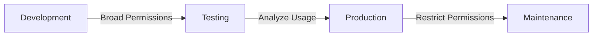
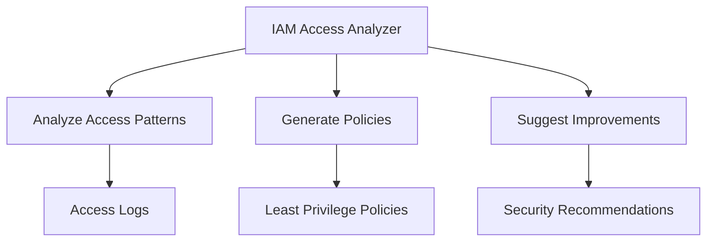
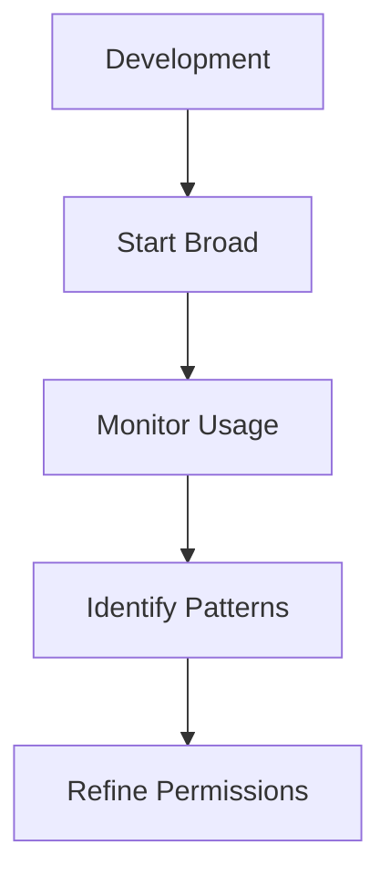

# Nguyên tắc Đặc quyền Tối thiểu trong AWS (Principle of Least Privilege)

## Mục lục
1. [Khái niệm cơ bản](#khái-niệm-cơ-bản)
2. [Triển khai thực tế](#triển-khai-thực-tế)
3. [IAM Access Analyzer](#iam-access-analyzer)
4. [Best Practices](#best-practices)

## Khái niệm cơ bản

### Định nghĩa


### Quy trình áp dụng


## Triển khai thực tế

### Ví dụ IAM Policy
```json
{
    "Version": "2012-10-17",
    "Statement": [
        {
            "Effect": "Allow",
            "Action": "s3:ListBucket",
            "Resource": "arn:aws:s3:::my-bucket",
            "Condition": {
                "StringLike": {
                    "s3:prefix": "data/reports/*"
                }
            }
        },
        {
            "Effect": "Allow",
            "Action": "s3:GetObject",
            "Resource": "arn:aws:s3:::my-bucket/data/reports/*.csv"
        }
    ]
}
```

### Phân tích Policy
1. **List Bucket Permission**:
   - Chỉ cho phép liệt kê nội dung
   - Giới hạn trong thư mục cụ thể
   - Path: data/reports/*

2. **Read Permission**:
   - Chỉ cho phép đọc file CSV
   - Path cụ thể: data/reports
   - File extension: .csv

## IAM Access Analyzer

### Tính năng


### Quy trình sử dụng
1. **Thu thập dữ liệu**:
   - Monitor access patterns
   - Log activity
   - Track service usage

2. **Phân tích**:
   - Identify required permissions
   - Review access patterns
   - Detect unused permissions

3. **Tạo policy**:
   - Generate based on usage
   - Optimize permissions
   - Validate access

## Best Practices

### 1. Development Phase


### 2. Production Phase
1. **Access Review**:
   - Regular audits
   - Remove unused permissions
   - Update as needed

2. **Policy Management**:
   - Version control
   - Documentation
   - Regular updates

### 3. Monitoring và Maintenance
- CloudTrail logs review
- Access pattern analysis
- Regular policy updates

## Tips cho Exam

1. **Khái niệm cần nhớ**:
   - Định nghĩa least privilege
   - Mục đích sử dụng
   - Tools hỗ trợ

2. **Practical Knowledge**:
   - IAM policy structure
   - Access Analyzer usage
   - Policy refinement process

3. **Security Focus**:
   - Risk mitigation
   - Access control
   - Compliance requirements