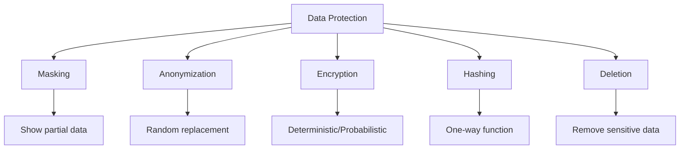
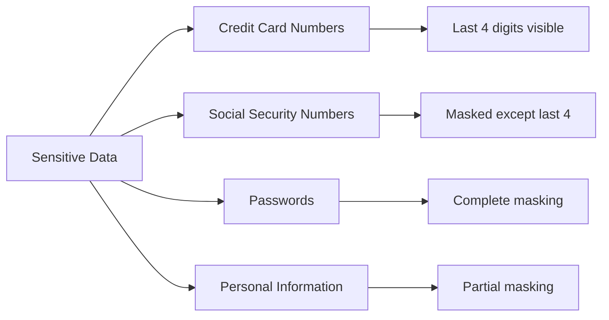
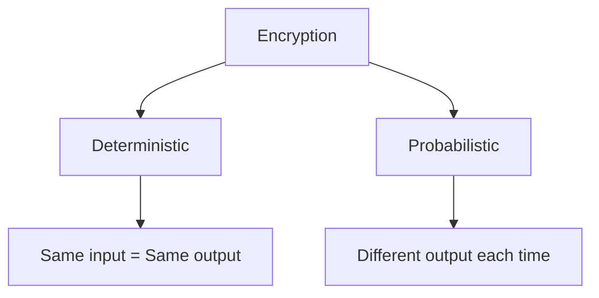
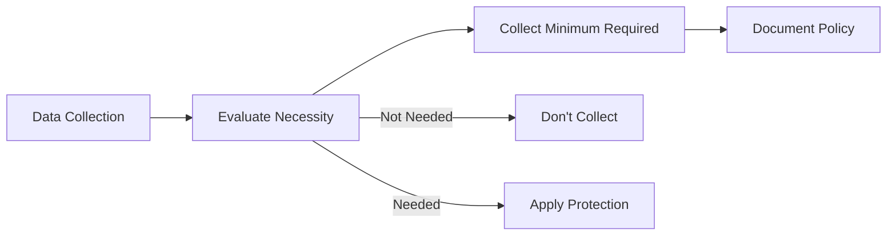

# Data Masking và Anonymization trong AWS

## Mục lục
1. [Phương pháp Bảo vệ Dữ liệu](#phương-pháp-bảo-vệ-dữ-liệu)
2. [Masking trong AWS](#masking-trong-aws)
3. [Anonymization Techniques](#anonymization-techniques)
4. [Best Practices](#best-practices)

## Phương pháp Bảo vệ Dữ liệu

### Các Kỹ thuật Chính


## Masking trong AWS

### 1. Redshift Masking
```sql
CREATE MASKING POLICY masked_credit_card_full
    WITH (credit_card varchar(256))
    USING ('XXXX-XXXX-XXXX-####');
```

### 2. Supported Services
1. **AWS Glue DataBrew**:
   - Built-in masking functions
   - Custom masking rules
   - Pattern matching

2. **Amazon Redshift**:
   - Column-level masking
   - Policy-based masking
   - Dynamic masking

### 3. Common Use Cases


## Anonymization Techniques

### 1. Data Replacement
1. **Random Substitution**:
   - Replace với random values
   - Maintain data format
   - Preserve referential integrity

2. **Shuffling**:
   - Đảo vị trí data trong column
   - Giữ nguyên distribution
   - Break connection với original records

### 2. Encryption Methods


### 3. Hashing
- One-way transformation
- Không thể reverse
- Có thể có collisions

## Best Practices

### 1. Data Collection


### 2. Implementation Strategy
1. **Planning**:
   - Identify sensitive data
   - Choose protection method
   - Define policies

2. **Execution**:
   - Implement at source
   - Validate results
   - Monitor effectiveness

### 3. Maintenance
- Regular policy review
- Update protection methods
- Audit compliance

## Tips cho Exam

### 1. Key Concepts
- Masking vs Anonymization
- Encryption types
- Hashing principles

### 2. AWS Services
- Glue DataBrew capabilities
- Redshift masking policies
- Integration options

### 3. Protection Strategy
1. **Decision Tree**:
   - Is data needed?
   - What level of protection?
   - Which method is best?

2. **Implementation**:
   - Service selection
   - Policy configuration
   - Validation process