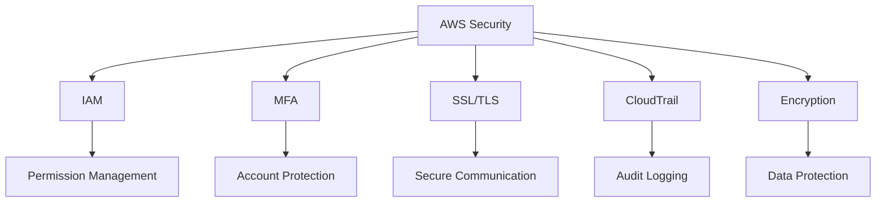
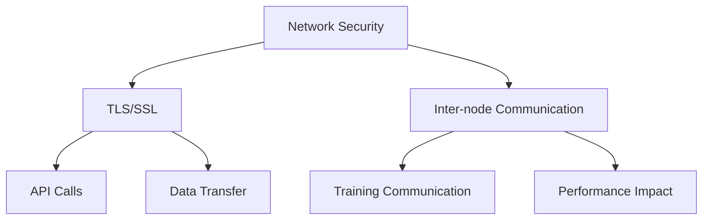
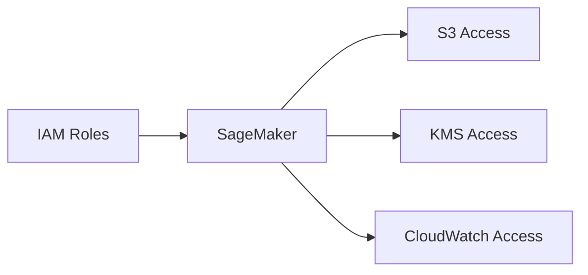
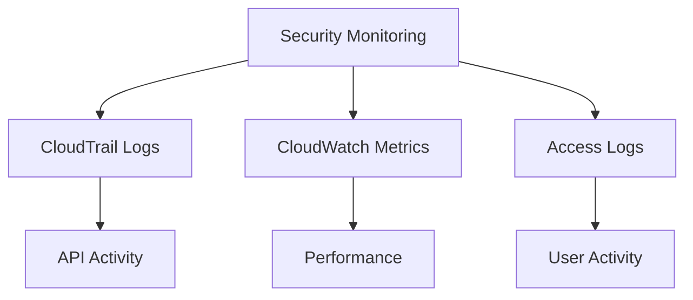

# Bảo mật trong Amazon SageMaker

## Mục lục
1. [Best Practices Chung](#best-practices-chung)
2. [Encryption at Rest](#encryption-at-rest)
3. [Encryption in Transit](#encryption-in-transit)
4. [IAM và Access Control](#iam-và-access-control)

## Best Practices Chung

### AWS Security Fundamentals


### CloudTrail vs CloudWatch
| Service | Mục đích | Use Case |
|---------|----------|-----------|
| CloudTrail | Auditing | Log API activity |
| CloudWatch | Monitoring | Performance metrics |

## Encryption at Rest

### 1. KMS Integration
```mermaid
graph LR
    A[KMS Keys] --> B[SageMaker Jobs]
    A --> C[Notebooks]
    A --> D[Training Artifacts]
    A --> E[Endpoints]
    
    B --> F[Docker Containers]
    C --> G[/opt/ml]
    C --> H[/temp]
```

### 2. S3 Encryption
1. **Training Data**:
   - S3 bucket encryption
   - KMS integration
   - Server-side encryption

2. **Model Artifacts**:
   - Secure storage
   - Encrypted buckets
   - Access control

## Encryption in Transit

### 1. Network Security


### 2. Inter-container Traffic
1. **Configuration**:
   - Console setup
   - API configuration
   - Training job settings

2. **Considerations**:
   - Performance impact
   - Training time
   - Cost implications

## IAM và Access Control

### 1. Role-based Access


### 2. Least Privilege
1. **Implementation**:
   - Minimal permissions
   - Resource-specific access
   - Regular review

2. **Service Access**:
   - Data access
   - API permissions
   - Resource management

## Best Practices Implementation

### 1. Data Protection
1. **PII Handling**:
   - Encryption required
   - Access logging
   - Secure transmission

2. **Model Protection**:
   - Artifact encryption
   - Secure endpoints
   - Access control

### 2. Monitoring và Audit


## Tips cho Exam

### 1. Key Concepts
- Encryption methods
- Security services
- Access control

### 2. Implementation Details
1. **KMS Integration**:
   - Key management
   - Service integration
   - Configuration options

2. **Network Security**:
   - TLS/SSL usage
   - Inter-node encryption
   - Performance considerations

### 3. Common Questions
- CloudTrail vs CloudWatch
- Encryption methods
- IAM best practices
- PII protection