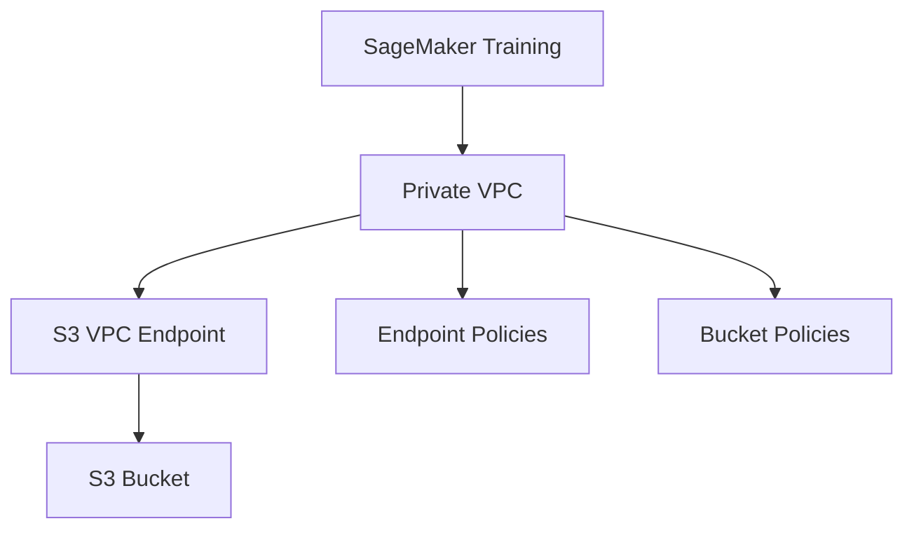
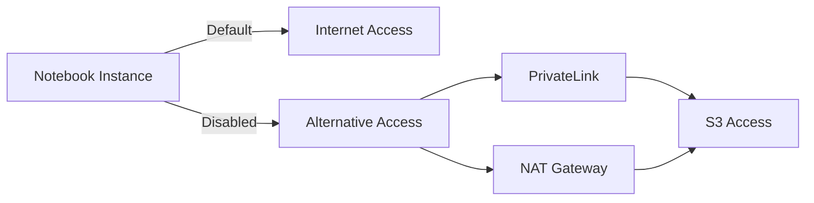
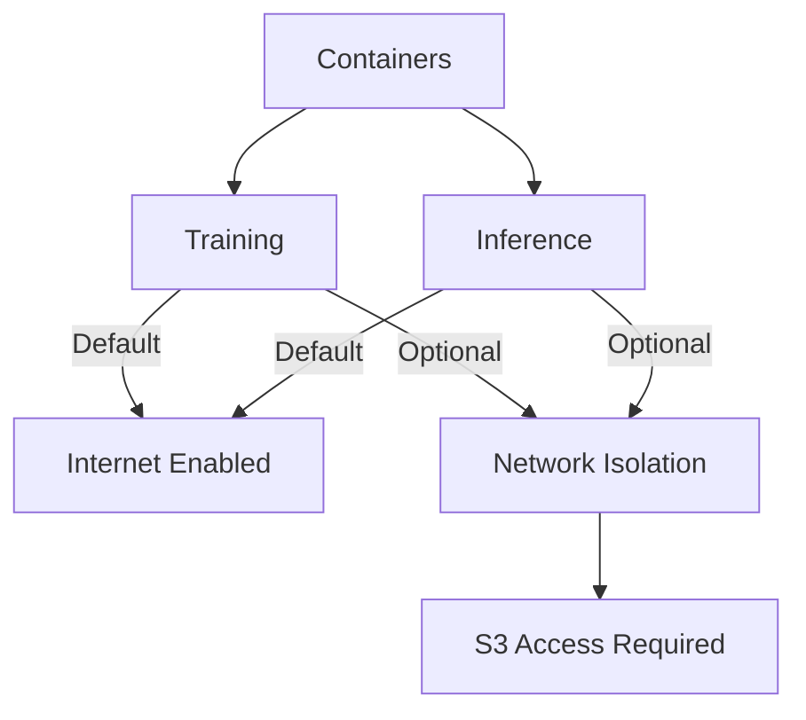
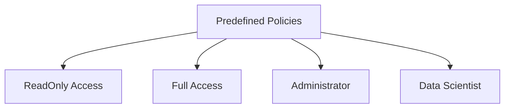
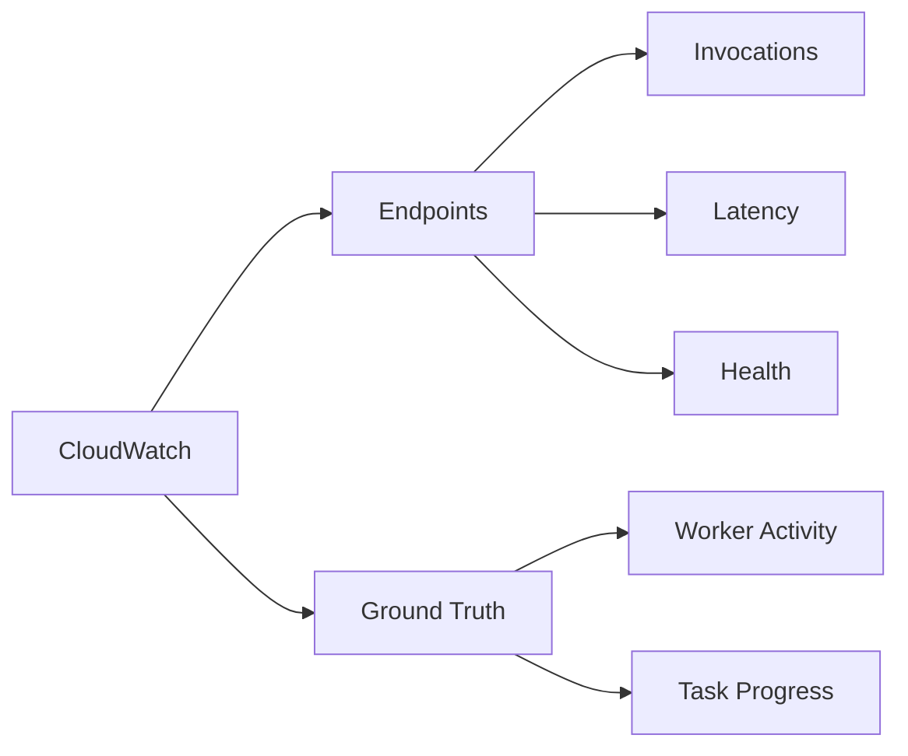
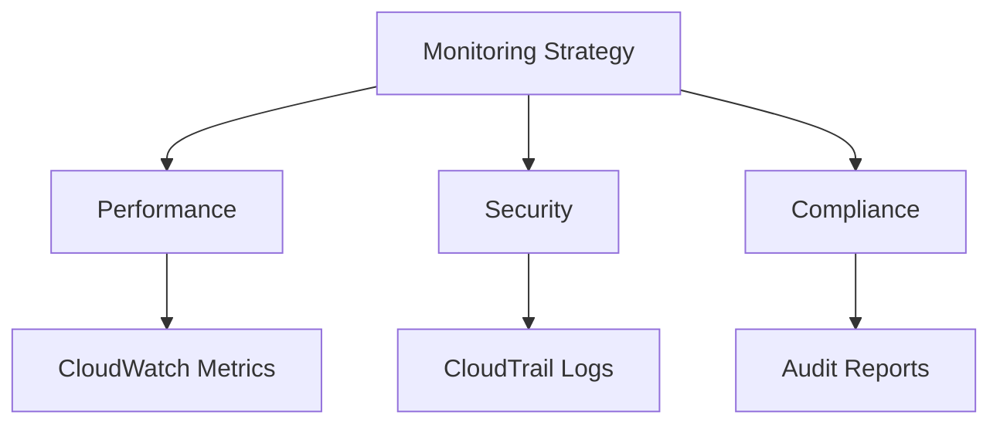

# VPC và Network Security trong SageMaker

## Mục lục
1. [VPC Configuration](#vpc-configuration)
2. [Internet Access](#internet-access)
3. [IAM Permissions](#iam-permissions)
4. [Monitoring và Logging](#monitoring-và-logging)

## VPC Configuration

### 1. Training Job VPC Setup

### 2. Network Requirements
1. **S3 Connectivity**:
   - VPC endpoints required
   - Custom endpoint policies
   - Bucket access policies

2. **Security Considerations**:
   - Private subnet configuration
   - Route tables
   - Security groups

## Internet Access

### 1. Notebook Instances

### 2. Container Access

## IAM Permissions

### 1. SageMaker-specific Permissions
| Permission Type | Description | Use Case |
|----------------|-------------|-----------|
| Training Jobs | Create/manage training | Model development |
| Models | Create/deploy models | Deployment |
| Endpoints | Manage inference endpoints | Production |
| HPO Jobs | Hyperparameter tuning | Model optimization |
| Notebooks | Create/manage notebooks | Development |

### 2. Predefined Policies

## Monitoring và Logging

### 1. CloudWatch Integration

### 2. CloudTrail Auditing
1. **Logging Features**:
   - User actions
   - Role activities
   - Service operations

2. **Log Management**:
   - S3 storage
   - Audit trail
   - Security analysis

## Best Practices

### 1. VPC Security
- Use private VPCs when possible
- Configure appropriate endpoints
- Implement least privilege access

### 2. Network Access
1. **Internet Access**:
   - Disable when not needed
   - Use PrivateLink/NAT
   - Monitor traffic

2. **Container Security**:
   - Consider network isolation
   - Manage S3 access
   - Monitor container activity

### 3. Monitoring Strategy

## Tips cho Exam

1. **VPC Configuration**:
   - S3 endpoint requirements
   - Network isolation impacts
   - Access solutions

2. **Security Settings**:
   - Default configurations
   - Security implications
   - Workaround options

3. **IAM và Monitoring**:
   - Permission types
   - Monitoring capabilities
   - Audit requirements