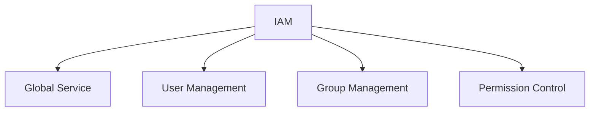
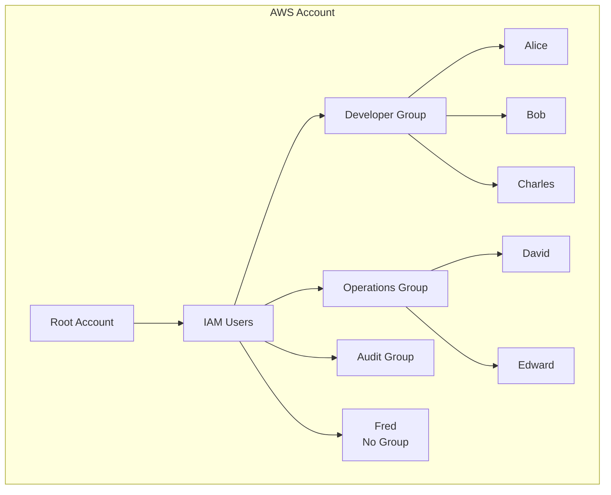
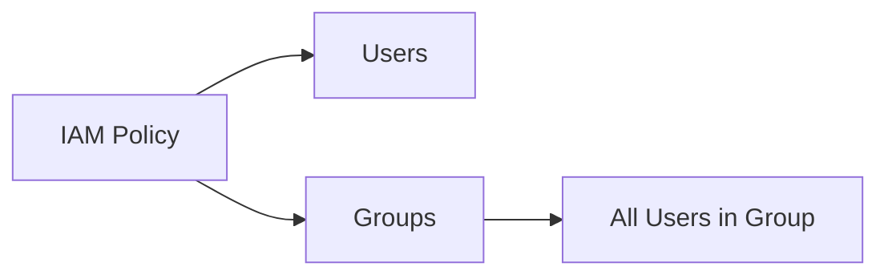
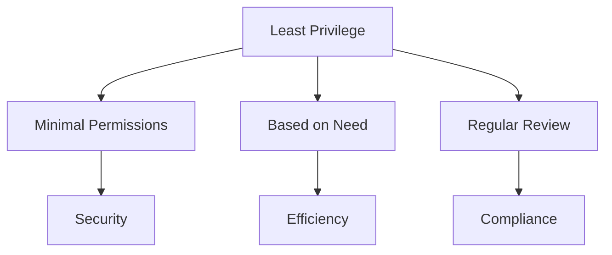

# AWS IAM - Identity and Access Management

## Mục lục
1. [Giới thiệu](#giới-thiệu)
2. [Users và Groups](#users-và-groups)
3. [Policies](#policies)
4. [Best Practices](#best-practices)

## Giới thiệu

IAM (Identity and Access Management) là dịch vụ global của AWS dùng để quản lý users và phân quyền trong tài khoản AWS.

### Đặc điểm chính


## Users và Groups

### 1. Cấu trúc tổ chức


### 2. Đặc điểm Groups
- Chỉ chứa users (không chứa groups khác)
- Users có thể thuộc nhiều groups
- Users không bắt buộc phải thuộc group

## Policies

### 1. Cấu trúc Policy
```json
{
    "Version": "2012-10-17",
    "Statement": [
        {
            "Effect": "Allow",
            "Action": [
                "ec2:Describe*",
                "elasticloadbalancing:Describe*",
                "cloudwatch:*"
            ],
            "Resource": "*"
        }
    ]
}
```

### 2. Permission Assignment


## Best Practices

### 1. Root Account
- Chỉ dùng để setup ban đầu
- Không sử dụng cho công việc hàng ngày
- Không chia sẻ thông tin đăng nhập

### 2. Least Privilege Principle


### 3. Security Guidelines
1. **User Management**:
   - Tạo user riêng cho mỗi người
   - Phân group hợp lý
   - Regular access review

2. **Permission Control**:
   - Chỉ cấp quyền cần thiết
   - Sử dụng groups để quản lý permissions
   - Regular policy review

## Tổng kết

### 1. Key Components
- IAM là dịch vụ global
- Quản lý users và groups
- Phân quyền qua policies
- Tuân thủ least privilege

### 2. Implementation Tips
1. **Tổ chức**:
   - Phân nhóm users hợp lý
   - Đặt tên có ý nghĩa
   - Document cấu trúc

2. **Bảo mật**:
   - Không dùng root account
   - Regular security review
   - Monitor access patterns