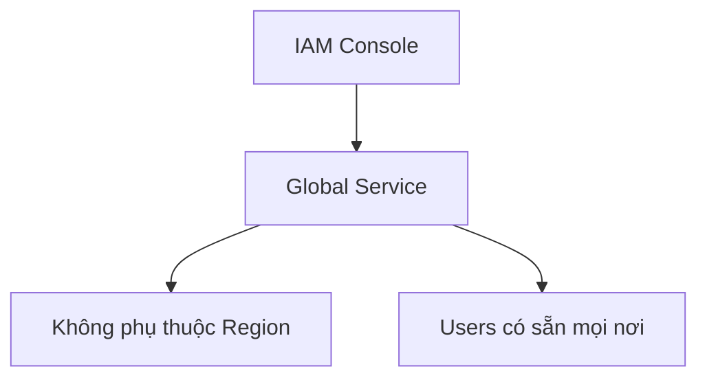
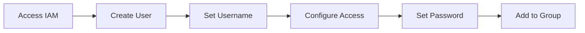
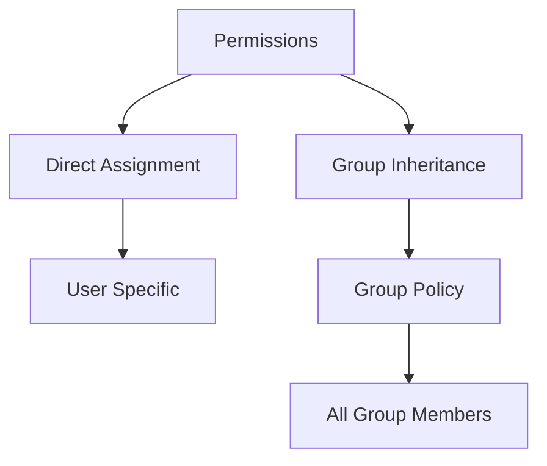
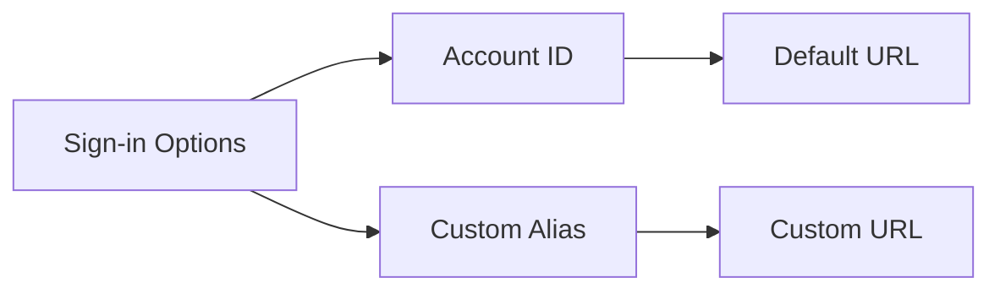
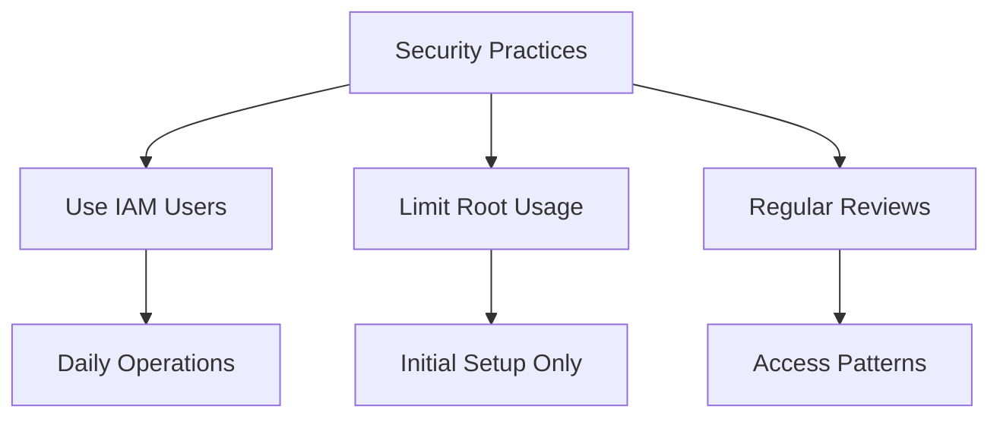

# Hướng dẫn Thực hành AWS IAM

## Mục lục
1. [Truy cập IAM Console](#truy-cập-iam-console)
2. [Tạo User và Group](#tạo-user-và-group)
3. [Cấu hình Access](#cấu-hình-access)
4. [Quản lý Sign-in](#quản-lý-sign-in)

## Truy cập IAM Console

### 1. Đặc điểm Global Service

### 2. Root User vs IAM User
- Root user: Chỉ dùng cho setup ban đầu
- IAM user: Sử dụng hàng ngày

## Tạo User và Group

### 1. Quy trình Tạo User

### 2. Cấu hình Group
1. **Tạo Admin Group**:
   - Đặt tên group
   - Chọn permissions
   - Administrator access policy

2. **Thêm User vào Group**:
   - Chọn group phù hợp
   - Inherit permissions
   - Review settings

## Cấu hình Access

### 1. Password Settings
- Auto-generated hoặc Custom
- Force password change option
- Security requirements

### 2. Permissions

### 3. Tags
- Optional metadata
- Key-value pairs
- Ví dụ: Department=Engineering

## Quản lý Sign-in

### 1. Sign-in URL

### 2. Multiple Account Access
1. **Cách thức**:
   - Private window cho IAM user
   - Regular window cho Root
   - Parallel access

2. **Security considerations**:
   - Không chia sẻ credentials
   - Secure password storage
   - Regular rotation

## Best Practices

### 1. Account Management
- Bảo mật thông tin đăng nhập
- Regular password updates
- Monitoring access

### 2. Security Tips

## Lưu ý Quan trọng

### 1. Root Account
- Chỉ dùng khi cần thiết
- Bảo vệ credentials
- Không chia sẻ access

### 2. IAM Users
- Sử dụng cho công việc hàng ngày
- Phân quyền phù hợp
- Regular access review

### 3. Documentation
1. **Track Changes**:
   - User creations
   - Permission updates
   - Group memberships

2. **Access Management**:
   - Sign-in URLs
   - Account aliases
   - Authentication methods