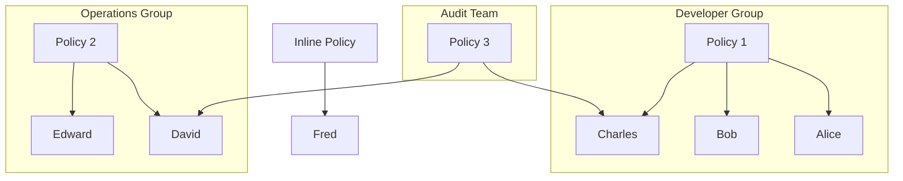
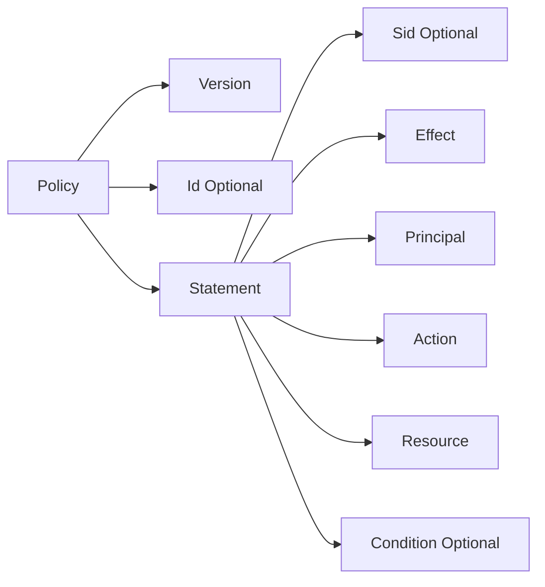
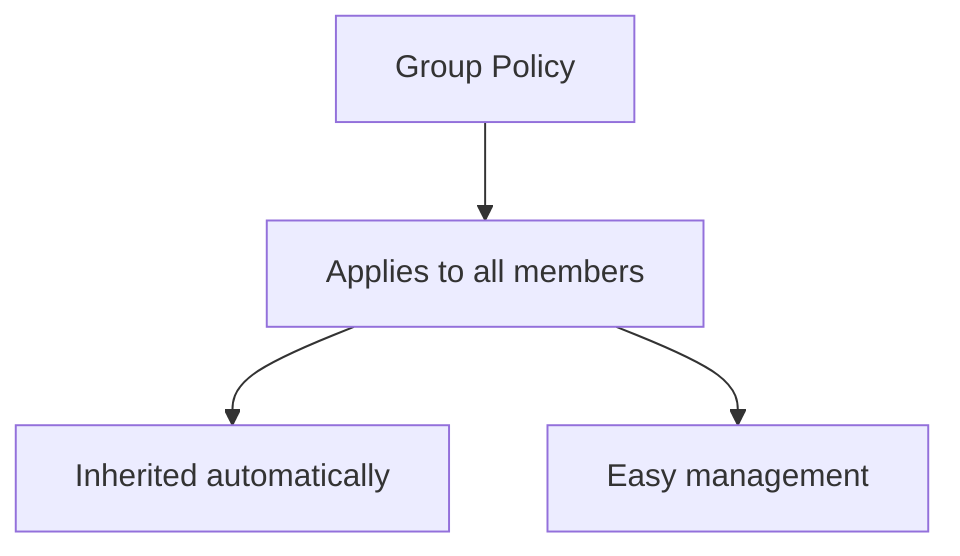
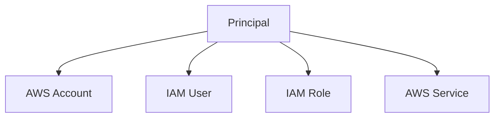
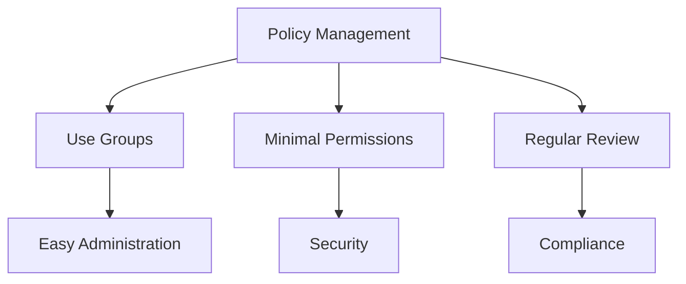

# IAM Policies: Cấu trúc và Áp dụng

## Mục lục
1. [Cách thức Inheritance](#cách-thức-inheritance)
2. [Cấu trúc Policy](#cấu-trúc-policy)
3. [Policy Types](#policy-types)
4. [Best Practices](#best-practices)

## Cách thức Inheritance

### Group và User Policies


### Multiple Policy Inheritance
- Users có thể nhận policies từ nhiều groups
- Inline policies áp dụng trực tiếp cho user
- Policies kết hợp với nhau

## Cấu trúc Policy

### JSON Structure
```json
{
    "Version": "2012-10-17",
    "Id": "PolicyID",
    "Statement": [
        {
            "Sid": "1",
            "Effect": "Allow",
            "Principal": {
                "AWS": "arn:aws:iam::account-id:root"
            },
            "Action": "s3:*",
            "Resource": "arn:aws:s3:::bucket-name/*"
        }
    ]
}
```

### Key Components


## Policy Types

### 1. Group Policies


### 2. Inline Policies
1. **Characteristics**:
   - Attached directly to user
   - Không được shared
   - Specific use cases

2. **Use Cases**:
   - Special permissions
   - Temporary access
   - User-specific rules

## Chi tiết Components

### 1. Effect
- Allow: Cho phép access
- Deny: Từ chối access
- Deny ưu tiên hơn Allow

### 2. Principal


### 3. Action
1. **Format**:
   - service:action
   - Wildcards support
   - Multiple actions

2. **Examples**:
   - s3:GetObject
   - ec2:StartInstances
   - iam:CreateUser

### 4. Resource
- ARN format
- Specific resources
- Resource patterns

## Best Practices

### 1. Policy Management


### 2. Security Guidelines
1. **Design**:
   - Clear purpose
   - Documented policies
   - Version control

2. **Implementation**:
   - Test policies
   - Audit access
   - Monitor usage

### 3. Maintenance
- Regular updates
- Remove unused policies
- Review inheritance

## Tips cho Exam

1. **Key Concepts**:
   - Policy structure
   - Inheritance rules
   - Effect priority

2. **Important Components**:
   - Effect
   - Principal
   - Action
   - Resource

3. **Practice Areas**:
   - JSON syntax
   - Permission scenarios
   - Policy combinations