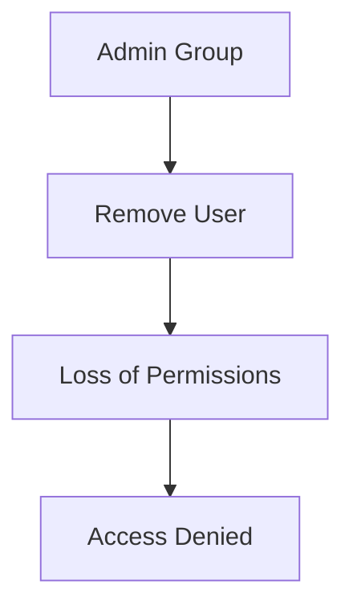
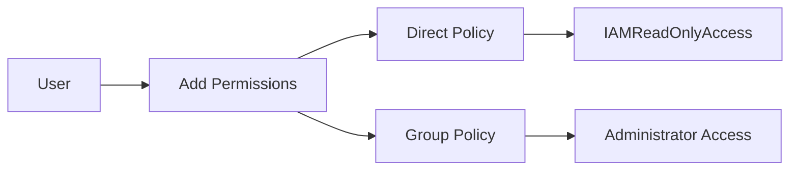
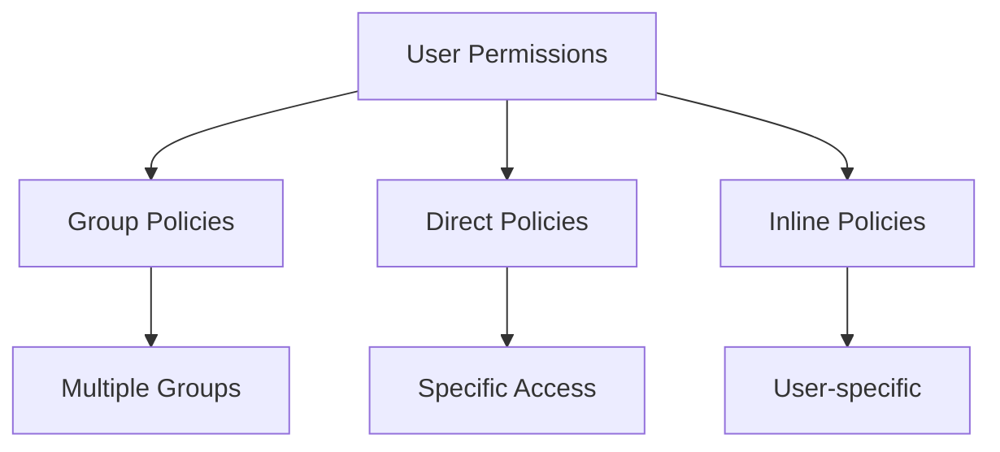
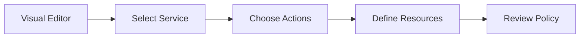
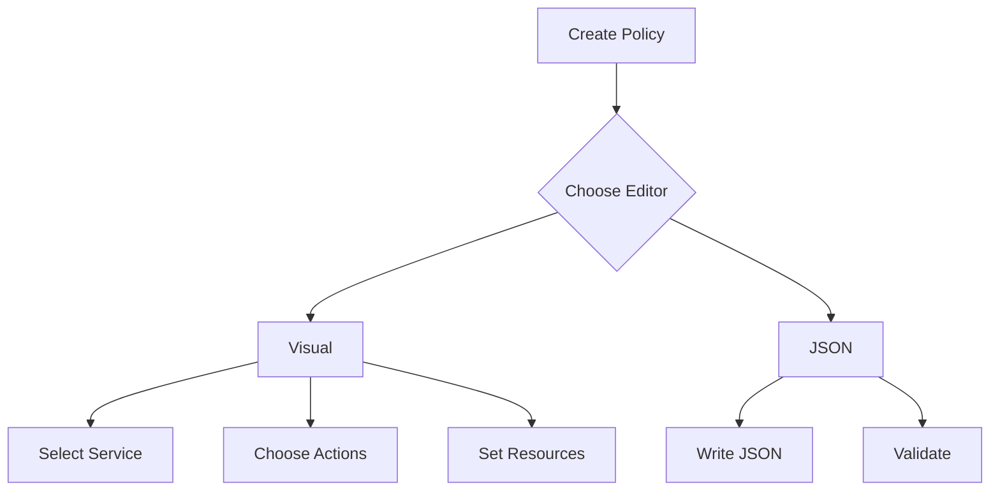
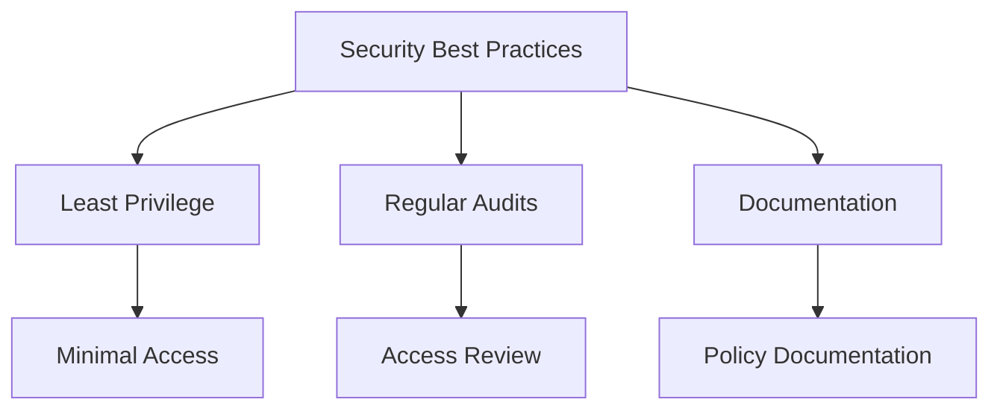

# Thực hành IAM Policies

## Mục lục
1. [Quản lý Group Permissions](#quản-lý-group-permissions)
2. [Tạo và Quản lý Policies](#tạo-và-quản-lý-policies)
3. [Policy Structure](#policy-structure)
4. [Visual Editor vs JSON](#visual-editor-vs-json)

## Quản lý Group Permissions

### 1. Remove User from Group


### 2. Add Direct Permissions


## Tạo và Quản lý Policies

### 1. Policy Examples
```json
// Administrator Access
{
    "Version": "2012-10-17",
    "Statement": [
        {
            "Effect": "Allow",
            "Action": "*",
            "Resource": "*"
        }
    ]
}

// IAM Read Only Access
{
    "Effect": "Allow",
    "Action": [
        "iam:Get*",
        "iam:List*"
    ],
    "Resource": "*"
}
```

### 2. Permission Inheritance


## Policy Structure

### 1. Components
1. **Effect**:
   - Allow
   - Deny

2. **Action**:
   - Service:Action
   - Wildcards (*)
   - API calls

3. **Resource**:
   - ARN
   - Wildcards
   - Specific resources

### 2. Visual Editor


## Hands-on Steps

### 1. Managing User Access
1. **Remove from Admin Group**:
   - Access IAM Console
   - Find user
   - Remove from group
   - Test access

2. **Add Read-only Access**:
   - Add direct policy
   - Choose IAMReadOnlyAccess
   - Verify permissions

### 2. Creating Custom Policy


## Best Practices

### 1. Policy Management
- Use groups for common permissions
- Direct policies for exceptions
- Regular permission review

### 2. Security


### 3. Troubleshooting
1. **Common Issues**:
   - Access denied
   - Permission conflicts
   - Inheritance problems

2. **Resolution Steps**:
   - Check group membership
   - Review policies
   - Test permissions

## Tips for Implementation

1. **Planning**:
   - Document requirements
   - Design policy structure
   - Plan groups

2. **Execution**:
   - Start with minimal access
   - Test thoroughly
   - Document changes

3. **Maintenance**:
   - Regular reviews
   - Update as needed
   - Monitor usage