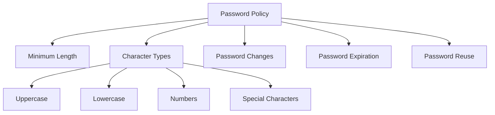
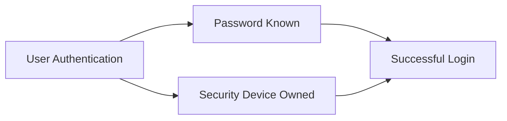
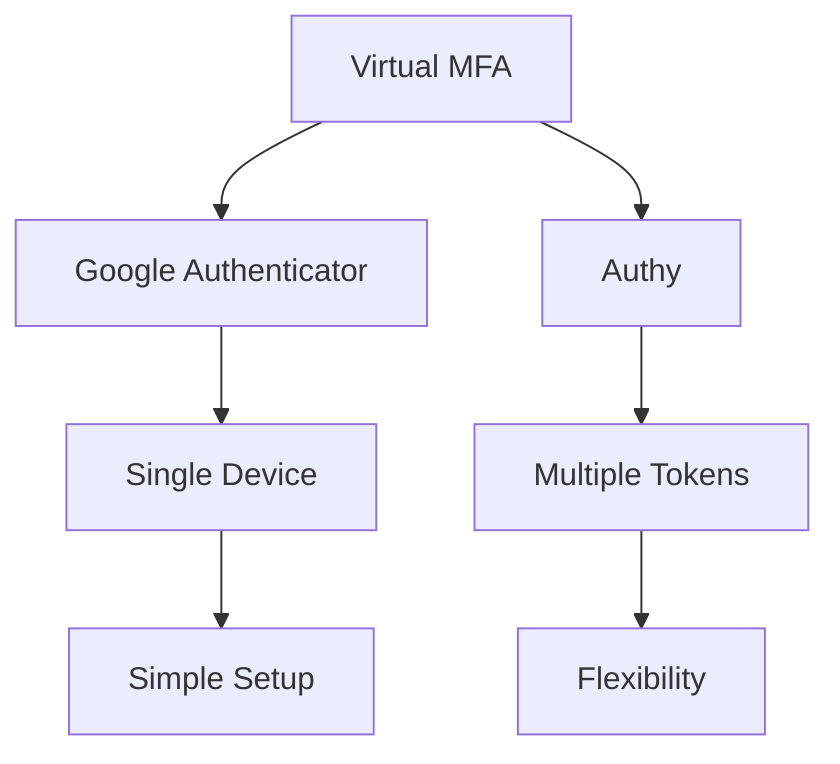
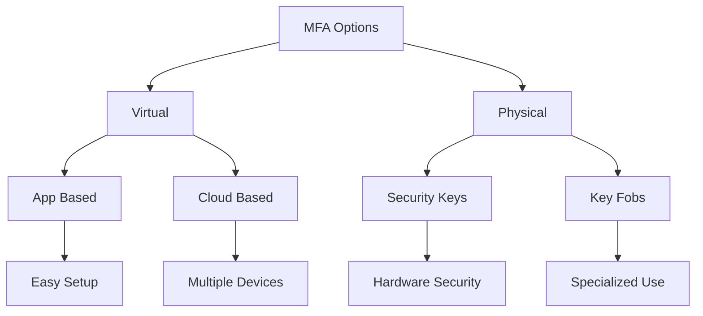
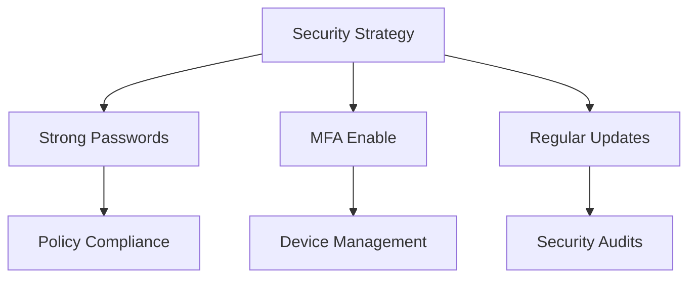

# Cơ chế Bảo mật Tài khoản IAM

## Mục lục
1. [Password Policy](#password-policy)
2. [Multi-Factor Authentication (MFA)](#multi-factor-authentication)
3. [MFA Devices](#mfa-devices)
4. [Best Practices](#best-practices)

## Password Policy

### Cấu hình Password

### Quản lý Password
1. **User Controls**:
   - Self-service change
   - Force change
   - Password history

2. **Time Controls**:
   - Expiration period
   - Change requirements
   - Reset policies

## Multi-Factor Authentication

### MFA Concept

### Security Benefits
1. **Enhanced Protection**:
   - Two-factor verification
   - Physical device requirement
   - Compromise prevention

2. **Risk Mitigation**:
   - Password theft protection
   - Account security
   - Access control

## MFA Devices

### 1. Virtual MFA

### 2. Physical Devices
| Device Type | Provider | Features |
|------------|----------|-----------|
| U2F Security Key | YubiKey | Multiple users, Physical key |
| Hardware Key Fob | Gemalto | Hardware token |
| GovCloud Key Fob | SurePassID | Government cloud specific |

### 3. Device Comparison

## Best Practices

### 1. Account Protection
- Protect root account
- Protect IAM users
- Regular security review

### 2. Implementation Strategy

### 3. Device Management
1. **Selection Criteria**:
   - Use case requirements
   - User convenience
   - Security level needed

2. **Maintenance**:
   - Device updates
   - Battery replacement
   - Backup procedures

## Tips cho Exam

1. **Password Policy**:
   - Configuration options
   - Enforcement methods
   - Policy limitations

2. **MFA Types**:
   - Available options
   - Provider information
   - Use case scenarios

3. **Security Implementation**:
   - Setup procedures
   - Best practices
   - Troubleshooting steps