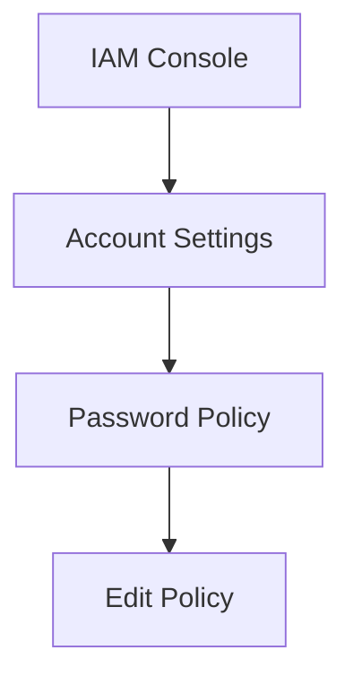
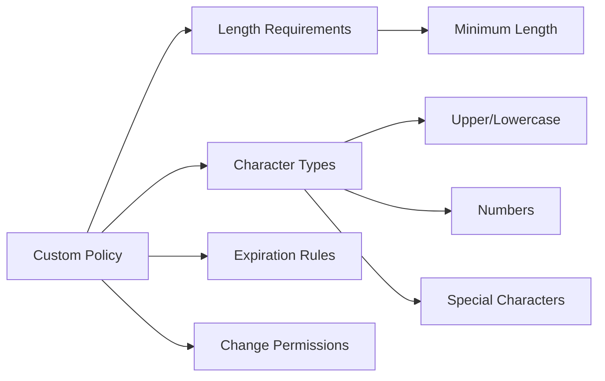
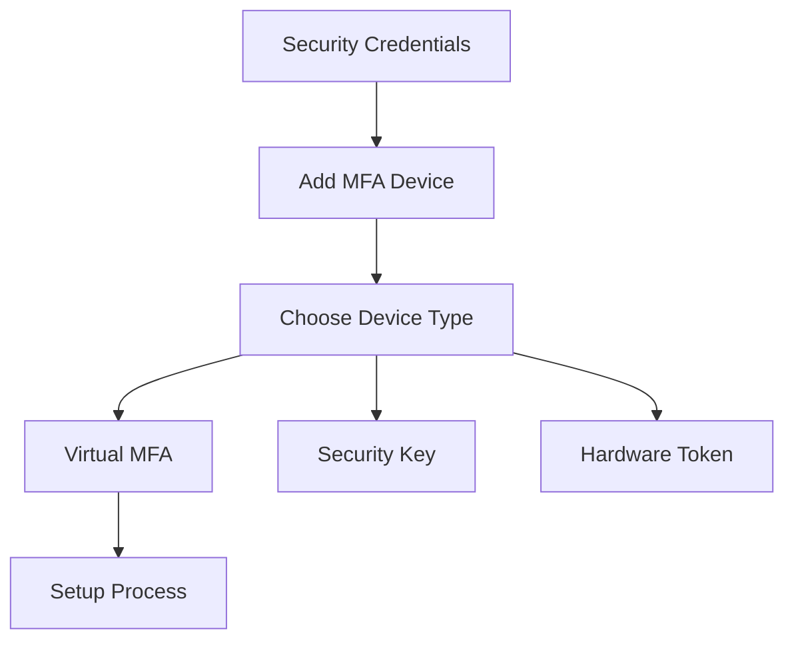
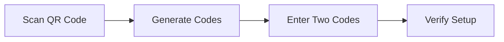
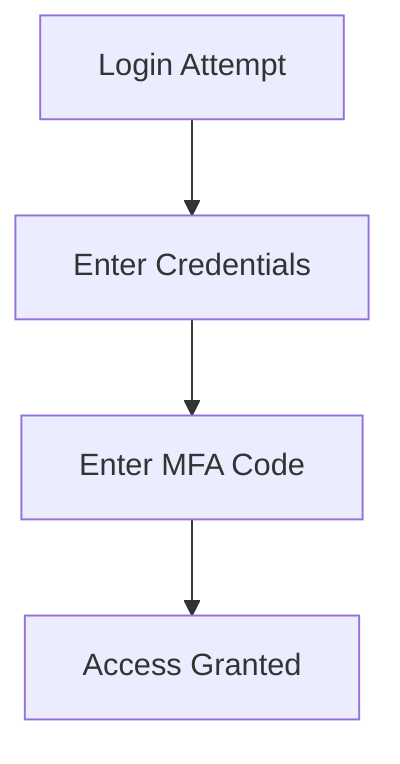
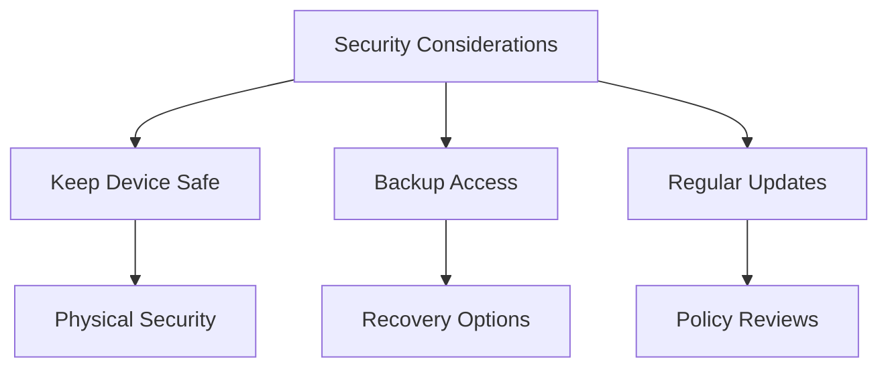
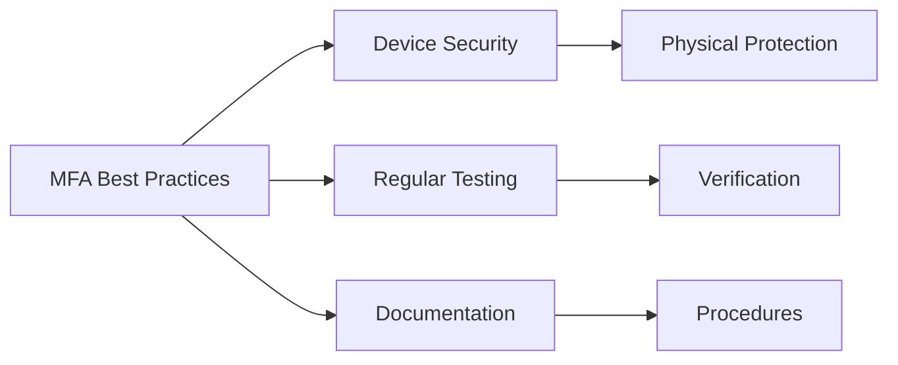

# Hướng dẫn Thực hành Bảo mật IAM

## Mục lục
1. [Thiết lập Password Policy](#thiết-lập-password-policy)
2. [Cấu hình MFA](#cấu-hình-mfa)
3. [Testing và Verification](#testing-và-verification)
4. [Best Practices](#best-practices)

## Thiết lập Password Policy

### 1. Truy cập Policy Settings

### 2. Cấu hình Options
1. **Default Policy**:
   - IAM default settings
   - Basic security requirements

2. **Custom Policy**:

## Cấu hình MFA

### 1. Root Account MFA Setup

### 2. Virtual MFA Implementation
1. **App Setup**:
   - Install authenticator app
   - Scan QR code
   - Verify codes

2. **Verification Process**:
   - Enter first code
   - Wait for code change
   - Enter second code
   - Confirm setup

## Testing và Verification

### 1. Login Process

### 2. Device Management
1. **View Devices**:
   - List registered devices
   - Device details
   - Remove options

2. **Maintenance**:
   - Regular verification
   - Backup procedures
   - Device updates

## Lưu ý Quan trọng

### 1. Bảo mật

### 2. Risk Management
1. **Device Loss**:
   - Backup procedures
   - Recovery process
   - Support contact

2. **Account Access**:
   - Alternative authentication
   - Emergency procedures
   - Documentation

## Best Practices

### 1. Password Policy
- Regular updates
- Strong requirements
- Clear documentation

### 2. MFA Management

### 3. Maintenance
1. **Regular Review**:
   - Policy effectiveness
   - Security updates
   - Access patterns

2. **Documentation**:
   - Setup procedures
   - Recovery process
   - Contact information

## Tips for Implementation

1. **Setup Process**:
   - Follow steps carefully
   - Verify each stage
   - Document settings

2. **Testing**:
   - Regular login tests
   - Recovery procedures
   - User training

3. **Monitoring**:
   - Access logs
   - Policy compliance
   - Security alerts