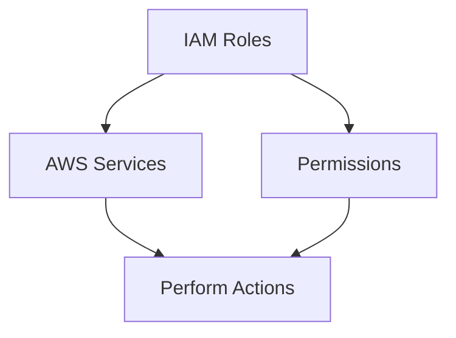
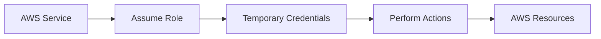
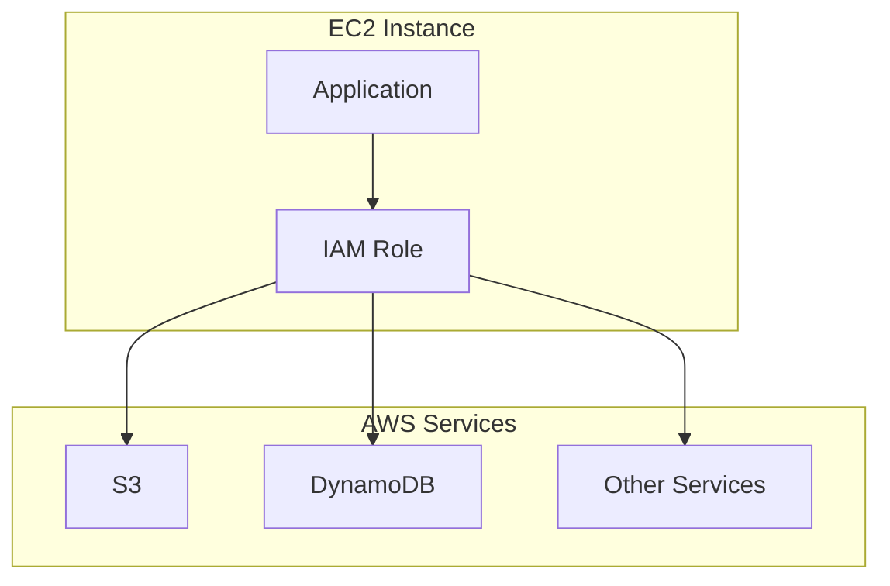
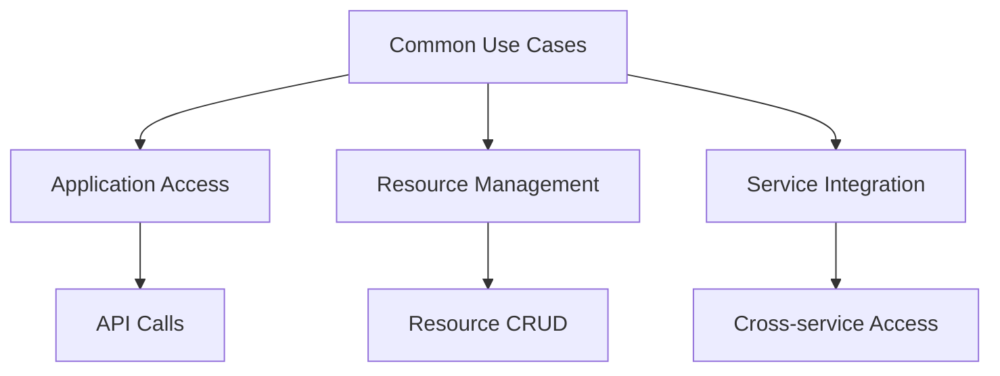
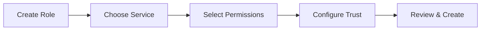
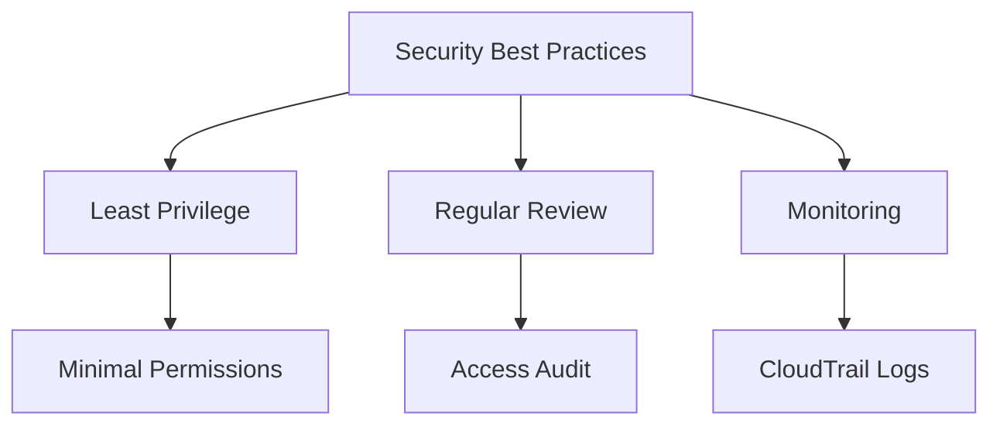

# IAM Roles: Cấp quyền cho AWS Services

## Mục lục
1. [Giới thiệu về IAM Roles](#giới-thiệu-về-iam-roles)
2. [Cách thức Hoạt động](#cách-thức-hoạt-động)
3. [Common Roles](#common-roles)
4. [Best Practices](#best-practices)

## Giới thiệu về IAM Roles

### Khái niệm cơ bản

### So sánh với IAM Users
| Đặc điểm | IAM Users | IAM Roles |
|----------|-----------|------------|
| Đối tượng | Physical users | AWS services |
| Credentials | Long-term | Temporary |
| Purpose | Direct access | Service actions |
| Management | Manual | Service-linked |

## Cách thức Hoạt động

### 1. Service Authorization Flow

### 2. EC2 Instance Example

## Common Roles

### 1. Service-specific Roles
1. **EC2 Instance Roles**:
   - Access AWS services
   - Resource management
   - Application permissions

2. **Lambda Function Roles**:
   - Execute functions
   - Access resources
   - Integration permissions

3. **CloudFormation Roles**:
   - Resource creation
   - Stack management
   - Service access

### 2. Use Cases

## Role Configuration

### 1. Creation Process

### 2. Trust Relationships
1. **Service Principal**:
   - Define trusted services
   - Access conditions
   - Permission boundaries

2. **Permission Policies**:
   - Action permissions
   - Resource access
   - Conditional access

## Best Practices

### 1. Security

### 2. Management
1. **Role Organization**:
   - Clear naming
   - Documentation
   - Regular cleanup

2. **Access Control**:
   - Trust relationships
   - Permission boundaries
   - Service limits

### 3. Monitoring
1. **Activity Tracking**:
   - Role usage
   - Permission changes
   - Access patterns

2. **Compliance**:
   - Audit requirements
   - Policy compliance
   - Regular reviews

## Tips for Implementation

1. **Planning**:
   - Define service needs
   - Document permissions
   - Review security requirements

2. **Execution**:
   - Create roles carefully
   - Test thoroughly
   - Monitor usage

3. **Maintenance**:
   - Regular reviews
   - Update permissions
   - Remove unused roles