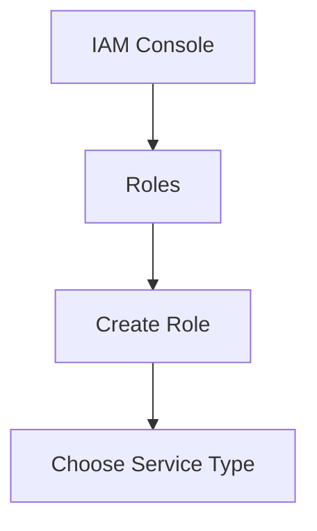
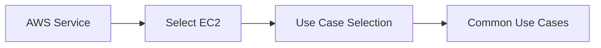
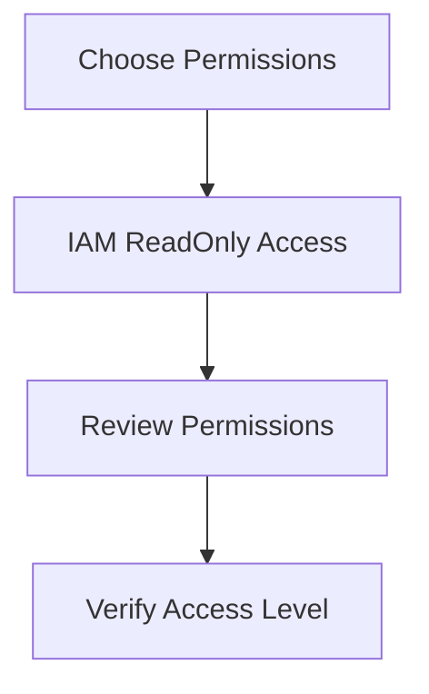
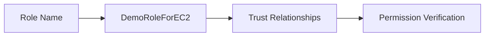
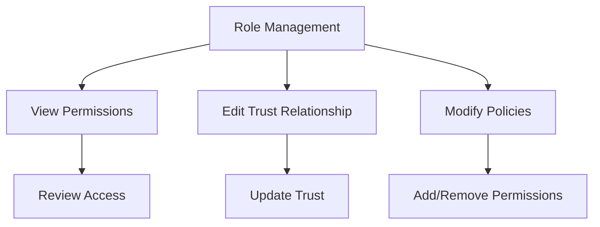
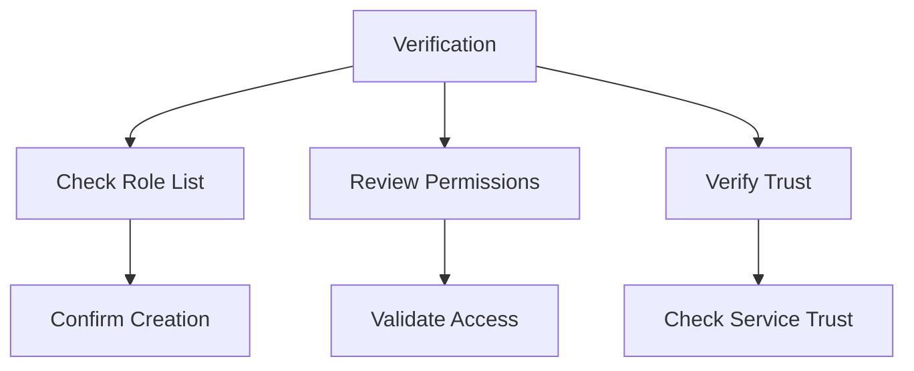

# Hướng dẫn Thực hành Tạo IAM Role

## Mục lục
1. [Tạo Role mới](#tạo-role-mới)
2. [Cấu hình Service và Permissions](#cấu-hình-service-và-permissions)
3. [Review và Completion](#review-và-completion)
4. [Quản lý Role](#quản-lý-role)

## Tạo Role mới

### 1. Truy cập Role Creation

### 2. Chọn Service Type

## Cấu hình Service và Permissions

### 1. Service Selection
1. **Commonly Used Services**:
   - EC2
   - Lambda
   - Other AWS services

2. **Use Case**:
   - EC2 instance
   - Basic operations

### 2. Permission Assignment

## Review và Completion

### 1. Role Configuration

### 2. Trust Entity Setup
1. **Service Principal**:
   - EC2 service
   - Trust configuration

2. **Permission Review**:
   - IAM read-only access
   - Service limitations

## Quản lý Role

### 1. Role Management

### 2. Best Practices
1. **Naming Convention**:
   - Clear, descriptive names
   - Service indication
   - Purpose identification

2. **Permission Management**:
   - Least privilege
   - Regular review
   - Documentation

## Implementation Guide

### 1. Step-by-step Process
1. **Access IAM Console**:
   - Navigate to Roles
   - Click Create Role

2. **Choose Service**:
   - Select AWS service
   - Choose EC2
   - Select use case

3. **Set Permissions**:
   - Add IAM ReadOnly
   - Review policy settings

4. **Complete Setup**:
   - Name role
   - Review configuration
   - Create role

### 2. Verification Steps

## Tips for Usage

### 1. Role Application
- Use with EC2 instances
- Service integration
- Access management

### 2. Security Considerations
- Regular audits
- Permission reviews
- Access monitoring

### 3. Maintenance
1. **Regular Tasks**:
   - Review permissions
   - Update policies
   - Monitor usage

2. **Documentation**:
   - Role purpose
   - Permission scope
   - Usage guidelines