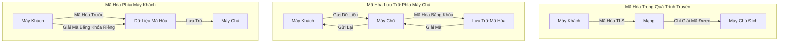

# Các Phương Thức Mã Hóa Trong Đám Mây

## Giới Thiệu

Trong môi trường điện toán đám mây, việc bảo mật dữ liệu là vô cùng quan trọng. Có ba phương thức mã hóa chính được sử dụng để đảm bảo an toàn thông tin:

## 1. Mã Hóa Trong Quá Trình Truyền (Encryption in Flight)

### Khái Niệm
- Còn được gọi là TLS (Transport Layer Security) hoặc SSL (Secure Sockets Layer)
- Mã hóa dữ liệu trước khi gửi và giải mã sau khi nhận

### Đặc Điểm Chính
- Sử dụng chứng chỉ TLS
- Ngăn chặn các cuộc tấn công "man in the middle"
- Hiển thị qua giao thức HTTPS trên các trang web

### Ví Dụ Thực Tế
Khi đăng nhập một trang web:
1. Thông tin đăng nhập (tên người dùng, mật khẩu) được mã hóa
2. Chỉ máy chủ đích mới có thể giải mã thông tin
3. Các máy chủ trung gian không thể đọc được dữ liệu

## 2. Mã Hóa Lưu Trữ Phía Máy Chủ (Server-Side Encryption at Rest)

### Khái Niệm
- Mã hóa dữ liệu sau khi máy chủ nhận được
- Lưu trữ dữ liệu ở dạng mã hóa

### Quy Trình
1. Nhận dữ liệu 
2. Mã hóa bằng khóa dữ liệu (data key)
3. Lưu trữ ở dạng đã mã hóa
4. Khi cần, sử dụng khóa để giải mã

### Ví Dụ Điển Hình
Dịch vụ Amazon S3:
- Nhận đối tượng 
- Mã hóa sử dụng khóa dữ liệu
- Lưu trữ ở dạng mã hóa
- Giải mã khi gửi lại cho khách hàng

## 3. Mã Hóa Phía Máy Khách (Client-Side Encryption)

### Khái Niệm
- Mã hóa và giải mã hoàn toàn ở phía máy khách
- Máy chủ không thể giải mã dữ liệu

### Đặc Điểm
- Khóa mã hóa được quản lý hoàn toàn bởi máy khách
- Dữ liệu được mã hóa trước khi gửi đến máy chủ
- Có thể lưu trữ trên các dịch vụ như FTP, Amazon S3, EBS

### Quy Trình
1. Máy khách mã hóa dữ liệu bằng khóa riêng
2. Gửi dữ liệu đã mã hóa đến máy chủ
3. Máy chủ lưu trữ dữ liệu mã hóa
4. Chỉ máy khách mới có thể giải mã khi có khóa

## Tổng Quan Các Phương Thức Mã Hóa

### Biểu Đồ Minh Họa

## Kết Luận

Ba phương thức mã hóa này cung cấp các lớp bảo mật khác nhau, đảm bảo an toàn cho dữ liệu trong môi trường điện toán đám mây. Việc lựa chọn phương thức phù hợp phụ thuộc vào yêu cầu bảo mật cụ thể của từng ứng dụng.
