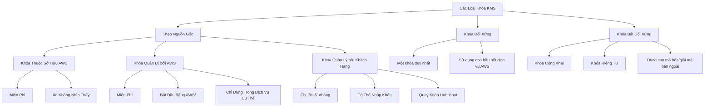

## Thực Hành Mã Hóa và Giải Mã với AWS KMS CLI

### Bước 1: Tạo Tệp Bí Mật
```bash
# Tạo một tệp chứa mật khẩu
echo "SuperSecretPassword" > ExampleSecretFile.txt
```

### Bước 2: Mã Hóa Tệp
```bash
# Mã hóa tệp sử dụng khóa KMS
aws kms encrypt \
    --key-id alias/tutorial \
    --plaintext fileb://ExampleSecretFile.txt \
    --output text \
    --query CiphertextBlob \
    --region eu-west-2 > ExampleSecretFileEncrypted.base64

# Giải mã base64 để có tệp nhị phân
base64 --decode ExampleSecretFileEncrypted.base64 > ExampleSecretFileEncrypted
```

### Bước 3: Giải Mã Tệp
```bash
# Giải mã tệp nhị phân
aws kms decrypt \
    --ciphertext-blob fileb://ExampleSecretFileEncrypted \
    --output text \
    --query Plaintext \
    --region eu-west-2 > ExampleFileDecrypted.base64

# Chuyển đổi base64 về văn bản gốc
base64 --decode ExampleFileDecrypted.base64 > ExampleFileDecrypted.txt
```

## Lưu Ý Quan Trọng về Mã Hóa

- **Tệp Gốc**: Chứa thông tin nhạy cảm
- **Tệp Mã Hóa**: Được mã hóa, không thể đọc được
- **Tệp Giải Mã**: Khôi phục nội dung gốc

### Các Điểm Chính Khi Sử Dụng KMS CLI

1. **Khóa Mã Hóa**: Sử dụng `--key-id` để chỉ định khóa KMS
2. **Vùng**: Luôn chỉ định `--region` của khóa
3. **Đọc Tệp**: Sử dụng `fileb://` để đọc tệp nhị phân
4. **Truy Vấn Kết Quả**: Sử dụng `--query` để lấy dữ liệu cụ thể
5. **Mã Hóa Base64**: Chuyển đổi giữa nhị phân và base64

## Phương Thức Thay Thế

### Sử Dụng SDK
- Các SDK như AWS SDK sẽ trừu tượng hóa các bước chi tiết này
- Cung cấp phương thức mã hóa/giải mã dễ sử dụng hơn
- Hỗ trợ nhiều ngôn ngữ lập trình

### Bảo Mật Khi Sử Dụng KMS
- **Không Bao Giờ** lưu trữ khóa trực tiếp
- Sử dụng KMS để quản lý và bảo vệ khóa
- Áp dụng nguyên tắc đặc quyền tối thiểu

## Cảnh Báo
- Mỗi lệnh gọi KMS đều có chi phí
- Kiểm soát và theo dõi việc sử dụng khóa
- Luôn mã hóa thông tin nhạy cảm# AWS Key Management Service (KMS)

## Tổng Quan

AWS KMS là dịch vụ quản lý khóa mã hóa của Amazon Web Services, giúp đơn giản hóa việc quản lý và sử dụng các khóa mã hóa trên các dịch vụ AWS.

## Đặc Điểm Chính

### Tích Hợp và Quản Lý

- **Tích Hợp Toàn Diện**: Được tích hợp sâu rộng với IAM để quản lý truy cập
- **Kiểm Tra Toàn Diện**: Có thể kiểm tra mọi lệnh API sử dụng khóa thông qua CloudTrail

### Ứng Dụng Rộng Rãi

KMS có thể được sử dụng để mã hóa dữ liệu trong nhiều dịch vụ AWS như:
- EBS (Elastic Block Store)
- S3 (Simple Storage Service)
- RDS (Relational Database Service)
- SSM (Systems Manager)

## Các Loại Khóa KMS

### 1. Khóa Đối Xứng (Symmetric Keys)
- Sử dụng một khóa duy nhất để mã hóa và giải mã
- Được sử dụng bởi hầu hết các dịch vụ AWS
- Không bao giờ truy cập trực tiếp được khóa

### 2. Khóa Bất Đối Xứng (Asymmetric Keys)
- Gồm một khóa công khai (để mã hóa) và khóa riêng tư (để giải mã)
- Phù hợp cho các thao tác mã hóa/giải mã hoặc ký/xác minh
- Cho phép mã hóa bên ngoài AWS bằng khóa công khai

## Các Loại Khóa Chi Tiết

### 1. Khóa Thuộc Sở Hữu AWS (AWS Owned Keys)
- Miễn phí
- Được sử dụng trong các dịch vụ như SSE-S3, SSE DynamoDB

### 2. Khóa Quản Lý bởi AWS (AWS Managed Keys)
- Miễn phí
- Bắt đầu bằng `AWS/` và tên dịch vụ (VD: `AWS/RDS`, `AWS/EBS`)
- Chỉ sử dụng được trong dịch vụ tương ứng

### 3. Khóa Quản Lý bởi Khách Hàng (Customer Managed Keys)
- Chi phí $1/tháng
- Cho phép nhập khóa tùy chọn
- Hỗ trợ quay khóa tự động hoặc theo yêu cầu

## Chính Sách và Quản Lý Khóa

### Chính Sách Khóa KMS
- **Chính Sách Mặc Định**: Cho phép tất cả người dùng trong tài khoản truy cập
- **Chính Sách Tùy Chỉnh**: Kiểm soát chi tiết truy cập và quản trị khóa
- Hỗ trợ truy cập giữa các tài khoản

### Quay Khóa (Key Rotation)
- Khóa quản lý bởi AWS: Tự động quay 1 năm/lần
- Khóa quản lý bởi khách hàng: Có thể bật quay tự động hoặc theo yêu cầu
- Khóa nhập khẩu: Chỉ quay thủ công

## Các Lưu Ý Quan Trọng

- **Phạm Vi Khu Vực**: Khóa KMS được giới hạn trong từng khu vực (region)
- **Sao Chép Giữa Các Khu Vực**: Cần tái mã hóa khi sao chép snapshot giữa các khu vực
- **Giá Cả**: 
  - $1/tháng cho khóa quản lý bởi khách hàng
  - Khoảng 3 xu/10.000 lệnh API

## Thực Hành Tốt Nhất

- **Không Bao Giờ** lưu trữ bí mật dưới dạng văn bản thuần
- Sử dụng KMS để mã hóa các giá trị nhạy cảm
- Sử dụng các công cụ như AWS CLI, SDK để quản lý khóa
- Áp dụng nguyên tắc đặc quyền tối thiểu khi cấp quyền truy cập

## Quy Trình Sao Chép Ảnh Chụp Mã Hóa Giữa Các Tài Khoản

1. Tạo snapshot được mã hóa với khóa KMS của tài khoản nguồn
2. Gắn chính sách khóa để cho phép truy cập giữa các tài khoản
3. Chia sẻ snapshot được mã hóa với tài khoản đích
4. Tạo bản sao snapshot với khóa KMS của tài khoản đích
5. Tạo ổ đĩa từ snapshot trong tài khoản đích

## Sơ Đồ Các Loại Khóa KMS



## Kết Luận

AWS KMS cung cấp giải pháp quản lý khóa mã hóa mạnh mẽ, linh hoạt và dễ sử dụng, giúp bảo vệ dữ liệu một cách hiệu quả trong môi trường đám mây.