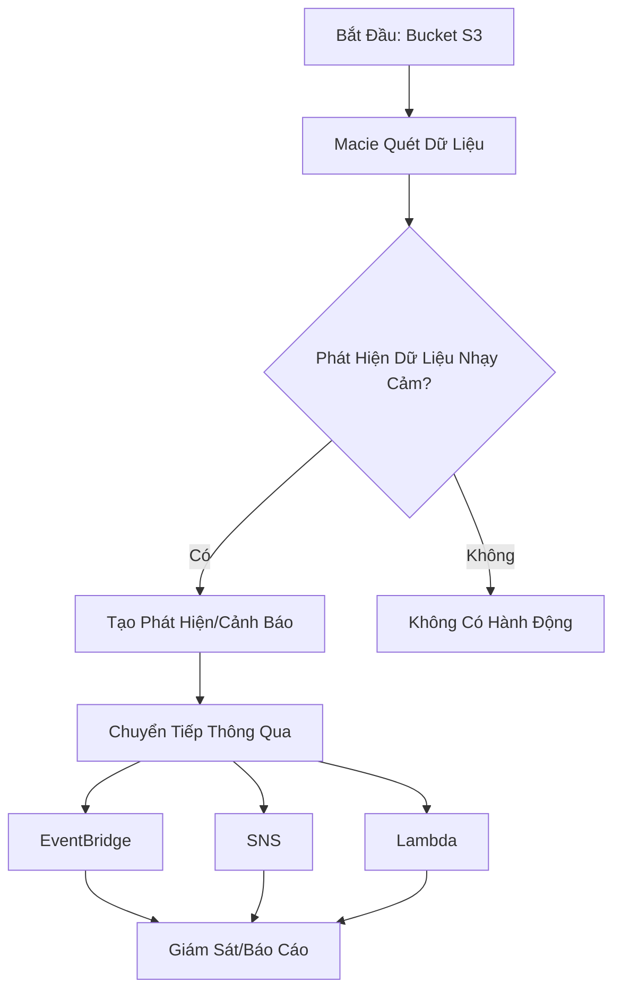

# Amazon Macie

## Tổng Quan

Amazon Macie là dịch vụ quản lý bảo mật và quyền riêng tư dữ liệu của AWS, sử dụng trí tuệ nhân tạo và học máy để khám phá và bảo vệ thông tin nhạy cảm.

## Quy Trình Hoạt Động

## Đặc Điểm Chính

### Chức Năng Cốt Lõi
- **Phát Hiện Dữ Liệu Nhạy Cảm**: Sử dụng học máy và kỹ thuật so khớp mẫu
- **Tập Trung Vào S3**: Phân tích và khám phá dữ liệu trong các bucket S3
- **Nhận Diện Thông Tin Nhận Dạng Cá Nhân (PII)**

### Quy Trình Hoạt Động
1. Quét các bucket S3 được chỉ định
2. Phát hiện thông tin nhạy cảm
3. Tạo cảnh báo thông qua các dịch vụ AWS

## Tích Hợp và Thông Báo

### Các Kênh Thông Báo
- **EventBridge**: Chuyển tiếp các phát hiện
- **SNS (Simple Notification Service)**: Gửi thông báo
- **Lambda**: Kích hoạt các hành động tự động

## Cách Sử Dụng

### Bật Macie
- Cực kỳ đơn giản: Chỉ một cú nhấp chuột
- Lựa chọn các bucket S3 cần quét

## Ví Dụ Minh Họa

### Kịch Bản Sử Dụng
- Một tổ chức có nhiều bucket S3 chứa dữ liệu khách hàng
- Macie quét và phát hiện:
  - Số an sinh xã hội
  - Địa chỉ email
  - Số thẻ tín dụng
  - Thông tin nhận dạng cá nhân khác

## Lợi Ích

- **Bảo Mật Tự Động**: Giảm thiểu rủi ro lộ thông tin
- **Phát Hiện Nhanh Chóng**: Cảnh báo ngay khi phát hiện dữ liệu nhạy cảm
- **Tích Hợp Linh Hoạt**: Dễ dàng kết nối với các dịch vụ AWS khác

## Hạn Chế

- Chỉ hoạt động với các bucket S3
- Yêu cầu cấu hình và giám sát ban đầu

## Thực Hành Tốt Nhất

- Thường xuyên kiểm tra các phát hiện
- Cấu hình cảnh báo chi tiết
- Kết hợp với các biện pháp bảo mật khác

## Kết Luận

Amazon Macie là công cụ quan trọng giúp tổ chức bảo vệ thông tin nhạy cảm một cách tự động và hiệu quả trong môi trường đám mây AWS.# Amazon Macie

## Tổng Quan

Amazon Macie là dịch vụ quản lý bảo mật và quyền riêng tư dữ liệu của AWS, sử dụng trí tuệ nhân tạo và học máy để khám phá và bảo vệ thông tin nhạy cảm.

## Đặc Điểm Chính

### Chức Năng Cốt Lõi
- **Phát Hiện Dữ Liệu Nhạy Cảm**: Sử dụng học máy và kỹ thuật so khớp mẫu
- **Tập Trung Vào S3**: Phân tích và khám phá dữ liệu trong các bucket S3
- **Nhận Diện Thông Tin Nhận Dạng Cá Nhân (PII)**

### Quy Trình Hoạt Động
1. Quét các bucket S3 được chỉ định
2. Phát hiện thông tin nhạy cảm
3. Tạo cảnh báo thông qua các dịch vụ AWS

## Tích Hợp và Thông Báo

### Các Kênh Thông Báo
- **EventBridge**: Chuyển tiếp các phát hiện
- **SNS (Simple Notification Service)**: Gửi thông báo
- **Lambda**: Kích hoạt các hành động tự động

## Cách Sử Dụng

### Bật Macie
- Cực kỳ đơn giản: Chỉ một cú nhấp chuột
- Lựa chọn các bucket S3 cần quét

## Ví Dụ Minh Họa

### Kịch Bản Sử Dụng
- Một tổ chức có nhiều bucket S3 chứa dữ liệu khách hàng
- Macie quét và phát hiện:
  - Số an sinh xã hội
  - Địa chỉ email
  - Số thẻ tín dụng
  - Thông tin nhận dạng cá nhân khác

## Lợi Ích

- **Bảo Mật Tự Động**: Giảm thiểu rủi ro lộ thông tin
- **Phát Hiện Nhanh Chóng**: Cảnh báo ngay khi phát hiện dữ liệu nhạy cảm
- **Tích Hợp Linh Hoạt**: Dễ dàng kết nối với các dịch vụ AWS khác

## Hạn Chế

- Chỉ hoạt động với các bucket S3
- Yêu cầu cấu hình và giám sát ban đầu

## Thực Hành Tốt Nhất

- Thường xuyên kiểm tra các phát hiện
- Cấu hình cảnh báo chi tiết
- Kết hợp với các biện pháp bảo mật khác

## Kết Luận

Amazon Macie là công cụ quan trọng giúp tổ chức bảo vệ thông tin nhạy cảm một cách tự động và hiệu quả trong môi trường đám mây AWS.