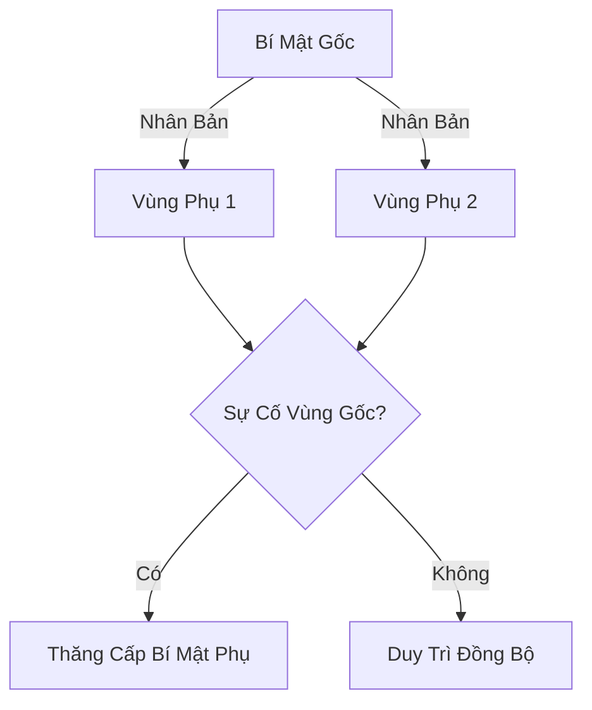

# AWS Secrets Manager

## Tổng Quan

AWS Secrets Manager là dịch vụ quản lý bí mật (secrets) tiên tiến, được thiết kế để lưu trữ, phân phối và quản lý các thông tin nhạy cảm một cách an toàn.

## Các Tính Năng Chính

### Quản Lý Bí Mật Nâng Cao
- **Luân Chuyển Tự Động**: Thay đổi bí mật theo định kỳ
- **Tạo Bí Mật Tự Động**: Sử dụng Lambda để sinh bí mật mới
- **Mã Hóa An Toàn**: Tích hợp với AWS KMS để mã hóa bí mật

## So Sánh với SSM Parameter Store

### Ưu Điểm của Secrets Manager
- Luân chuyển bí mật chủ động
- Tích hợp sẵn với nhiều dịch vụ AWS
- Hỗ trợ quản lý bí mật phức tạp hơn

## Tích Hợp Dịch Vụ

### Tích Hợp Sẵn Có
- **Cơ Sở Dữ Liệu**: 
  - Amazon RDS
  - MySQL
  - PostgreSQL
  - Aurora
  - Và nhiều dịch vụ khác

## Tính Năng Đa Vùng (Multi-Region)

### Cơ Chế Hoạt Động
- **Nhân Bản Bí Mật**: Sao chép bí mật giữa nhiều vùng AWS
- **Đồng Bộ Tự Động**: Đảm bảo tính nhất quán giữa các bản sao

### Lợi Ích
- **Khôi Phục Thảm Họa**: Chuyển đổi dự phòng giữa các vùng
- **Ứng Dụng Đa Vùng**: Hỗ trợ kiến trúc ứng dụng phân tán
- **Sao Lưu**: Đảm bảo tính sẵn sàng của bí mật

## Quy Trình Quản Lý Bí Mật

1. **Tạo Bí Mật**: Lưu trữ thông tin nhạy cảm
2. **Cấu Hình Luân Chuyển**: Thiết lập chu kỳ thay đổi
3. **Tích Hợp Lambda**: Tạo bí mật mới tự động
4. **Mã Hóa**: Bảo vệ bằng KMS
5. **Truy Xuất An Toàn**: Sử dụng API Secrets Manager

## Thực Hành Tốt Nhất

- Sử dụng luân chuyển bí mật thường xuyên
- Tránh lưu trữ bí mật trong mã nguồn
- Kiểm soát truy cập chặt chẽ
- Sử dụng tính năng đa vùng cho tính sẵn sàng cao

## Kết Luận

AWS Secrets Manager cung cấp giải pháp toàn diện để quản lý, bảo vệ và luân chuyển các bí mật một cách an toàn và hiệu quả trong môi trường đám mây.