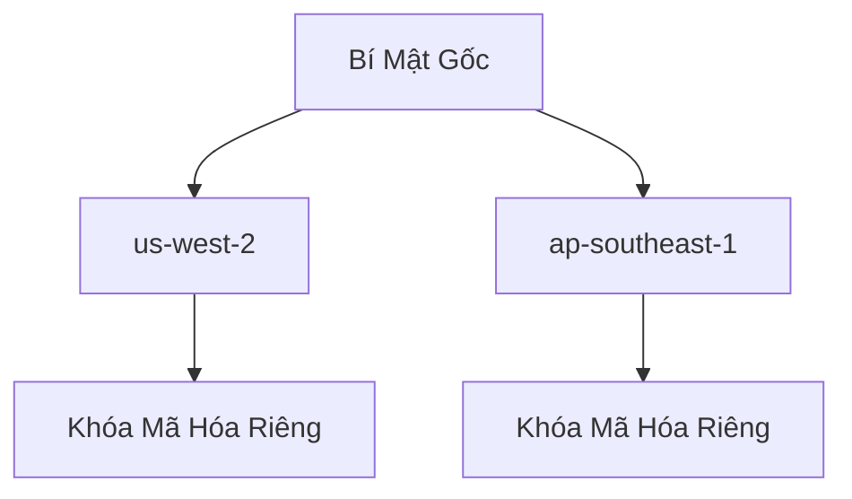
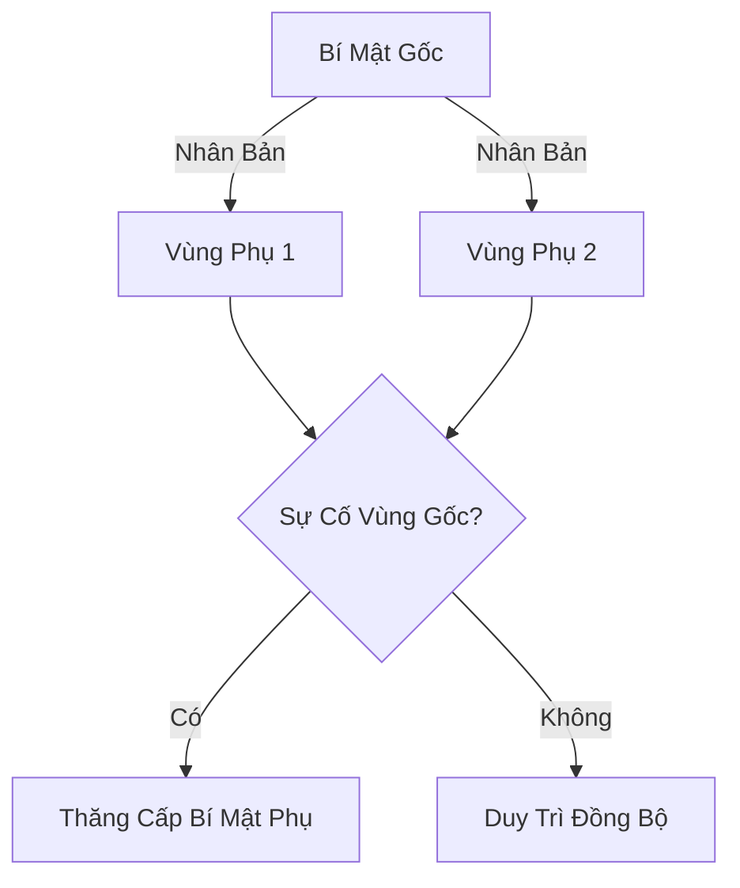

# AWS Secrets Manager

## Chi Tiết Định Giá

- **Dùng Thử**: Gói miễn phí 30 ngày
- **Giá Cả**:
  - $0.40 mỗi bí mật/tháng
  - $0.05 cho mỗi 10.000 lệnh API

## Các Loại Bí Mật Hỗ Trợ

### Loại Bí Mật
- Amazon RDS
- Amazon DocumentDB
- Amazon Redshift
- Các loại bí mật tùy chỉnh

## Quy Trình Tạo Bí Mật

### Bước 1: Nhập Nội Dung Bí Mật
- **Phương Thức Nhập**:
  - Qua giao diện người dùng
  - Nhập văn bản thuần
  - Sử dụng tài liệu JSON

#### Ví Dụ Mẫu
```json
{
  "MySecretKey": "MyVerySecretValue",
  "API_KEY": "SecretAPIKey"
}
```

### Bước 2: Mã Hóa Bí Mật
- Sử dụng khóa KMS mặc định
- Tùy chọn sử dụng khóa KMS tùy chỉnh

### Bước 3: Cấu Hình Bí Mật
- **Đặt Tên**: VD: `prod/my-secret`
- **Chính Sách Truy Cập**:
  - Giới hạn truy cập theo IAM
  - Hỗ trợ chính sách truy cập giữa các tài khoản AWS

### Bước 4: Nhân Bản Đa Vùng
- Sao chép bí mật sang nhiều khu vực
- Hỗ trợ ứng dụng và cơ sở dữ liệu nhiều vùng



### Bước 5: Luân Chuyển Bí Mật
- **Tùy Chọn Luân Chuyển**:
  - Kích hoạt/vô hiệu hóa
  - Cấu hình chu kỳ luân chuyển
- **Hàm Lambda**: Tạo bí mật mới tự động

## Tích Hợp Đặc Biệt: Cơ Sở Dữ Liệu

### Ví Dụ Với Amazon RDS
- Tạo tên người dùng và mật khẩu
- Tích hợp trực tiếp với cơ sở dữ liệu
- **Ưu Điểm**:
  - Tự động cập nhật thông tin đăng nhập
  - Luân chuyển mật khẩu dễ dàng

## Truy Xuất Bí Mật

### Phương Thức Truy Xuất
- Sử dụng mã code của AWS
- Chỉ những người dùng có quyền mới truy cập được

## Thực Hành Tốt Nhất

- Sử dụng giai đoạn dùng thử 30 ngày
- Xóa bí mật không sử dụng để tránh chi phí
- Quản lý quyền truy cập chặt chẽ
- Sử dụng luân chuyển bí mật thường xuyên

## Kết Luận

AWS Secrets Manager cung cấp giải pháp toàn diện, an toàn và linh hoạt để quản lý các bí mật trong môi trường điện toán đám mây.# AWS Secrets Manager

## Tổng Quan

AWS Secrets Manager là dịch vụ quản lý bí mật (secrets) tiên tiến, được thiết kế để lưu trữ, phân phối và quản lý các thông tin nhạy cảm một cách an toàn.

## Các Tính Năng Chính

### Quản Lý Bí Mật Nâng Cao
- **Luân Chuyển Tự Động**: Thay đổi bí mật theo định kỳ
- **Tạo Bí Mật Tự Động**: Sử dụng Lambda để sinh bí mật mới
- **Mã Hóa An Toàn**: Tích hợp với AWS KMS để mã hóa bí mật

## So Sánh với SSM Parameter Store

### Ưu Điểm của Secrets Manager
- Luân chuyển bí mật chủ động
- Tích hợp sẵn với nhiều dịch vụ AWS
- Hỗ trợ quản lý bí mật phức tạp hơn

## Tích Hợp Dịch Vụ

### Tích Hợp Sẵn Có
- **Cơ Sở Dữ Liệu**: 
  - Amazon RDS
  - MySQL
  - PostgreSQL
  - Aurora
  - Và nhiều dịch vụ khác

## Tính Năng Đa Vùng (Multi-Region)

### Cơ Chế Hoạt Động
- **Nhân Bản Bí Mật**: Sao chép bí mật giữa nhiều vùng AWS
- **Đồng Bộ Tự Động**: Đảm bảo tính nhất quán giữa các bản sao

### Lợi Ích
- **Khôi Phục Thảm Họa**: Chuyển đổi dự phòng giữa các vùng
- **Ứng Dụng Đa Vùng**: Hỗ trợ kiến trúc ứng dụng phân tán
- **Sao Lưu**: Đảm bảo tính sẵn sàng của bí mật



## Quy Trình Quản Lý Bí Mật

1. **Tạo Bí Mật**: Lưu trữ thông tin nhạy cảm
2. **Cấu Hình Luân Chuyển**: Thiết lập chu kỳ thay đổi
3. **Tích Hợp Lambda**: Tạo bí mật mới tự động
4. **Mã Hóa**: Bảo vệ bằng KMS
5. **Truy Xuất An Toàn**: Sử dụng API Secrets Manager

## Thực Hành Tốt Nhất

- Sử dụng luân chuyển bí mật thường xuyên
- Tránh lưu trữ bí mật trong mã nguồn
- Kiểm soát truy cập chặt chẽ
- Sử dụng tính năng đa vùng cho tính sẵn sàng cao

## Kết Luận

AWS Secrets Manager cung cấp giải pháp toàn diện để quản lý, bảo vệ và luân chuyển các bí mật một cách an toàn và hiệu quả trong môi trường đám mây.