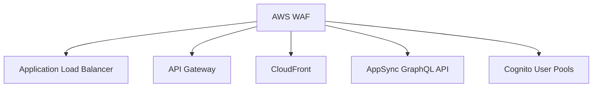
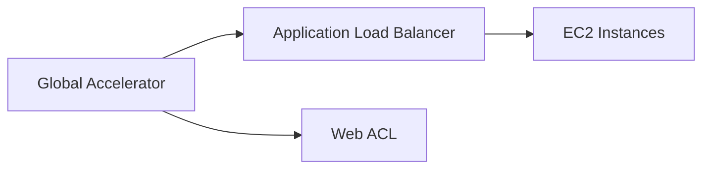

# AWS Web Application Firewall (WAF)

## Tổng Quan

AWS WAF là giải pháp bảo vệ ứng dụng web chống lại các mối đe dọa tại Lớp 7 (HTTP).

## Đặc Điểm Kỹ Thuật

### Lớp Bảo Vệ
- **Lớp 7 (HTTP)**: Bảo vệ chống các cuộc tấn công web
- **So Sánh**: Lớp 4 (TCP/UDP) không được hỗ trợ

## Các Dịch Vụ Hỗ Trợ WAF

### Điểm Triển Khai
- Application Load Balancer
- API Gateway
- CloudFront
- AppSync GraphQL API
- Cognito User Pools

## Các Loại Quy Tắc (Web ACL)

### Các Kiểu Lọc
1. **Lọc Địa Chỉ IP**
   - Tối đa 10.000 địa chỉ IP mỗi tập hợp
   - Hỗ trợ nhiều tập hợp quy tắc

2. **Lọc Chi Tiết**
   - Tiêu đề HTTP
   - Nội dung phần thân
   - Chuỗi URI

3. **Bảo Vệ Chống**
   - SQL Injection
   - Cross-Site Scripting
   - Giới hạn kích thước yêu cầu
   - Chặn/cho phép theo quốc gia

4. **Quy Tắc Dựa Trên Tần Suất**
   - Kiểm soát số lượng yêu cầu từng IP
   - Phòng chống DDoS
   - Ví dụ: Giới hạn 10 yêu cầu/giây

## Phạm Vi Web ACL

### Phân Vùng
- Hầu hết các dịch vụ: Phạm vi khu vực
- CloudFront: Phạm vi toàn cầu

## Nhóm Quy Tắc (Rule Groups)
- Tập hợp các quy tắc được tổ chức
- Dễ dàng áp dụng cho nhiều Web ACL

## Kiến Trúc Nâng Cao: IP Cố Định

### Thách Thức
- Application Load Balancer không có IP cố định
- WAF không hỗ trợ Network Load Balancer

### Giải Pháp: Global Accelerator

#### Quy Trình
1. Sử dụng Global Accelerator
2. Đặt WAF trước Application Load Balancer
3. Đạt được IP cố định và bảo vệ ứng dụng

## Thực Hành Tốt Nhất

- Giới hạn truy cập theo địa chỉ IP
- Kiểm soát tần suất yêu cầu
- Cấu hình bảo vệ chống tấn công web
- Theo dõi và cập nhật quy tắc thường xuyên

## Kết Luận

AWS WAF cung cấp giải pháp bảo mật linh hoạt, chi tiết cho các ứng dụng web, bảo vệ chống lại nhiều loại mối đe dọa tại lớp ứng dụng.