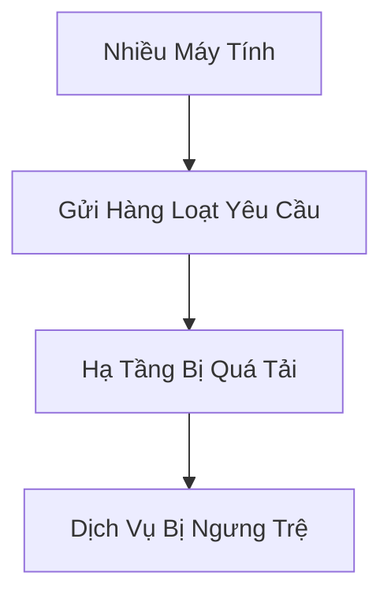
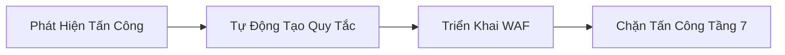

# AWS Shield: Giải Pháp Bảo Vệ Chống Tấn Công DDoS

## Tấn Công DDoS là Gì?

### Định Nghĩa
- **DDoS (Distributed Denial of Service)**: Tấn công từ chối dịch vụ phân tán
- Mục Tiêu: Làm quá tải hạ tầng bằng nhiều yêu cầu đồng thời
- Nguồn: Nhiều máy tính khác nhau trên toàn thế giới

## Các Mức Bảo Vệ AWS Shield

### Shield Standard
- **Miễn Phí**: Tự động kích hoạt cho mọi khách hàng AWS
- **Bảo Vệ Các Tầng**: 3 và 4
- **Loại Tấn Công Được Bảo Vệ**:
  - SYN Floods
  - UDP Floods
  - Các tấn công phản xạ
  - Tấn công tầng mạng và vận chuyển

### Shield Advanced
- **Chi Phí**: Khoảng 3.000$/tháng/tổ chức
- **Phạm Vi Bảo Vệ**:
  - Amazon EC2
  - Elastic Load Balancing
  - Amazon CloudFront
  - Global Accelerator
  - Route 53

## Ưu Điểm của Shield Advanced

### Bảo Vệ Nâng Cao
- Chống tấn công DDoS tinh vi
- Hỗ trợ 24/7 từ đội ngũ ứng phó DDoS của AWS

### Tính Năng Đặc Biệt
- Giảm thiểu chi phí do tấn công
- Tự động tạo và triển khai quy tắc WAF

## So Sánh Chi Tiết

| Tính Năng | Shield Standard | Shield Advanced |
|-----------|-----------------|-----------------|
| Chi Phí | Miễn Phí | 3.000$/tháng |
| Bảo Vệ Tầng | 3 & 4 | 3, 4 & 7 |
| Hỗ Trợ Kỹ Thuật | Không | 24/7 |
| Tự Động Giảm Thiểu | Cơ Bản | Nâng Cao |

## Thực Hành Tốt Nhất

- Đánh giá nhu cầu bảo mật của ứng dụng
- Cân nhắc nâng cấp lên Shield Advanced
- Kết hợp với các giải pháp bảo mật khác
- Thường xuyên giám sát lưu lượng truy cập

## Kết Luận

AWS Shield cung cấp giải pháp bảo vệ toàn diện chống lại các cuộc tấn công DDoS, giúp duy trì tính sẵn sàng và hiệu suất của ứng dụng.