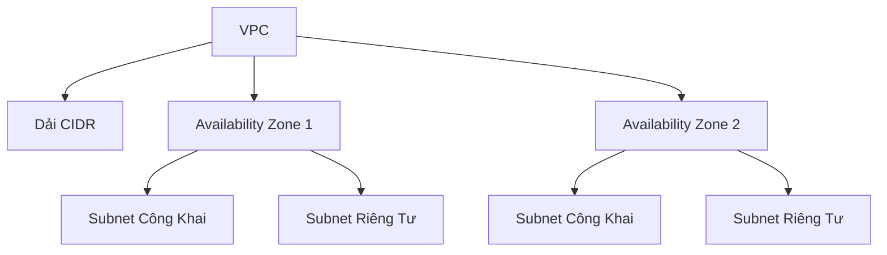

# AWS Virtual Private Cloud (VPC) và Mạng

## Tổng Quan về VPC

### Định Nghĩa
- **VPC**: Mạng riêng ảo trong đám mây AWS
- **Phạm Vi**: Tài nguyên cấp khu vực (regional)
- **Mục Đích**: Triển khai và cách ly tài nguyên mạng

## Kiến Trúc VPC

### Cấu Trúc Cơ Bản
- **CIDR Range**: Dải địa chỉ IP cho VPC
- **Availability Zones (AZ)**: Phân vùng vật lý
- **Subnets**: Phân đoạn mạng trong VPC

## Các Loại Subnet

### Subnet Công Khai (Public Subnet)
- **Đặc Điểm**: 
  - Truy cập được từ Internet
  - Có thể truy cập Internet
- **Kết Nối**: Thông qua Internet Gateway

### Subnet Riêng Tư (Private Subnet)
- **Đặc Điểm**:
  - Không truy cập trực tiếp từ Internet
  - Bảo mật cao hơn
- **Kết Nối Internet**: Thông qua NAT Gateway

## Cổng Mạng

### Internet Gateway
- **Chức Năng**: Kết nối VPC với Internet
- **Vị Trí**: Nằm trong VPC
- **Vai Trò**: Cung cấp kết nối hai chiều cho subnet công khai

### NAT Gateway
- **Chức Năng**: Cho phép subnet riêng tư truy cập Internet
- **Quản Lý**: Do AWS quản lý
- **Vị Trí**: Đặt trong subnet công khai
- **Mục Đích**: Cập nhật phần mềm cho các instance riêng tư

## VPC Mặc Định

### Đặc Điểm
- Tự động tạo khi sử dụng AWS
- Một VPC cho mỗi khu vực
- Thường chỉ chứa các subnet công khai

## Bảng Định Tuyến

### Chức Năng
- Điều khiển luồng lưu lượng mạng
- Xác định định tuyến giữa các subnet
- Kiểm soát truy cập Internet

## Thực Hành Tốt Nhất

- Phân chia mạng theo mục đích
- Sử dụng subnet riêng tư cho các dịch vụ nhạy cảm
- Giới hạn truy cập Internet
- Sử dụng NAT Gateway cho kết nối an toàn

## Kết Luận

VPC cung cấp khả năng kiểm soát, bảo mật và linh hoạt cho môi trường mạng đám mây, cho phép triển khai cơ sở hạ tầng an toàn và được phân đoạn hiệu quả.