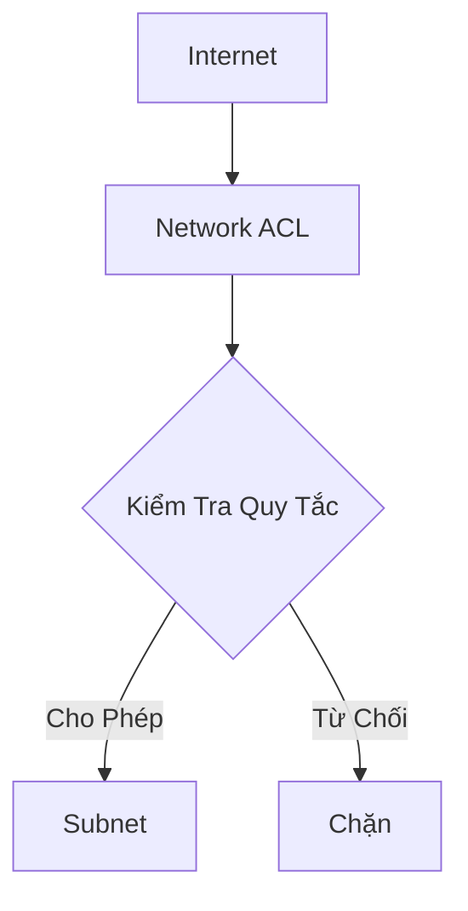
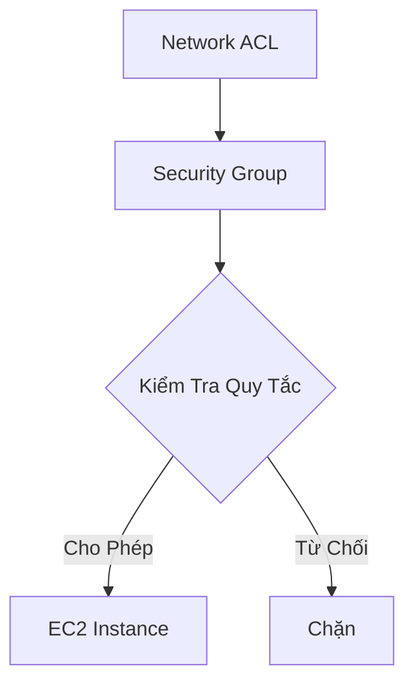

# Bảo Mật Mạng trong AWS VPC

## Network ACL (NACL)

### Định Nghĩa
- Tường lửa kiểm soát lưu lượng đến và đi từ subnet
- Hoạt động ở cấp độ subnet

### Đặc Điểm
- Hỗ trợ cả quy tắc cho phép (allow) và từ chối (deny)
- Chỉ làm việc với địa chỉ IP
- Là lớp bảo vệ đầu tiên trong VPC

## Security Groups

### Định Nghĩa
- Tường lửa kiểm soát lưu lượng đến và đi từ:
  - Elastic Network Interface (ENI)
  - EC2 Instance

### Đặc Điểm
- Chỉ có quy tắc cho phép (allow)
- Có thể tham chiếu:
  - Địa chỉ IP
  - Nhóm bảo mật khác

## So Sánh Chi Tiết

| Tiêu Chí | Network ACL | Security Group |
|----------|-------------|----------------|
| Phạm Vi | Cấp Subnet | Cấp Instance/ENI |
| Loại Quy Tắc | Allow & Deny | Chỉ Allow |
| Trạng Thái | Không Trạng Thái | Có Trạng Thái |

## VPC Flow Logs

### Chức Năng
- Ghi lại toàn bộ lưu lượng IP trong VPC
- Hỗ trợ giám sát và khắc phục sự cố kết nối

### Phạm Vi Ghi Nhận
- VPC
- Subnet
- Elastic Network Interface

### Điểm Đến Lưu Trữ
- Amazon S3
- CloudWatch Logs
- Kinesis Data Firehose

### Thông Tin Ghi Nhận
- Lưu lượng được phép
- Lưu lượng bị từ chối
- Thông tin từ các dịch vụ AWS:
  - Elastic Load Balancers
  - ElastiCache
  - RDS
  - Aurora

## Thực Hành Tốt Nhất

- Cấu hình NACL chặt chẽ
- Sử dụng Security Groups để kiểm soát chi tiết
- Kích hoạt VPC Flow Logs để giám sát
- Thường xuyên xem xét và cập nhật quy tắc bảo mật

## Kết Luận

Bảo mật mạng VPC là một lớp bảo vệ quan trọng, cung cấp nhiều cơ chế kiểm soát và giám sát lưu lượng mạng trong môi trường đám mây AWS.