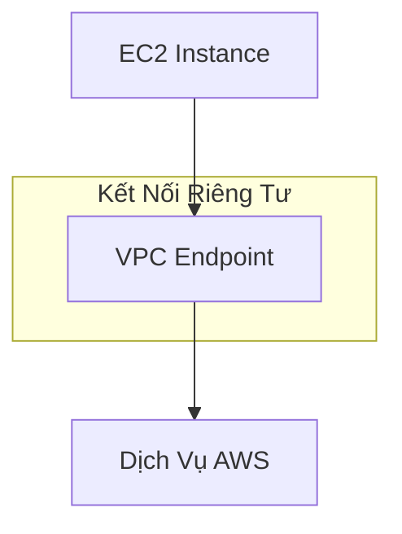

# Kết Nối Mạng trong AWS VPC

## VPC Peering

### Định Nghĩa
- Kết nối giữa hai VPC như một mạng duy nhất
- Có thể giữa các tài khoản hoặc khu vực khác nhau

### Điều Kiện
- Dải IP không được chồng lấn
- Kết nối không có tính chất chuyển tiếp

```mermaid
graph TD
    A[VPC A] -->|Peering| B[VPC B]
    A -x|Không Kết Nối| C[VPC C]
    B -x|Không Kết Nối| C
```

### Hạn Chế
- Mỗi kết nối VPC phải được thiết lập riêng
- Số lượng kết nối tăng theo số lượng VPC

## VPC Endpoints

### Khái Niệm
- Kết nối riêng tới dịch vụ AWS
- Không sử dụng Internet công cộng

### Các Loại Endpoint

#### 1. Gateway Endpoint
- Chỉ dành cho S3 và DynamoDB
- Kết nối từ subnet riêng tư

#### 2. Interface Endpoint
- Hỗ trợ các dịch vụ khác (VD: CloudWatch)
- Sử dụng giao diện mạng (ENI)



## Kết Nối Trung Tâm Dữ Liệu

### Site-to-Site VPN
- **Phương Thức**: Kết nối qua Internet công cộng
- **Ưu Điểm**:
  - Dễ thiết lập
  - Nhanh chóng (vài phút)
  - Được mã hóa

### Direct Connect
- **Phương Thức**: Kết nối vật lý riêng
- **Ưu Điểm**:
  - Kết nối riêng tư
  - Tốc độ cao
  - An toàn
- **Nhược Điểm**:
  - Thời gian thiết lập lâu (ít nhất 1 tháng)

## So Sánh Kết Nối

| Tiêu Chí | Site-to-Site VPN | Direct Connect |
|----------|------------------|----------------|
| Môi Trường | Internet công cộng | Đường truyền riêng |
| Tốc Độ | Trung bình | Cao |
| Thời Gian Thiết Lập | Nhanh (vài phút) | Chậm (1 tháng) |
| Mã Hóa | Có | Không |

## Thực Hành Tốt Nhất

- Xác minh không chồng lấn IP khi peering
- Sử dụng endpoint để truy cập dịch vụ AWS riêng tư
- Cân nhắc Direct Connect cho kết nối dài hạn
- Thiết lập VPN cho kết nối tạm thời

## Kết Luận

Các phương thức kết nối VPC cung cấp linh hoạt và an toàn trong việc mở rộng và kết nối mạng đám mây.