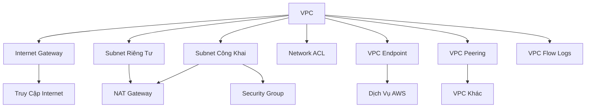

# Tổng Quan Khái Niệm VPC AWS

## Mối Quan Hệ Các Thành Phần VPC

[Phần còn lại của tài liệu giữ nguyên như ở phiên bản trước]# Tổng Quan Khái Niệm VPC AWS

## Các Thành Phần Chính

### 1. Virtual Private Cloud (VPC)
- Mạng riêng ảo trong AWS
- Một VPC mặc định cho mỗi khu vực

### 2. Subnet
- Gắn với Availability Zone cụ thể
- Phân đoạn mạng trong VPC
- Phân loại:
  - Subnet Công Khai
  - Subnet Riêng Tư

### 3. Cổng Kết Nối
- **Internet Gateway**: 
  - Truy cập Internet cho subnet công khai
  - Cấp VPC

- **NAT Gateway/Instance**: 
  - Cung cấp truy cập Internet cho subnet riêng tư

## Bảo Mật Mạng

### 4. Tường Lửa
- **Network ACL (NACL)**:
  - Không trạng thái
  - Cấp subnet
  - Cho phép/từ chối lưu lượng

- **Security Groups**:
  - Có trạng thái
  - Cấp instance/ENI
  - Chỉ cho phép lưu lượng

## Kết Nối Mạng

### 5. VPC Peering
- Kết nối giữa các VPC
- Điều kiện:
  - Không chồng lấn IP
  - Kết nối không chuyển tiếp

### 6. VPC Endpoints
- Truy cập riêng tới dịch vụ AWS
- Hai loại:
  - Gateway Endpoint
  - Interface Endpoint

### 7. Kết Nối Trung Tâm Dữ Liệu
- **Site-to-Site VPN**:
  - Kết nối qua Internet
  - Nhanh, được mã hóa

- **Direct Connect**:
  - Kết nối vật lý riêng
  - Tốc độ cao, an toàn

## Giám Sát

### 8. VPC Flow Logs
- Ghi lại lưu lượng mạng
- Hỗ trợ khắc phục sự cố

## Lời Khuyên Ôn Thi

- Không lo lắng về chi tiết kỹ thuật
- Nắm vững các khái niệm cơ bản
- Tập trung vào mục đích của từng thành phần

## Kết Luận

VPC là nền tảng cho việc xây dựng hạ tầng mạng an toàn, linh hoạt trong môi trường đám mây AWS.