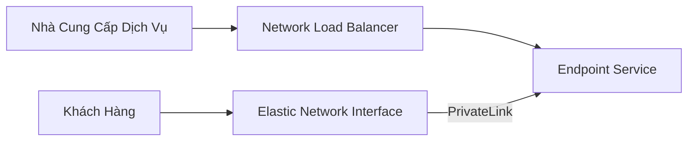

# AWS PrivateLink

## Khái Niệm Cơ Bản

### Định Nghĩa
AWS PrivateLink là giải pháp kết nối riêng tư các dịch vụ giữa các VPC mà không cần sử dụng internet công cộng.

## Vấn Đề Và Giải Pháp

### Thách Thức Truyền Thống
- VPC Peering không hiệu quả
- Thiếu tính bảo mật
- Khó mở rộng

### Ưu Điểm PrivateLink
- Kết nối riêng tư trực tiếp
- Không phụ thuộc vào:
  - VPC Peering
  - Internet Gateway
  - NAT
  - Bảng Định Tuyến

## Kiến Trúc Chi Tiết

### Quy Trình Hoạt Động
1. Nhà Cung Cấp:
   - Tạo Network Load Balancer
   - Cung cấp Endpoint Service

2. Khách Hàng:
   - Tạo Elastic Network Interface
   - Thiết lập kết nối PrivateLink

## Lợi Ích Chính

### 1. Bảo Mật
- Toàn bộ giao tiếp qua mạng riêng
- Không sử dụng internet công cộng

### 2. Khả Năng Mở Rộng
- Dễ dàng thêm khách hàng mới
- Quản lý đơn giản

### 3. Kiến Trúc Linh Hoạt
- Hỗ trợ các mô hình dịch vụ đa dạng
- Tích hợp với AWS Marketplace

## Ví Dụ Thực Tế

### Kịch Bản
- Nhà cung cấp dịch vụ bên thứ ba
- Ứng dụng đặt trong VPC riêng
- Cung cấp dịch vụ cho nhiều khách hàng AWS

## Thực Hành Tốt Nhất

- Sử dụng Network Load Balancer
- Cấu hình Endpoint Service chi tiết
- Kiểm soát truy cập chặt chẽ
- Giám sát lưu lượng kết nối

## Hạn Chế
- Yêu cầu cấu hình kỹ thuật
- Phụ thuộc vào cấu trúc mạng

## Kết Luận

AWS PrivateLink cung cấp giải pháp kết nối an toàn, riêng tư và dễ mở rộng giữa các dịch vụ trong môi trường điện toán đám mây.