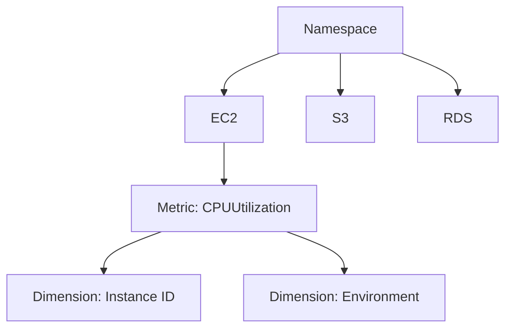
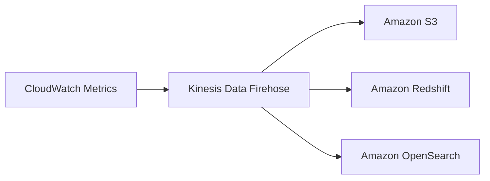

# Amazon CloudWatch Metrics

## Khái Niệm Cơ Bản

### Định Nghĩa
- **Metric**: Biến số để giám sát hoạt động dịch vụ AWS
- Cung cấp cái nhìn toàn diện về hiệu suất hạ tầng đám mây

## Cấu Trúc Metrics

### Namespace
- Nhóm các metrics theo dịch vụ
- Mỗi dịch vụ có một namespace riêng
- Ví dụ: EC2, S3, RDS

### Dimensions
- Các thuộc tính bổ sung của metric
- Tối đa 30 dimension mỗi metric
- Giúp phân loại và lọc chi tiết

## Các Loại Metrics

### Metrics Có Sẵn
- **EC2**: Sử dụng CPU, Network
- **S3**: Kích thước bucket
- **Nhiều dịch vụ khác**

### Custom Metrics
- Tạo metrics riêng
- Ví dụ điển hình: Sử dụng bộ nhớ EC2

## Streaming Metrics

### Điểm Đến
1. **Kinesis Data Firehose**
   - Phân phối gần thời gian thực
   - Độ trễ thấp

2. **Dịch Vụ Bên Thứ Ba**
   - Datadog
   - Dynatrace
   - New Relic
   - Splunk
   - Sumo Logic

### Quy Trình Streaming

## Tùy Chọn Lọc
- Streaming toàn bộ metrics
- Lọc theo namespace cụ thể

## Thực Hành Trong Giao Diện

### Tính Năng
- Xem metrics theo thời gian
- Chọn khoảng thời gian tùy chỉnh
- Các dạng hiển thị:
  - Đường
  - Khu vực
  - Số liệu
  - Biểu đồ tròn

### Chế Độ Giám Sát
- Mặc định: 5 phút/lần
- Chi tiết: 1 phút/lần (bật giám sát chi tiết)

## Thực Hành Tốt Nhất

- Sử dụng giám sát chi tiết khi cần
- Tạo dashboard tổng quan
- Cấu hình streaming cho phân tích
- Giám sát các metric quan trọng

## Kết Luận

Amazon CloudWatch Metrics cung cấp giải pháp giám sát toàn diện, linh hoạt cho môi trường đám mây AWS, giúp theo dõi và phân tích hiệu suất hệ thống một cách chi tiết.