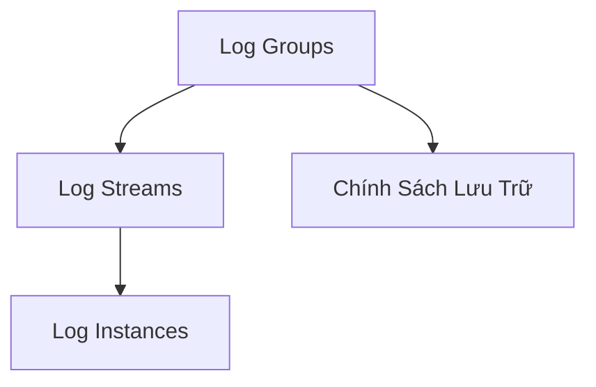
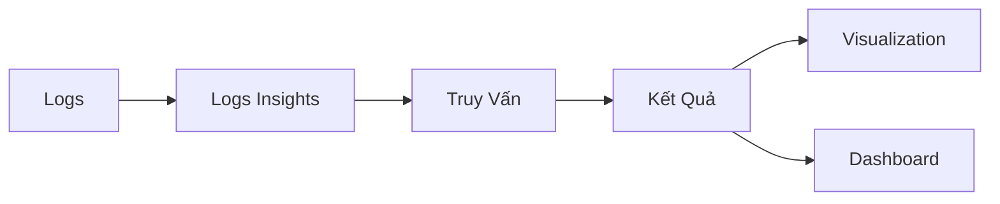
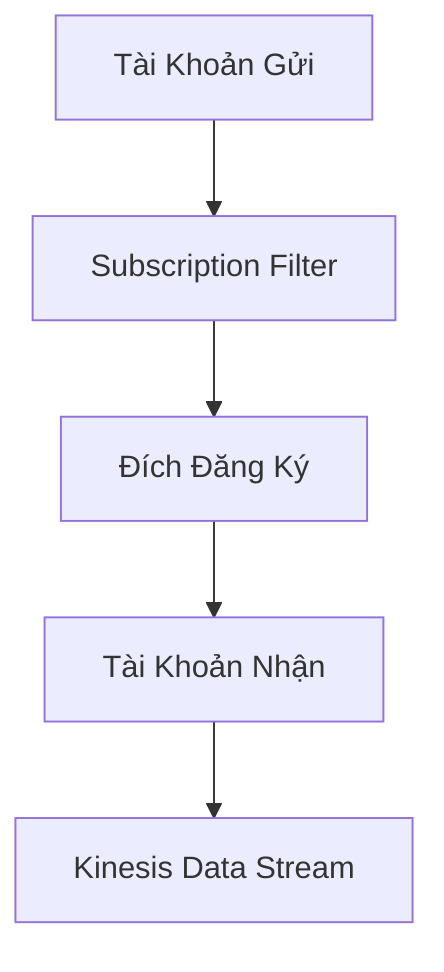

# Amazon CloudWatch Logs

## Cấu Trúc Logs

### Khái Niệm Cơ Bản
- **Log Groups**: Nhóm logs của ứng dụng
- **Log Streams**: Các phiên bản log cụ thể
- **Chính Sách Lưu Trữ**: 1 ngày đến 10 năm

## Các Nguồn Logs

### Dịch Vụ Hỗ Trợ
- SDK và Agents
- Elastic Beanstalk
- ECS Containers
- Lambda Functions
- VPC Flow Logs
- API Gateway
- CloudTrail
- Route53

## Phương Thức Thu Thập

### Agents
- **CloudWatch Unified Agent**: Được khuyến nghị
- **CloudWatch Logs Agent**: Đã lỗi thời

## Mã Hóa

### Bảo Mật
- Mã hóa mặc định
- Hỗ trợ KMS encryption tùy chọn

## CloudWatch Logs Insights

### Tính Năng Truy Vấn
- Truy vấn logs theo khoảng thời gian
- Trực quan hóa kết quả
- Ngôn ngữ truy vấn chuyên dụng

### Khả Năng
- Truy vấn nhiều nhóm logs
- Hỗ trợ nhiều tài khoản
- Không phải truy vấn thời gian thực

## Xuất Logs

### Phương Thức Xuất

1. **Batch Export (Amazon S3)**
   - Thời gian xuất: Lên đến 12 giờ
   - Lệnh: `CreateExportTask`

2. **Subscription (Streaming)**
   - Streaming gần thời gian thực
   - Đích:
     - Kinesis Data Streams
     - Kinesis Data Firehose
     - Lambda

### Tích Hợp Đa Tài Khoản

#### Quy Trình
- Tạo subscription filter
- Tạo đích đăng ký
- Cấu hình chính sách truy cập
- Tạo IAM role

## Thực Hành Tốt Nhất

- Sử dụng Unified Agent
- Cấu hình chính sách lưu trữ phù hợp
- Sử dụng Logs Insights cho phân tích
- Cân nhắc streaming cho xử lý thời gian thực

## Kết Luận

Amazon CloudWatch Logs cung cấp giải pháp toàn diện để thu thập, lưu trữ, phân tích và xuất logs trong môi trường đám mây AWS.