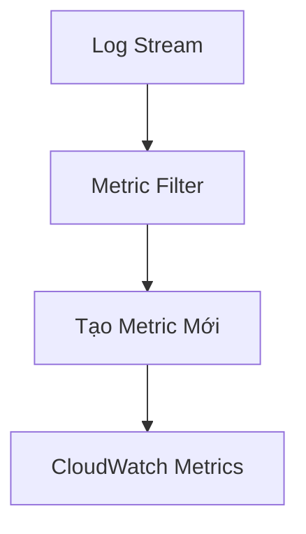
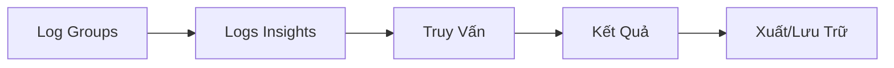

# Hướng Dẫn Thực Hành CloudWatch Logs

## Khám Phá Log Groups

### Nguồn Log Groups
- Tự động tạo bởi dịch vụ AWS
- Ví dụ:
  - Lambda
  - DataSync
  - Glue
  - Systems Manager (SSM)

## Cấu Trúc Log Streams

### Đặc Điểm
- Nhiều stream trong mỗi log group
- Mỗi stream đại diện cho một phiên/instance cụ thể
- Hỗ trợ stdout và stderr

## Khám Phá và Lọc Logs

### Kỹ Thuật Tìm Kiếm
- Tìm kiếm từ khóa
- Ví dụ: 
  - Tìm "http"
  - Tìm "installing"

## Metric Filters

### Quy Trình Tạo
1. Chọn mẫu lọc
2. Chọn log stream
3. Kiểm tra kết quả phù hợp

### Cấu Hình Metric Filter
- Đặt tên namespace
- Chọn giá trị metric
- Đơn vị tính

## Cảnh Báo (Alarms)

### Tạo Cảnh Báo
- Dựa trên metric filter
- Đặt ngưỡng cảnh báo
- Tích hợp với các hành động thông báo

## Subscription Filters

### Đích Hỗ Trợ
- Elasticsearch
- Kinesis Data Streams
- Kinesis Firehose
- Lambda

### Giới Hạn
- Tối đa 2 subscription filter/log group

## Cài Đặt Lưu Trữ

### Tùy Chọn Lưu Trữ
- Không giới hạn
- Lên đến 10 năm (120 tháng)

## Xuất Logs

### Phương Thức Xuất
- Xuất sang Amazon S3
- Tùy chọn:
  - Phạm vi thời gian
  - Prefix log stream
  - Chọn S3 bucket

## CloudWatch Logs Insights

### Tính Năng Truy Vấn
- Ngôn ngữ truy vấn chuyên dụng
- Phạm vi truy vấn lên đến 60 ngày

### Ví Dụ Truy Vấn Mẫu
- Thống kê độ trễ Lambda
- Top 10 địa chỉ IP VPC flow logs

## Mã Hóa Log Group

### Tùy Chọn Bảo Mật
- Sử dụng khóa KMS
- Bảo vệ thông tin nhạy cảm

## Thực Hành Tốt Nhất

- Kiểm tra và quản lý log groups thường xuyên
- Sử dụng metric filters để giám sát
- Cấu hình cảnh báo kịp thời
- Xuất logs cho phân tích sâu

## Kết Luận

CloudWatch Logs cung cấp công cụ mạnh mẽ để quản lý, giám sát và phân tích nhật ký hệ thống trong môi trường AWS.