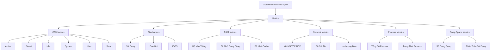
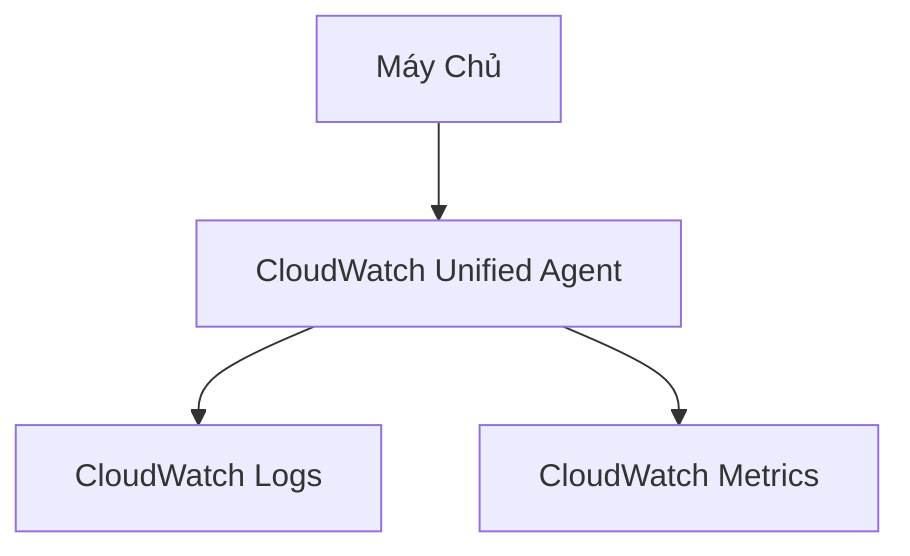

# CloudWatch Agents

## Chi Tiết Metrics Thu Thập

[Phần còn lại của tài liệu giữ nguyên như phiên bản trước]# CloudWatch Agents

## Tổng Quan

### Mục Đích
- Thu thập logs và metrics từ máy chủ
- Đẩy dữ liệu vào CloudWatch

## Yêu Cầu Cơ Bản

### Điều Kiện
- Cần IAM role cho phép gửi logs
- Áp dụng cho:
  - EC2 instances
  - Máy chủ tại chỗ

## Các Loại Agent

### 1. CloudWatch Logs Agent (Cũ)
- Chỉ gửi logs
- Chức năng hạn chế

### 2. CloudWatch Unified Agent (Mới)
- Gửi cả logs và metrics
- Cấu hình tập trung qua SSM Parameter Store

## Metrics Chi Tiết

### Các Loại Metrics Thu Thập

#### CPU Metrics
- Trạng thái chi tiết:
  - Active
  - Guest
  - Idle
  - System
  - User
  - Steal

#### Disk Metrics
- Sử dụng ổ đĩa
- Số lần đọc/ghi
- IOPS

#### RAM Metrics
- Bộ nhớ trống
- Bộ nhớ đang sử dụng
- Bộ nhớ cache

#### Network Metrics
- Kết nối TCP/UDP
- Số lượng gói tin
- Lưu lượng byte

#### Process Metrics
- Tổng số process
- Trạng thái process:
  - Chết
  - Bị chặn
  - Nhàn rỗi
  - Đang chạy
  - Ngủ

#### Swap Space Metrics
- Sử dụng bộ nhớ swap
- Phần trăm sử dụng

## So Sánh Giám Sát

### Giám Sát Mặc Định EC2
- CPU
- Disk
- Network

### Giám Sát Unified Agent
- Chi tiết hơn
- Bổ sung:
  - Memory
  - Swap
  - Process
  - Granular metrics

## Thực Hành Tốt Nhất

- Sử dụng Unified Agent
- Cấu hình IAM role phù hợp
- Giám sát metrics quan trọng
- Cấu hình tập trung qua SSM

## Kết Luận

CloudWatch Unified Agent cung cấp giải pháp giám sát toàn diện, chi tiết cho hạ tầng máy chủ trong môi trường AWS.