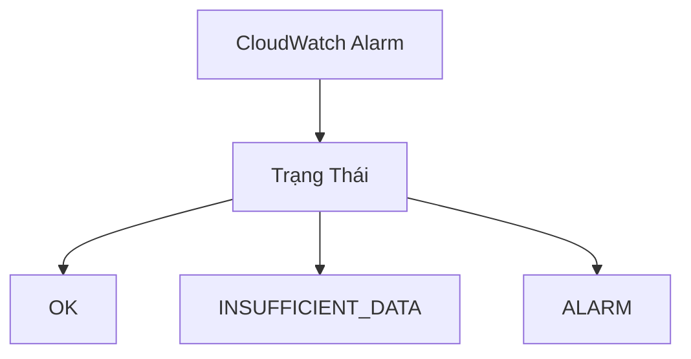
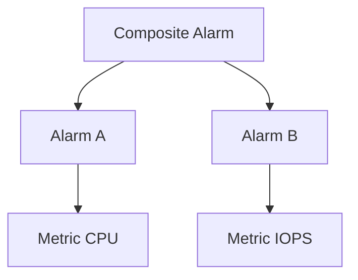

# AWS CloudWatch Alarms

## Tổng Quan

### Định Nghĩa
CloudWatch Alarms là công cụ giám sát và cảnh báo dựa trên các metric trong môi trường AWS.

## Trạng Thái Alarm

### Các Trạng Thái Chính
1. **OK**: Không vi phạm ngưỡng
2. **INSUFFICIENT_DATA**: Không đủ dữ liệu để đánh giá
3. **ALARM**: Đã vượt quá ngưỡng cảnh báo

## Cấu Hình Alarm

### Thời Gian Đánh Giá
- Linh hoạt: Từ 10 giây đến bội số của 60 giây
- Hỗ trợ metric độ phân giải cao

### Mục Tiêu Hành Động

#### 1. Hành Động EC2
- Dừng instance
- Chấm dứt instance
- Khởi động lại
- Khôi phục instance

#### 2. Hành Động Auto Scaling
- Mở rộng (scale out)
- Thu hẹp (scale in)

#### 3. Thông Báo
- Gửi thông báo qua SNS
- Kích hoạt Lambda function

## Composite Alarms

### Khái Niệm
- Kết hợp nhiều alarm
- Sử dụng điều kiện AND/OR

### Lợi Ích
- Giảm thiểu cảnh báo nhiễu
- Tạo điều kiện phức tạp
- Linh hoạt trong giám sát

## Kiểm Tra Trạng Thái EC2

### Các Loại Kiểm Tra
1. **Instance Status Check**
   - Kiểm tra máy ảo EC2
2. **System Status Check**
   - Kiểm tra phần cứng
3. **EBS Volume Status Check**
   - Kiểm tra ổ đĩa đính kèm

### Khôi Phục Instance
- Giữ nguyên địa chỉ IP
- Giữ nguyên metadata
- Giữ nguyên placement group

## Tích Hợp Với Logs

### Metric Filters
- Tạo alarm từ log metric
- Ví dụ: Cảnh báo khi có từ "error"

## Kiểm Tra Alarm

### Công Cụ Kiểm Tra
- Sử dụng lệnh `set-alarm-state` CLI
- Kiểm tra hành động khi alarm được kích hoạt

## Thực Hành Tốt Nhất

- Đặt ngưỡng cảnh báo phù hợp
- Sử dụng Composite Alarms cho giám sát phức tạp
- Kiểm tra và tinh chỉnh thường xuyên
- Tích hợp với các hành động tự động

## Kết Luận

CloudWatch Alarms cung cấp giải pháp giám sát và ứng phó linh hoạt, giúp duy trì hiệu suất và tính sẵn sàng của hạ tầng AWS.