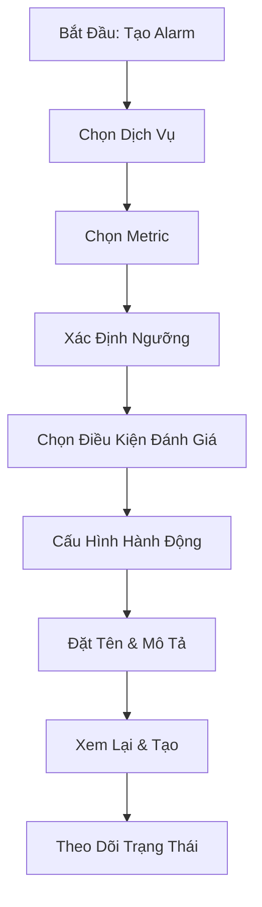
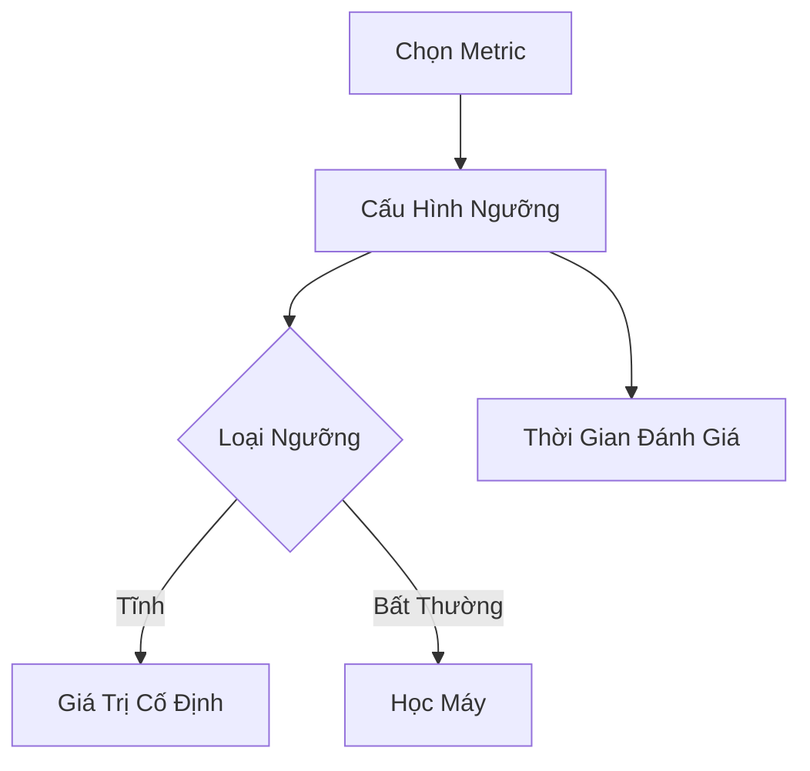

# Hướng Dẫn Thực Hành: Tạo CloudWatch Alarm

## Quy Trình Tạo Alarm Chi Tiết



[Phần còn lại của tài liệu giữ nguyên như phiên bản trước]# Hướng Dẫn Thực Hành: Tạo CloudWatch Alarm

## Quy Trình Tạo Alarm

### Bước 1: Chọn Metric
- Định vị metric cụ thể (VD: CPU Utilization)
- Lọc theo instance ID
- Xác nhận metric mong muốn

### Bước 2: Cấu Hình Ngưỡng Alarm

#### Tùy Chọn Ngưỡng
- **Loại Ngưỡng**: 
  - Tĩnh (Static)
  - Phát hiện bất thường (Anomaly detection)

#### Điều Kiện Cảnh Báo
- Chọn toán tử so sánh (>, <, =)
- Xác định giá trị ngưỡng
- Thiết lập điều kiện đánh giá



### Bước 3: Hành Động Alarm

#### Các Loại Hành Động
- EC2 Actions
  - Dừng instance
  - Chấm dứt instance
  - Khôi phục instance
- Auto Scaling Actions
- Thông Báo SNS

## Kiểm Tra Trạng Thái Alarm

### Phương Pháp Kiểm Tra

#### Phương Thức 1: Chờ Đợi Tự Nhiên
- Đợi metric đạt ngưỡng
- Quan sát trạng thái thay đổi

#### Phương Thức 2: AWS CLI
- Sử dụng lệnh `set-alarm-state`
- Kiểm tra hành động của alarm

```bash
aws cloudwatch set-alarm-state \
    --alarm-name "TênAlarm" \
    --state-value ALARM \
    --state-reason "Kiểm tra hành động"
```

### Trạng Thái Alarm
- **OK**: Bình thường
- **INSUFFICIENT_DATA**: Chưa đủ dữ liệu
- **ALARM**: Vượt ngưỡng

## Lưu Ý Quan Trọng

### Thời Gian Đánh Giá
- Mặc định: 5 phút
- Có thể điều chỉnh
- Phụ thuộc vào chế độ giám sát

### Giám Sát Chi Tiết
- Bật giám sát chi tiết để có dữ liệu mỗi 1 phút
- Hữu ích cho các ứng dụng nhạy cảm

## Thực Hành Tốt Nhất

- Đặt ngưỡng phù hợp
- Kiểm tra và tinh chỉnh thường xuyên
- Kết hợp nhiều metric
- Sử dụng Composite Alarms

## Kết Luận

CloudWatch Alarm cung cấp giải pháp giám sát linh hoạt, cho phép tự động hóa các hành động ứng phó với các sự kiện hệ thống.