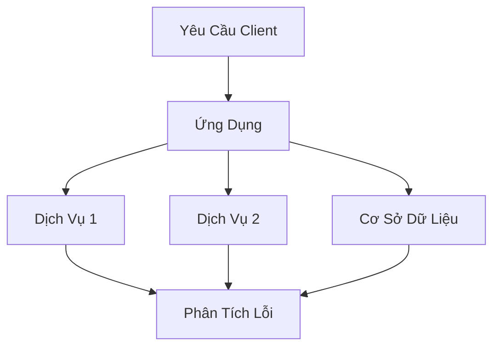
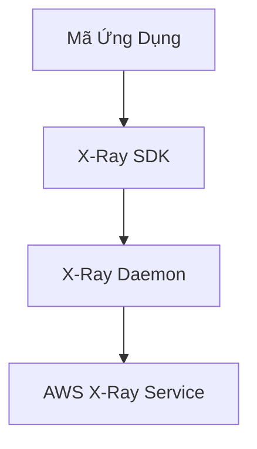

# AWS X-Ray: Giải Pháp Truy Vết Ứng Dụng

## Vấn Đề Trước Khi Có X-Ray

### Thách Thức Gỡ Lỗi Truyền Thống
- Thêm log ở mọi nơi
- Triển khai lại ứng dụng
- Khó khăn trong phân tích logs
- Phức tạp với kiến trúc microservices

## Giới Thiệu AWS X-Ray

### Mục Đích
- Phân tích trực quan ứng dụng
- Theo dõi luồng yêu cầu giữa các dịch vụ
- Xác định điểm nghẽn và lỗi

## Ưu Điểm Chính

### Khả Năng Truy Vết
- Xác định hiệu suất
- Hiểu rõ phụ thuộc giữa các dịch vụ
- Định vị điểm lỗi
- Đánh giá SLA
- Phân tích tác động người dùng

## Tương Thích Dịch Vụ

### Hỗ Trợ
- AWS Lambda
- Elastic Beanstalk
- ECS
- Elastic Load Balancers
- API Gateway
- EC2
- Ứng dụng on-premise

## Nguyên Lý Hoạt Động

### Khái Niệm Truy Vết (Tracing)
- Theo dõi yêu cầu từ đầu đến cuối
- Mỗi thành phần thêm đoạn (segment)
- Hỗ trợ phân đoạn phụ (sub-segment)

### Cấu Trúc Trace
- Theo dõi phần trăm yêu cầu
- Giới hạn số lượng trace

## Bảo Mật

### Các Lớp Bảo Vệ
- Ủy quyền IAM
- Mã hóa KMS

## Cài Đặt và Kích Hoạt

### Yêu Cầu Kỹ Thuật
1. **Mã Nguồn**
   - Ngôn ngữ: Java, Python, Go, Node.js, .NET
   - Nhập AWS SDK
   - Tích hợp X-Ray SDK

2. **X-Ray Daemon**
   - Chương trình chặn gói UDP
   - Hỗ trợ Linux, Windows, Mac
   - Tự động với dịch vụ AWS

### Cấu Hình EC2
- Cài đặt X-Ray daemon
- Cấu hình IAM role
- Gửi trace mỗi giây

### Cấu Hình Lambda
- IAM execution role
- Nhập X-Ray SDK
- Kích hoạt active tracing

## Khắc Phục Sự Cố

### Các Vấn Đề Thường Gặp
- Thiếu quyền IAM
- Daemon chưa chạy
- SDK chưa được tích hợp đúng

## Ưu Điểm Độc Đáo
- Đồ họa trực quan
- Dễ hiểu ngay cả với phi kỹ thuật
- Phân tích toàn diện

## Kết Luận

AWS X-Ray là giải pháp mạnh mẽ giúp hiểu rõ hành vi và hiệu suất của ứng dụng phân tán, cung cấp cái nhìn sâu sắc về kiến trúc hệ thống.