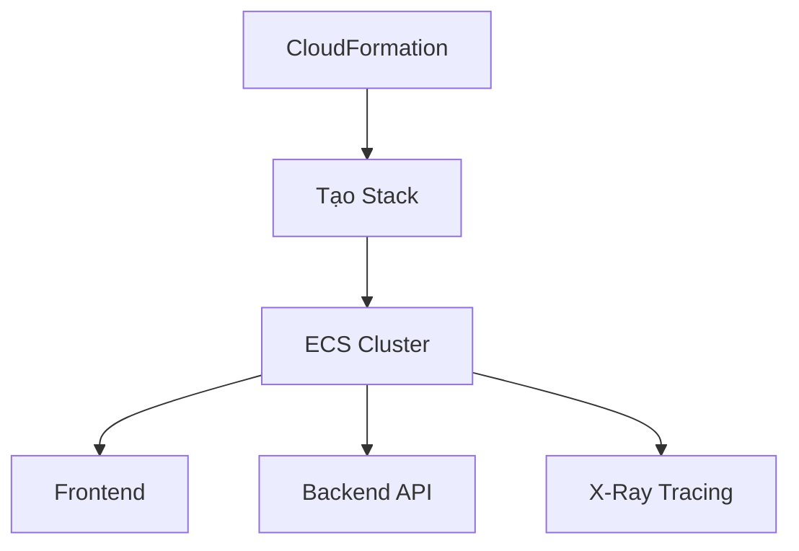
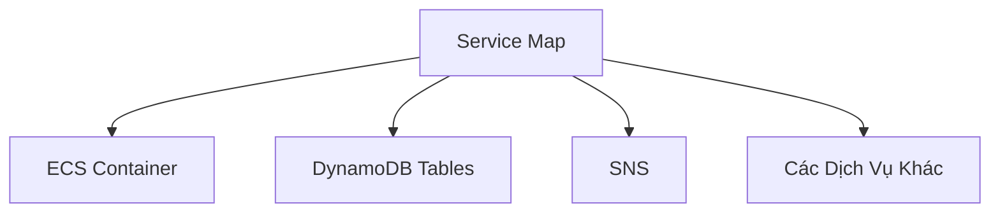

# Hướng Dẫn Thực Hành AWS X-Ray

## Chuẩn Bị Môi Trường

### Bước 1: Triển Khai Ứng Dụng Mẫu
- Sử dụng CloudFormation
- Template: EB Javas Scorekeep X-Ray simplified
- Cấu hình:
  - Chọn subnet
  - Xác định VPC ID

## Khám Phá Giao Diện X-Ray

### Vị Trí
- Nằm trong CloudWatch console
- Mục: Service Map

### Các Thành Phần Chính
- Service Map
- Traces
- Chi tiết phân tích

## Thực Hành Theo Dõi

### Tạo Hoạt Động
- Chơi game mẫu (Tic Tac Toe)
- Tạo và thực hiện game

### Phân Tích Service Map

#### Khám Phá Phụ Thuộc
- Các dịch vụ liên quan
- Mối quan hệ giữa các thành phần
- Điểm lỗi (màu cam/đỏ)

## Phân Tích Traces

### Truy Vấn Traces
- Lọc theo dịch vụ
- Phân tích chi tiết từng trace

### Thông Tin Chi Tiết
- Thời gian phản hồi
- Chi tiết API call
- Phân phối độ trễ

## Kỹ Thuật Phân Tích Sâu

### Phân Tích Lỗi
- Xác định điểm lỗi
- Chi tiết segment
- Thông tin metadata

### Theo Dõi Hiệu Suất
- So sánh thời gian phản hồi
- Xác định điểm nghẽn

## Lưu Ý Quan Trọng

### Hạn Chế Hiện Tại
- Giao diện mới còn hạn chế
- Một số tính năng chưa có

### Dọn Dẹp
- Xóa CloudFormation stack
- Giải phóng tài nguyên

## Thực Hành Tốt Nhất

- Áp dụng X-Ray cho nhiều dịch vụ
- Phân tích thường xuyên
- Sử dụng sampling linh hoạt
- Kết hợp với CloudWatch Logs

## Kết Luận

AWS X-Ray cung cấp cái nhìn toàn diện về hoạt động ứng dụng, giúp phát hiện và khắc phục vấn đề một cách hiệu quả.