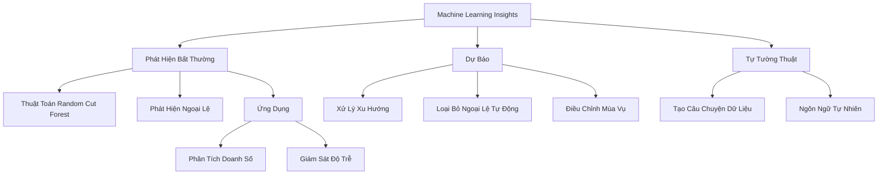
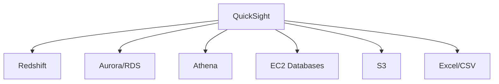

# Amazon QuickSight: Công Cụ Phân Tích Dữ Liệu Đám Mây

## Machine Learning Insights Chi Tiết

[Phần còn lại của tài liệu giữ nguyên như phiên bản trước]# Amazon QuickSight: Công Cụ Phân Tích Dữ Liệu Đám Mây

## Tổng Quan

### Định Nghĩa
- Dịch vụ phân tích và trực quan hóa dữ liệu đám mây
- Ứng dụng không dành cho kỹ thuật viên
- Phù hợp cho người dùng kinh doanh

## Đặc Điểm Chính

### Khả Năng Kết Nối
- Nguồn dữ liệu đa dạng:
  - Amazon Redshift
  - Aurora, RDS
  - Athena
  - EC2 hosted databases
  - S3
  - Excel
  - CSV/TSV
  - IoT Analytics

## Công Nghệ Nền Tảng

### SPICE (Super-fast Parallel In-memory Calculation Engine)
- Công nghệ tăng tốc truy vấn
- Các kỹ thuật:
  - Lưu trữ cột
  - Tính toán trong bộ nhớ
  - Sinh mã máy

### Giới Hạn
- 10GB bộ nhớ SPICE/người dùng
- Khả năng mở rộng lên đến hàng trăm nghìn người dùng

## Tính Năng Máy Học

### Machine Learning Insights
1. **Phát Hiện Bất Thường**
   - Sử dụng thuật toán Random Cut Forest
   - Phát hiện ngoại lệ trong dữ liệu

2. **Dự Báo**
   - Hỗ trợ xu hướng và mùa vụ
   - Loại bỏ ngoại lệ tự động

3. **Tự Tường Thuật**
   - Tạo câu chuyện dữ liệu bằng ngôn ngữ tự nhiên

## QuickSight Q

### Truy Vấn Bằng Ngôn Ngữ Tự Nhiên
- Trả lời câu hỏi kinh doanh
- Yêu cầu đào tạo chuyên sâu
- Cấu hình chủ đề dữ liệu

## Báo Cáo Trang

### Tính Năng Mới
- Báo cáo nhiều trang
- Định dạng chuyên nghiệp
- Phù hợp in ấn cho ban quản lý

## Bảo Mật

### Các Lớp Bảo Vệ
- Xác thực đa yếu tố
- Kết nối VPC
- Bảo mật cấp hàng
- Bảo mật cấp cột (ở phiên bản doanh nghiệp)

### Quản Lý Người Dùng
- Tích hợp IAM
- Đăng nhập qua email
- Hỗ trợ SAML SSO
- Tích hợp Active Directory

## Định Giá

### Các Phiên Bản
- Tiêu Chuẩn
- Doanh Nghiệp
- Doanh Nghiệp với Q

### Yếu Tố Gia Tăng Chi Phí
- Số lượng người dùng
- Dung lượng SPICE
- Tính năng bổ sung

## Hạn Chế

- Không phù hợp cho ETL nặng
- Các tính năng máy học còn hạn chế

## Kết Luận

Amazon QuickSight là công cụ phân tích dữ liệu mạnh mẽ, thân thiện với người dùng, cung cấp khả năng trực quan hóa và insights nhanh chóng.