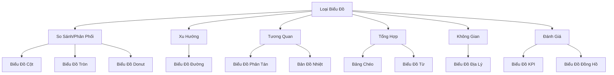

# Các Loại Biểu Đồ trong Amazon QuickSight

## Tổng Quan các Loại Biểu Đồ

[Phần còn lại của tài liệu giữ nguyên như phiên bản trước]# Các Loại Biểu Đồ trong Amazon QuickSight

## Tổng Quan

### Mục Tiêu
- Trực quan hóa dữ liệu
- Hiển thị mối quan hệ và xu hướng
- Hỗ trợ phân tích kinh doanh

## Các Loại Biểu Đồ

### 1. Biểu Đồ Cột (Bar Charts)
- **Mục Đích**: So sánh và phân phối dữ liệu
- **Kiểu**:
  - Dọc
  - Ngang
- **Ứng Dụng**:
  - So sánh giá trị giữa các danh mục
  - Hiển thị phân phối dữ liệu

### 2. Biểu Đồ Đường (Line Charts)
- **Mục Đích**: Hiển thị xu hướng theo thời gian
- **Biến Thể**:
  - Đường đơn
  - Đường xếp chồng
  - Đường diện tích
- **Ứng Dụng**:
  - Theo dõi thay đổi
  - Phân tích xu hướng

### 3. Biểu Đồ Phân Tán (Scatter Plots)
- **Mục Đích**: Hiển thị tương quan
- **Đặc Điểm**:
  - Hiển thị điểm dữ liệu thô
  - Xác định mối quan hệ giữa hai biến
- **Ứng Dụng**:
  - Phân tích mối tương quan
  - Nhận diện nhóm dữ liệu

### 4. Bản Đồ Nhiệt (Heat Maps)
- **Mục Đích**: Hiển thị dữ liệu hai chiều bằng màu sắc
- **Đặc Điểm**:
  - Mã hóa màu theo giá trị
  - Hiển thị mật độ/cường độ
- **Ứng Dụng**:
  - Phân tích gen
  - So sánh đa chiều

### 5. Biểu Đồ Tròn (Pie Charts)
- **Mục Đích**: Tổng hợp và so sánh
- **Đặc Điểm**:
  - Hiển thị tỷ lệ phần trăm
  - Các phần được biểu diễn bằng các góc
- **Ứng Dụng**:
  - So sánh tỷ lệ
  - Hiển thị cấu phần

### 6. Biểu Đồ Donut
- **Mục Đích**: So sánh phần trăm
- **Đặc Điểm**:
  - Tương tự biểu đồ tròn
  - Có lỗ trống ở giữa
- **Ứng Dụng**:
  - Hiển thị tỷ lệ phần trăm
  - Nhấn mạnh tổng thể

### 7. Bảng Chéo (Pivot Tables)
- **Mục Đích**: Tổng hợp dữ liệu đa chiều
- **Đặc Điểm**:
  - Linh hoạt trong tổng hợp
  - Áp dụng hàm thống kê
- **Ứng Dụng**:
  - Phân tích doanh số
  - Tổng hợp dữ liệu phức tạp

### 8. Biểu Đồ Địa Lý (Geospatial Charts)
- **Mục Đích**: Hiển thị dữ liệu trên bản đồ
- **Đặc Điểm**:
  - Kích thước điểm biểu thị giá trị
  - Hỗ trợ phân tích vị trí
- **Ứng Dụng**:
  - Phân bố dân số
  - Phân tích địa lý kinh doanh

### 9. Biểu Đồ Từ (Word Clouds)
- **Mục Đích**: Hiển thị tần suất từ
- **Đặc Điểm**:
  - Kích thước từ theo tần suất
  - Trực quan hóa văn bản
- **Ứng Dụng**:
  - Phân tích văn bản
  - Hiển thị từ khóa phổ biến

### 10. Biểu Đồ KPI
- **Mục Đích**: So sánh giá trị với mục tiêu
- **Đặc Điểm**:
  - Hiển thị giá trị thực tế
  - So sánh với mục tiêu
- **Ứng Dụng**:
  - Theo dõi hiệu suất
  - Đánh giá tiến độ

### 11. Biểu Đồ Đồng Hồ (Gauge Charts)
- **Mục Đích**: Hiển thị mức độ
- **Đặc Điểm**:
  - Giống đồng hồ ô tô
  - Hiển thị giá trị so với phạm vi
- **Ứng Dụng**:
  - Theo dõi mức sử dụng
  - Đánh giá tiến độ

## Kết Luận

Mỗi loại biểu đồ đều có ưu điểm và ứng dụng riêng. Việc chọn biểu đồ phù hợp phụ thuộc vào loại dữ liệu và mục tiêu phân tích.