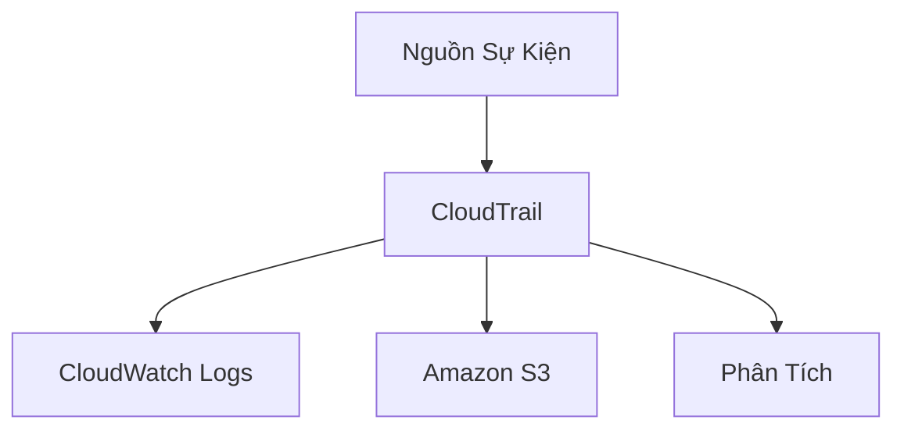
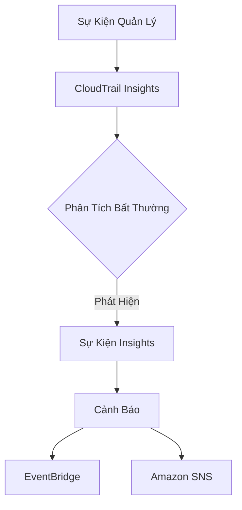

# AWS CloudTrail: Giải Pháp Kiểm Toán và Quản Trị

## Tổng Quan

### Định Nghĩa
- Dịch vụ kiểm toán và tuân thủ cho tài khoản AWS
- Ghi lại lịch sử sự kiện và lệnh API

## Đặc Điểm Chính

### Phạm Vi Ghi Nhận
- Hoạt động từ:
  - Giao diện quản trị
  - SDK
  - CLI
  - Các dịch vụ AWS khác
- Bật mặc định

## Các Loại Sự Kiện

### 1. Sự Kiện Quản Lý (Management Events)
- **Mục Đích**: Theo dõi thao tác trên tài nguyên
- **Phân Loại**:
  - Sự kiện đọc (Read Events)
  - Sự kiện ghi (Write Events)

#### Ví Dụ
- Gắn chính sách IAM
- Tạo subnet
- Cấu hình logging

### 2. Sự Kiện Dữ Liệu (Data Events)
- **Mặc Định**: Không được ghi nhận
- **Khối Lượng Cao**
- **Ví Dụ**:
  - Hoạt động cấp đối tượng S3
  - Hoạt động Lambda

### 3. Sự Kiện Insights (CloudTrail Insights)
- **Mục Đích**: Phát hiện hoạt động bất thường
- **Phương Thức**:
  - Phân tích sự kiện quản lý
  - Xác định mẫu bất thường

## Phân Tích Insights

### Các Điểm Phát Hiện
- Cung cấp tài nguyên không chính xác
- Chạm giới hạn dịch vụ
- Loạt hành động IAM
- Khoảng trống bảo trì định kỳ

## Lưu Trữ Sự Kiện

### Chính Sách Lưu Trữ
- **Mặc Định**: 90 ngày
- **Giải Pháp Kéo Dài**:
  - Chuyển sang S3
  - Phân tích bằng Athena

## Tích Hợp

### Đích Xuất
- CloudWatch Logs
- Amazon S3
- Athena

## Thực Hành Tốt Nhất

- Kích hoạt ghi nhật ký đầy đủ
- Sao lưu sự kiện dài hạn
- Giám sát hoạt động bất thường
- Sử dụng Insights cho an ninh

## Kết Luận

AWS CloudTrail cung cấp giải pháp toàn diện để giám sát, kiểm toán và đảm bảo tuân thủ trong môi trường đám mây AWS.