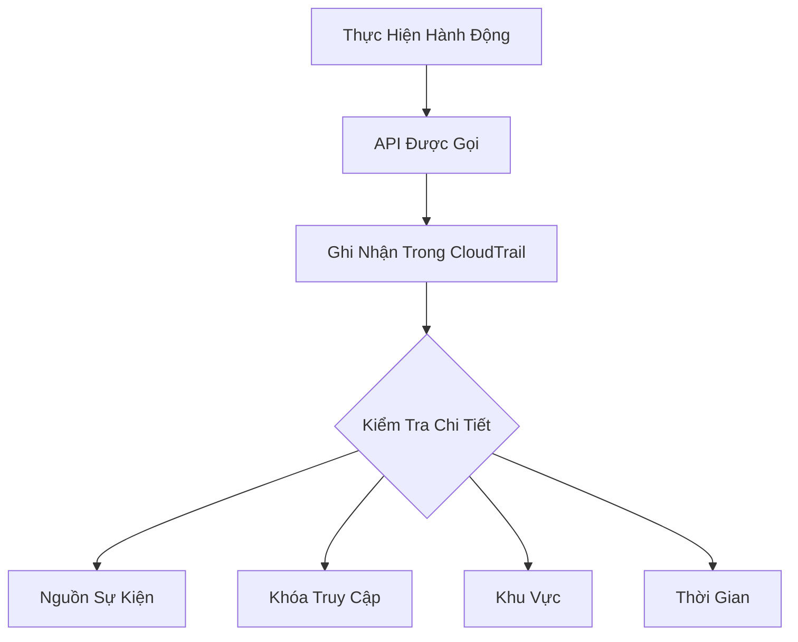
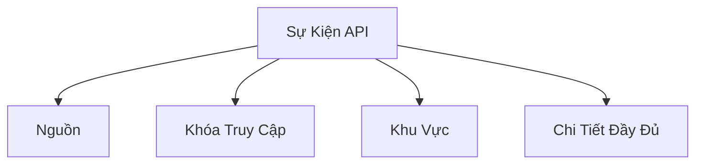

# Hướng Dẫn Thực Hành AWS CloudTrail

## Quy Trình Chi Tiết Theo Dõi Sự Kiện

[Phần còn lại của tài liệu giữ nguyên như phiên bản trước]# Hướng Dẫn Thực Hành AWS CloudTrail

## Khám Phá Lịch Sử Sự Kiện

### Tổng Quan
- Lưu trữ lịch sử API trong 90 ngày
- Ghi nhận mọi hoạt động trong tài khoản AWS

## Các Thành Phần Chính Trong Giao Diện

### Lịch Sử Sự Kiện (Event History)
- **Phạm Vi**: 90 ngày gần nhất
- **Thông Tin Chi Tiết**:
  - Nguồn sự kiện
  - Khóa truy cập
  - Khu vực
  - Chi tiết đầy đủ về sự kiện

## Quy Trình Theo Dõi Sự Kiện

### Ví Dụ Thực Tế: Chấm Dứt Máy Ảnh EC2

#### Bước 1: Thực Hiện Hành Động
- Chấm dứt máy ảnh EC2 từ giao diện

#### Bước 2: Kiểm Tra trong CloudTrail
- Đợi 5 phút
- Tìm kiếm sự kiện `terminate instances`

## Thông Tin Chi Tiết Sự Kiện

### Các Trường Quan Trọng
- Nguồn sự kiện (EC2)
- Khóa truy cập được sử dụng
- Khu vực thực hiện
- Toàn bộ chi tiết sự kiện

## Thực Hành Tốt Nhất

- Kiểm tra thường xuyên lịch sử sự kiện
- Xác minh các hành động quan trọng
- Sử dụng để điều tra và kiểm toán

## Kết Luận

CloudTrail cung cấp cái nhìn toàn diện về các hoạt động trong tài khoản AWS, hỗ trợ giám sát và bảo mật.