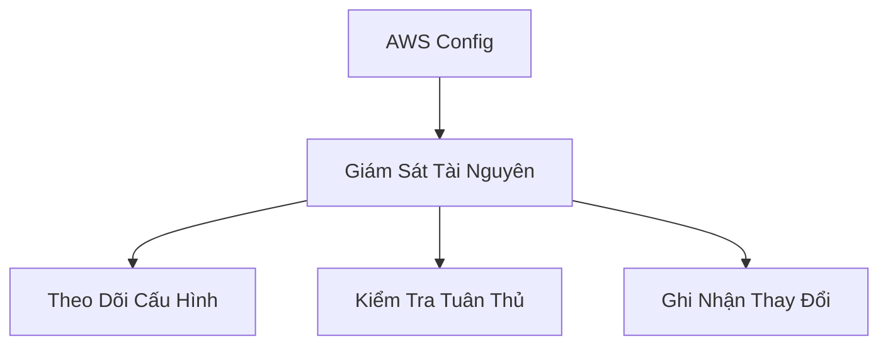
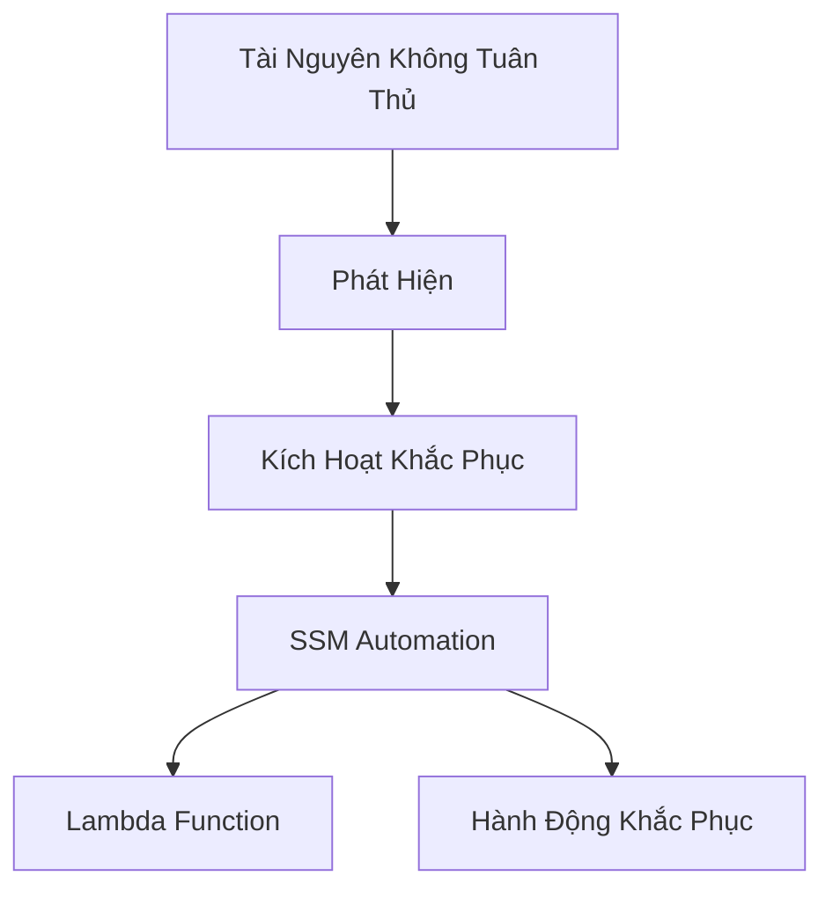

# AWS Config: Dịch Vụ Kiểm Toán và Tuân Thủ Tài Nguyên

## Tổng Quan

### Định Nghĩa
- Dịch vụ giám sát và ghi nhận tuân thủ tài nguyên AWS
- Theo dõi cấu hình và thay đổi theo thời gian

## Chức Năng Chính

### Các Câu Hỏi Giải Quyết
- Truy cập SSH không hạn chế
- Bucket công khai
- Thay đổi cấu hình Load Balancer

## Phạm Vi Dịch Vụ

### Đặc Điểm
- Dịch vụ theo khu vực
- Có thể tổng hợp dữ liệu từ nhiều khu vực/tài khoản
- Lưu trữ cấu hình tài nguyên

## Các Loại Quy Tắc

### 1. Quy Tắc Do AWS Quản Lý
- Trên 75 quy tắc sẵn có
- Bao phủ nhiều loại tài nguyên

### 2. Quy Tắc Tùy Chỉnh
- Sử dụng Lambda function
- Ví dụ:
  - Kiểm tra loại EBS
  - Kiểm tra loại EC2 instance

### Phương Thức Đánh Giá
- Khi cấu hình thay đổi
- Theo chu kỳ định kỳ

## Hạn Chế

### Điều Quan Trọng
- Chỉ kiểm tra tuân thủ
- Không ngăn chặn hành động
- Không thay thế các cơ chế bảo mật như IAM

## Chi Phí

### Định Giá
- 0.003 xu/mục cấu hình/khu vực
- 0.001 xu/đánh giá quy tắc/khu vực

## Tính Năng Nâng Cao

### Theo Dõi Tài Nguyên
- Xem lịch sử tuân thủ
- Liên kết với CloudTrail
- Xác định thay đổi và người thay đổi

## Khắc Phục Tự Động

### Phương Pháp
- Sử dụng SSM Automation Documents
- Ví dụ: Hủy khóa truy cập IAM quá hạn

### Tính Năng
- Thử lại nhiều lần
- Linh hoạt trong xử lý

## Thông Báo

### Kênh Thông Báo
- EventBridge
- SNS (Simple Notification Service)

### Tùy Chọn
- Thông báo toàn bộ sự kiện
- Lọc theo điều kiện
- Gửi đến email, Slack, v.v.

## Thực Hành Tốt Nhất

- Cấu hình cho nhiều khu vực
- Tạo quy tắc phù hợp
- Thiết lập khắc phục tự động
- Giám sát thường xuyên

## Kết Luận

AWS Config cung cấp giải pháp toàn diện để giám sát, đánh giá và duy trì tính tuân thủ của tài nguyên đám mây.