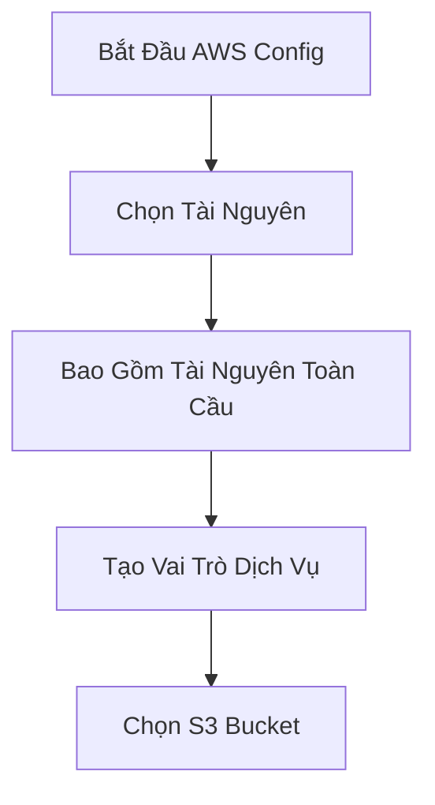
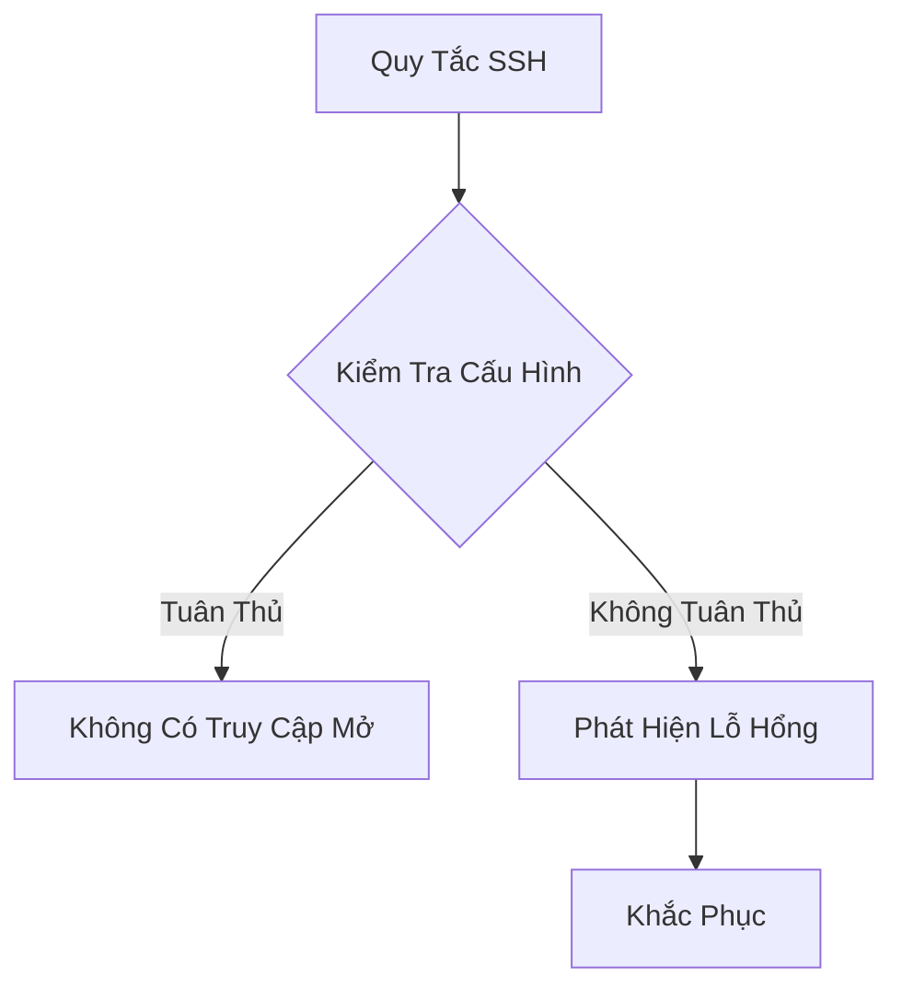

# Hướng Dẫn Thực Hành AWS Config

## Bắt Đầu Với AWS Config

### Bước 1: Bắt Đầu Cấu Hình
- Chọn "Get Started"
- Lựa chọn ghi nhận tài nguyên

### Các Tùy Chọn Cấu Hình
- Ghi nhận tất cả tài nguyên
- Tùy chọn tài nguyên toàn cầu
- Lưu trữ trong S3 Bucket

## Khám Phá Tài Nguyên

### Danh Sách Tài Nguyên
- Hiển thị các tài nguyên đã khám phá
- Lọc theo loại tài nguyên
- Xem trạng thái tuân thủ

## Quy Tắc Tuân Thủ

### Các Loại Quy Tắc
1. **Quy Tắc Do AWS Quản Lý**
   - Sẵn có trên 75 quy tắc
   - Dễ dàng áp dụng

2. **Quy Tắc Tùy Chỉnh**
   - Sử dụng Lambda function
   - Tùy biến theo nhu cầu

### Ví Dụ: Quy Tắc Bảo Mật SSH
- Kiểm tra truy cập SSH vào nhóm bảo mật
- Kích hoạt khi cấu hình thay đổi

## Quản Lý Tuân Thủ

### Theo Dõi Trạng Thái
- Xem chi tiết từng tài nguyên
- Kiểm tra lịch sử thay đổi
- Liên kết với CloudTrail

### Khắc Phục Tự Động
- Sử dụng SSM Automation Documents
- Cấu hình hành động khắc phục
- Tùy chọn thử lại

## Thông Báo và Tích Hợp

### Kênh Thông Báo
- Amazon SNS
- EventBridge
- CloudWatch Events

### Tích Hợp Đa Tài Khoản
- Sử dụng Aggregators
- Tập trung dữ liệu từ nhiều tài khoản

## Thực Hành Tốt Nhất

- Giới hạn ghi nhận tài nguyên
- Tạo quy tắc phù hợp
- Cấu hình khắc phục tự động
- Giám sát thường xuyên

## Lưu Ý Quan Trọng
- Theo dõi chi phí
- Kiểm tra kỹ quy tắc
- Cập nhật thường xuyên

## Kết Luận

AWS Config cung cấp giải pháp toàn diện để giám sát, đánh giá và duy trì tính tuân thủ tài nguyên đám mây.