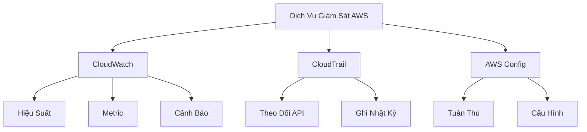

# So Sánh Dịch Vụ Giám Sát AWS

## Tổng Quan

## Chi Tiết Từng Dịch Vụ

### CloudWatch
- **Mục Đích**: Giám sát hiệu suất
- **Chức Năng**:
  - Theo dõi metric
  - Tạo dashboard
  - Cảnh báo
  - Phân tích log

#### Ví Dụ với Load Balancer
- Số kết nối đến
- Mã lỗi theo thời gian
- Dashboard hiệu suất

### CloudTrail
- **Mục Đích**: Ghi lại hoạt động API
- **Phạm Vi**: Toàn cầu
- **Chức Năng**:
  - Theo dõi người thực hiện
  - Chi tiết thay đổi
  - Kiểm toán bảo mật

#### Ví Dụ với Load Balancer
- Ai thay đổi chứng chỉ SSL
- Ai sửa nhóm bảo mật
- Chi tiết API call

### AWS Config
- **Mục Đích**: Quản lý cấu hình
- **Chức Năng**:
  - Theo dõi thay đổi cấu hình
  - Kiểm tra tuân thủ
  - Đánh giá quy tắc

#### Ví Dụ với Load Balancer
- Theo dõi thay đổi cấu hình
- Quy tắc về chứng chỉ SSL
- Kiểm tra lưu lượng mã hóa

## So Sánh Chi Tiết

| Tiêu Chí | CloudWatch | CloudTrail | AWS Config |
|----------|------------|------------|------------|
| **Mục Đích** | Hiệu Suất | API Tracking | Cấu Hình & Tuân Thủ |
| **Phạm Vi** | Metric & Log | Toàn Cầu | Theo Khu Vực |
| **Loại Dữ Liệu** | Metric, Log | API Calls | Cấu Hình Tài Nguyên |
| **Cảnh Báo** | Có | Không | Có |
| **Chi Phí** | Theo Metric | Theo Sự Kiện | Theo Tài Nguyên |

## Mối Quan Hệ Bổ Sung

### Tích Hợp
- Có thể kết hợp để có cái nhìn toàn diện
- Hỗ trợ nhau trong giám sát và bảo mật

### Ví Dụ Tổng Hợp: Load Balancer
1. **CloudWatch**: Giám sát hiệu suất
2. **CloudTrail**: Ghi lại thay đổi
3. **Config**: Kiểm tra tuân thủ

## Thực Hành Tốt Nhất

- Sử dụng kết hợp các dịch vụ
- Cấu hình cảnh báo
- Theo dõi thường xuyên
- Phân tích toàn diện

## Kết Luận

Mỗi dịch vụ đều có vai trò riêng, nhưng khi kết hợp sẽ cung cấp cái nhìn toàn diện và sâu sắc về hạ tầng AWS.