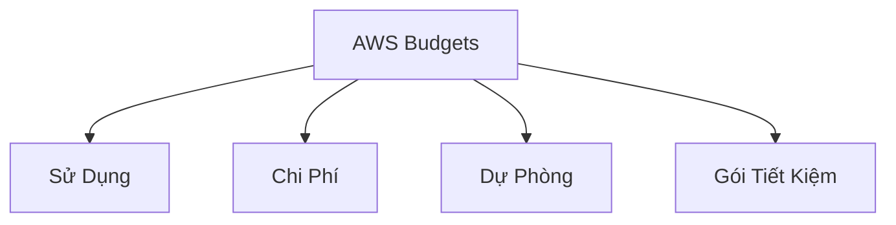
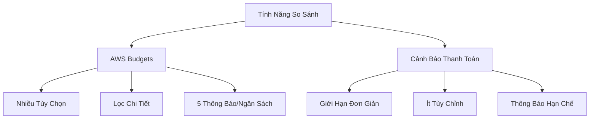

# AWS Budgets: Quản Lý Chi Phí Đám Mây

## Tổng Quan

### Định Nghĩa
- Công cụ quản lý và theo dõi chi phí AWS
- Tạo ngân sách dựa trên chi phí thực tế hoặc ước tính

## Các Loại Ngân Sách

### 1. Loại Ngân Sách
- Sử Dụng (Usage)
- Chi Phí (Cost)
- Dự Phòng (Reservation)
- Gói Tiết Kiệm (Savings Plan)

## Tính Năng Chi Tiết

### Theo Dõi Dự Phòng
- Giám sát mức sử dụng dự phòng
- Hỗ trợ dịch vụ:
  - EC2
  - ElastiCache
  - RDS
  - Redshift

### Thông Báo
- Tối đa 5 thông báo mỗi ngân sách
- Các tùy chọn lọc phong phú:
  - Dịch vụ
  - Tài khoản liên kết
  - Thẻ (Tag)
  - Tùy chọn mua hàng

## Ưu Điểm

### So Sánh Với Cảnh Báo Thanh Toán
- Chi tiết hơn
- Linh hoạt hơn
- Tùy chỉnh nâng cao

## Định Giá

### Chi Phí
- 2 ngân sách đầu tiên miễn phí
- 0.02 đô/ngày/ngân sách sau đó

## Thực Hành Tốt Nhất

### Quản Lý Ngân Sách
- Tạo ngân sách chi tiết
- Đặt ngưỡng cảnh báo phù hợp
- Theo dõi thường xuyên
- Sử dụng các tùy chọn lọc

### Chiến Lược
- Ngân sách theo dự án
- Ngân sách theo dịch vụ
- Ngân sách theo nhóm tài nguyên

## Kết Luận

AWS Budgets cung cấp giải pháp toàn diện để kiểm soát, giám sát và quản lý chi phí đám mây một cách chủ động và chi tiết.