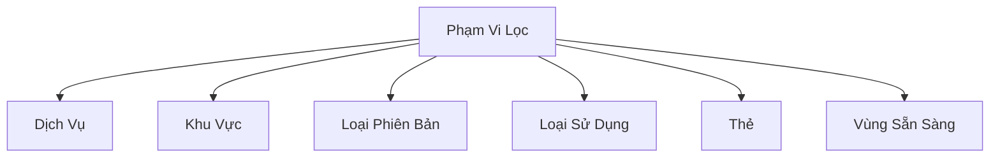
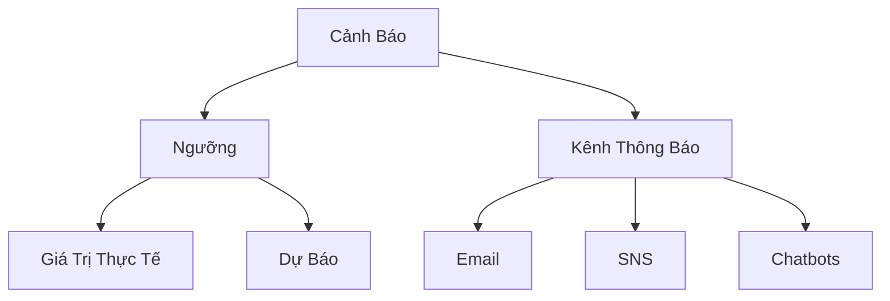

# Hướng Dẫn Thực Hành AWS Budgets

## Phạm Vi và Lọc Ngân Sách

### Các Tùy Chọn Lọc
- Dịch vụ AWS
- Khu vực
- Loại phiên bản
- Loại sử dụng
- Thẻ
- Vùng sẵn sàng

## Các Loại Chi Phí

### Tùy Chọn Tính Toán
- Chi phí không được giảm trừ
- Chi phí được phân bổ
- Chi phí được nhóm
- Loại phí (bao gồm hoàn tiền, tín dụng)

## Cấu Hình Cảnh Báo

### Ngưỡng Cảnh Báo
- Giá trị thực tế
- Dự báo chi phí
- Phần trăm ngân sách

### Kênh Thông Báo
- Email
- Amazon SNS
- Amazon Chatbots
  - Chime
  - Slack

## Hành Động Tự Động

### Các Tùy Chọn
- Gắn chính sách IAM
- Gắn Chính sách Điều khiển Dịch vụ (SCP)
- Dừng dịch vụ
  - EC2
  - RDS

### Yêu Cầu
- Vai trò IAM đặc biệt
- Quyền quản lý tài nguyên

## Các Loại Ngân Sách Chuyên Sâu

### 1. Ngân Sách Sử Dụng
- Theo nhóm loại sử dụng
- Ví dụ: Chuyển dữ liệu giữa các Availability Zone

### 2. Ngân Sách Gói Tiết Kiệm
- Theo dõi việc sử dụng
- Kiểm tra phạm vi bảo phủ

### 3. Ngân Sách Dự Phòng
- Theo dõi việc sử dụng dự phòng
- Kiểm tra phạm vi bảo phủ

## Thực Hành Tốt Nhất

- Tạo ngân sách chi tiết
- Đặt ngưỡng cảnh báo thực tế
- Sử dụng nhiều kênh thông báo
- Cấu hình hành động tự động
- Theo dõi thường xuyên

## Lưu Ý Quan Trọng
- 2 ngân sách đầu tiên miễn phí
- 0.02 đô/ngày/ngân sách sau đó
- Cần quyền IAM phù hợp

## Kết Luận

AWS Budgets cung cấp giải pháp toàn diện để quản lý, giám sát và kiểm soát chi phí đám mây một cách chủ động và chi tiết.