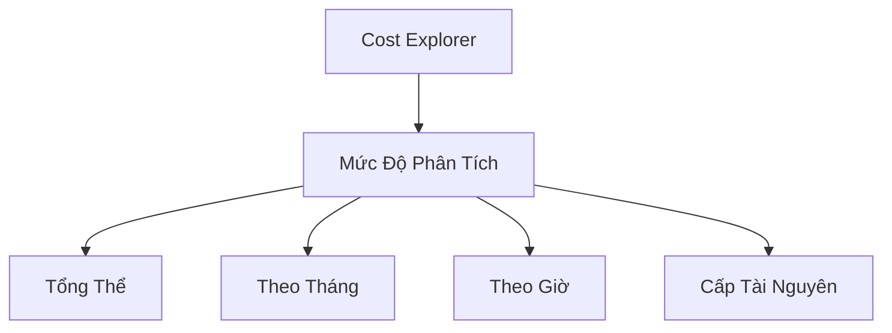
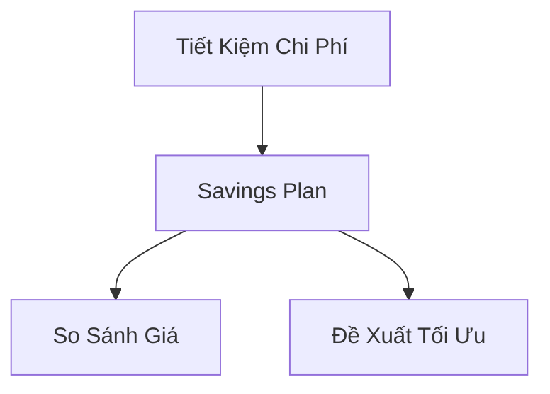

# AWS Cost Explorer: Quản Lý Chi Phí Đám Mây

## Tổng Quan

### Định Nghĩa
- Công cụ trực quan hóa và phân tích chi phí AWS
- Giúp hiểu và quản lý chi phí sử dụng

## Tính Năng Chính

### Phân Tích Chi Phí

#### Các Cấp Độ Chi Tiết
- Tổng chi phí trên toàn bộ tài khoản
- Phân tích theo tháng
- Chi tiết theo giờ
- Mức độ tài nguyên cụ thể

### Phân Tích Dịch Vụ

#### Ví Dụ Phân Tích
- Chi phí theo dịch vụ AWS
- So sánh chi phí giữa các loại phiên bản
- Đánh giá hiệu quả sử dụng tài nguyên

## Tính Năng Nâng Cao

### 1. Tiết Kiệm Chi Phí
- Đề xuất Savings Plan
- So sánh các phương án tiết kiệm

### 2. Dự Báo Chi Phí
- Dự đoán chi phí trong 12 tháng
- Dựa trên lịch sử sử dụng
- Hiển thị mức độ tin cậy

## Các Chế Độ Xem

### Biểu Đồ và Báo Cáo
- Chi phí theo dịch vụ
- Chi phí theo giờ
- Mức độ tài nguyên
- Dự báo chi phí

## Thực Hành Tốt Nhất

### Quản Lý Chi Phí
- Phân tích thường xuyên
- Kiểm tra hiệu quả sử dụng tài nguyên
- Xem xét các đề xuất tiết kiệm
- So sánh các phương án chi phí

### Chiến Lược
- Đánh giá kích thước phiên bản
- Theo dõi sử dụng theo giờ
- Cân nhắc Savings Plan
- Dự báo chi phí trong tương lai

## Lưu Ý Quan Trọng

- Công cụ duy nhất về thanh toán trong kỳ thi
- Cung cấp cái nhìn toàn diện về chi phí
- Hỗ trợ ra quyết định chiến lược

## Kết Luận

AWS Cost Explorer là công cụ quan trọng giúp doanh nghiệp hiểu rõ, quản lý và tối ưu hóa chi phí đám mây một cách hiệu quả.