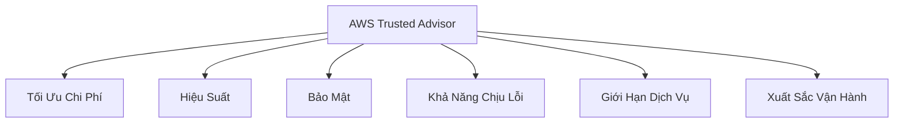
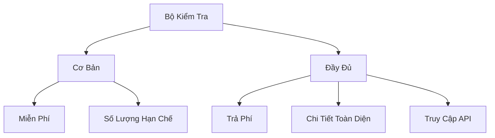

# AWS Trusted Advisor: Đánh Giá Tài Khoản AWS

## Tổng Quan

### Định Nghĩa
- Dịch vụ đánh giá tài khoản AWS
- Không cần cài đặt
- Cung cấp khuyến nghị và đánh giá toàn diện

## Danh Mục Kiểm Tra

### Sáu Nhóm Kiểm Tra Chính

### Chi Tiết Nhóm Kiểm Tra

#### 1. Tối Ưu Chi Phí
- Phân tích chi phí dư thừa
- Đề xuất tiết kiệm

#### 2. Hiệu Suất
- Kiểm tra cấu hình tài nguyên
- Khuyến nghị tối ưu hóa

#### 3. Bảo Mật
- Kiểm tra snapshot công khai
- Đánh giá nhóm bảo mật
- Kiểm tra sử dụng tài khoản gốc

#### 4. Khả Năng Chịu Lỗi
- Đánh giá kiến trúc dự phòng
- Khuyến nghị tăng tính sẵn sàng

#### 5. Giới Hạn Dịch Vụ
- Theo dõi giới hạn tài nguyên
- Cảnh báo sắp đạt giới hạn

#### 6. Xuất Sắc Vận Hành
- Đánh giá quy trình quản lý
- Đề xuất cải thiện

## Phạm Vi Kiểm Tra

### Bộ Kiểm Tra

#### 1. Bộ Kiểm Tra Cơ Bản (Miễn Phí)
- Số lượng kiểm tra hạn chế
- Tập trung vào bảo mật cơ bản

#### 2. Bộ Kiểm Tra Đầy Đủ (Trả Phí)
- Yêu cầu gói hỗ trợ Business/Enterprise
- Toàn diện và chi tiết hơn

## Các Tính Năng Nâng Cao

### Truy Cập Lập Trình
- Hỗ trợ AWS Support API
- Khả dụng với gói hỗ trợ Business/Enterprise

### Ví Dụ Kiểm Tra
- Snapshot EBS công khai
- Snapshot RDS công khai
- Sử dụng tài khoản gốc
- Quy tắc nhóm bảo mật
- Giới hạn dịch vụ Auto Scaling
- Dung lượng DynamoDB

## Thực Hành Tốt Nhất

- Kiểm tra thường xuyên
- Xem xét các khuyến nghị
- Nâng cấp gói hỗ trợ nếu cần
- Thực hiện các điều chỉnh được đề xuất

## Hạn Chế

- Bộ kiểm tra miễn phí hạn chế
- Các tính năng chi tiết yêu cầu trả phí
- Chỉ cung cấp khuyến nghị, không tự động khắc phục

## Kết Luận

AWS Trusted Advisor là công cụ quan trọng giúp tối ưu hóa, bảo mật và quản lý tài khoản AWS một cách hiệu quả.