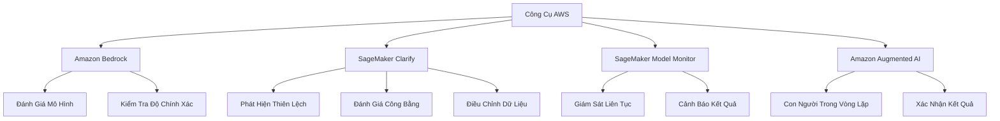
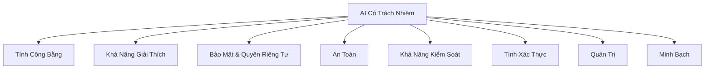

# Kiến Trúc AI Có Trách Nhiệm của AWS

## Công Cụ AWS cho AI Có Trách Nhiệm

[Phần còn lại của tài liệu giữ nguyên như phiên bản trước]# Kiến Trúc AI Có Trách Nhiệm của AWS

## Các Nguyên Tắc Cốt Lõi

### Chiều Kích Chính của AI Có Trách Nhiệm

## Chi Tiết Từng Nguyên Tắc

### 1. Tính Công Bằng
- Phát hiện và giảm thiểu thiên lệch
- Đảm bảo đối xử công bằng với mọi nhóm

### 2. Khả Năng Giải Thích
- Hiểu được quyết định của mô hình
- Theo dõi nguồn gốc kết quả
- Khả năng điều tra và sửa lỗi

### 3. Bảo Mật & Quyền Riêng Tư
- Ngăn chặn rò rỉ thông tin cá nhân
- Bảo vệ dữ liệu nhạy cảm
- Thiết lập rào chắn bảo mật

### 4. An Toàn
- Đảm bảo hệ thống hoạt động ổn định
- Ngăn ngừa kết quả bất ngờ
- Đánh giá rủi ro tiềm ẩn

### 5. Khả Năng Kiểm Soát
- Khả năng điều chỉnh hành vi mô hình
- Cung cấp các điều khiển linh hoạt
- Giám sát và điều chỉnh

### 6. Tính Xác Thực
- Đánh giá độ chính xác
- Quản lý hiện tượng ảo giác
- Xác định giới hạn chấp nhận được

### 7. Quản Trị
- Tuân thủ quy định
- Theo dõi hoạt động
- Báo cáo minh bạch

### 8. Minh Bạch
- Công bố năng lực và giới hạn
- Chia sẻ thông tin chi tiết về mô hình

## Công Cụ AWS Hỗ Trợ

### Amazon Bedrock
- Công cụ đánh giá mô hình tích hợp
- Kiểm tra độ chính xác

### SageMaker Clarify
- Phát hiện thiên lệch
- Đánh giá tính công bằng
- Điều chỉnh dữ liệu

### SageMaker Model Monitor
- Giám sát liên tục
- Cảnh báo kết quả không chính xác

### Amazon Augmented AI
- Đưa con người vào quy trình
- Kiểm tra và xác nhận kết quả

## Công Cụ Quản Trị

### SageMaker Quản Lý ML
- Quản lý vai trò người dùng
- Thẻ mô hình
- Bảng điều khiển mô hình

## Thực Hành Tốt Nhất

- Liên tục đánh giá
- Theo dõi các chỉ số
- Cập nhật và điều chỉnh
- Đảm bảo tính minh bạch

## Lưu Ý Quan Trọng
- AI không phải là không tưởng
- Luôn có rủi ro tiềm ẩn
- Cần quản lý và giám sát liên tục

## Kết Luận

Kiến trúc AI có trách nhiệm là nền tảng để phát triển các hệ thống AI đáng tin cậy, an toàn và công bằng.