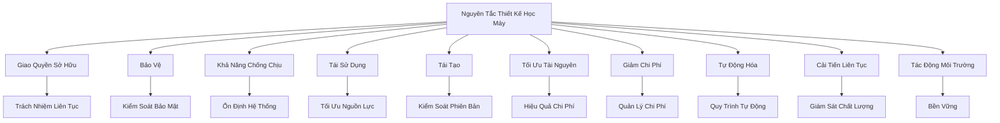
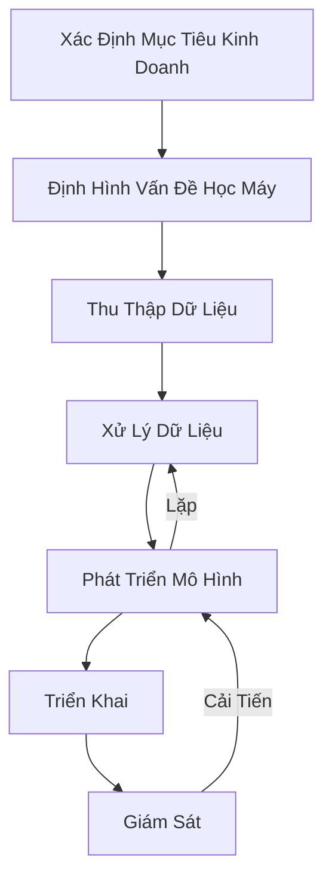

# Nguyên Tắc Thiết Kế Hệ Thống Học Máy của AWS

## Tổng Quan Các Nguyên Tắc

[Phần còn lại của tài liệu giữ nguyên như phiên bản trước]# Nguyên Tắc Thiết Kế Hệ Thống Học Máy của AWS

## Vòng Đời Phát Triển Học Máy

## Các Nguyên Tắc Chính

### 1. Giao Quyền Sở Hữu
- **Mục Tiêu**: Đảm bảo trách nhiệm liên tục
- **Thực Hành**:
  - Chỉ định chủ sở hữu hệ thống
  - Theo dõi thường xuyên
  - Ngăn chặn sự lãng quên

### 2. Bảo Vệ
- **Mục Tiêu**: Kiểm soát bảo mật
- **Thực Hành**:
  - Quản lý truy cập
  - Theo dõi luồng dữ liệu
  - Bảo vệ thông tin nhạy cảm

### 3. Khả Năng Chống Chịu
- **Mục Tiêu**: Đảm bảo tính ổn định
- **Thực Hành**:
  - Chịu lỗi phần cứng
  - Khả năng phục hồi
  - Tránh mất mát công việc huấn luyện

### 4. Khả Năng Tái Sử Dụng
- **Mục Tiêu**: Tối ưu hóa nguồn lực
- **Thực Hành**:
  - Tái sử dụng mô hình đã huấn luyện
  - Tránh phát minh lại
  - Giảm chi phí

### 5. Khả Năng Tái Tạo
- **Mục Tiêu**: Kiểm soát phiên bản
- **Thực Hành**:
  - Kiểm soát phiên bản mô hình
  - Theo dõi dữ liệu huấn luyện
  - Khả năng quay lại trạng thái trước

### 6. Tối Ưu Hóa Tài Nguyên
- **Mục Tiêu**: Hiệu quả chi phí
- **Thực Hành**:
  - Lựa chọn phần cứng phù hợp
  - Sử dụng mô hình hiệu quả
  - Cân nhắc quy mô mô hình

### 7. Giảm Chi Phí
- **Mục Tiêu**: Quản lý chi phí
- **Thực Hành**:
  - Theo dõi chi phí
  - Sử dụng dịch vụ quản lý
  - Lựa chọn giải pháp tiết kiệm

### 8. Tự Động Hóa
- **Mục Tiêu**: Tối ưu quy trình
- **Thực Hành**:
  - Huấn luyện liên tục
  - Tích hợp và triển khai liên tục
  - Tự động cập nhật mô hình

### 9. Cải Tiến Liên Tục
- **Mục Tiêu**: Theo dõi và nâng cấp
- **Thực Hành**:
  - Giám sát chất lượng mô hình
  - Phát hiện sự dịch chuyển mô hình
  - Điều chỉnh kịp thời

### 10. Tác Động Môi Trường
- **Mục Tiêu**: Bền vững
- **Thực Hành**:
  - Sử dụng năng lượng hiệu quả
  - Chọn phần cứng tiết kiệm năng lượng
  - Cân nhắc nhu cầu thực tế

## Kết Luận

Các nguyên tắc thiết kế của AWS giúp xây dựng hệ thống học máy hiệu quả, an toàn và có trách nhiệm.