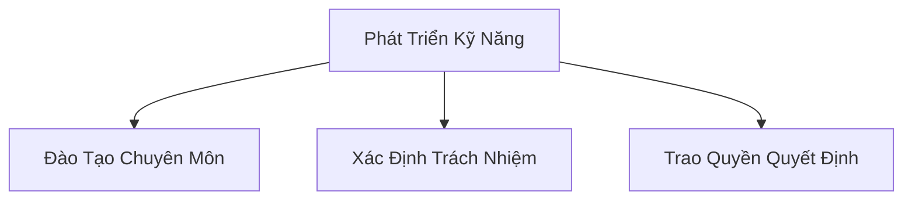
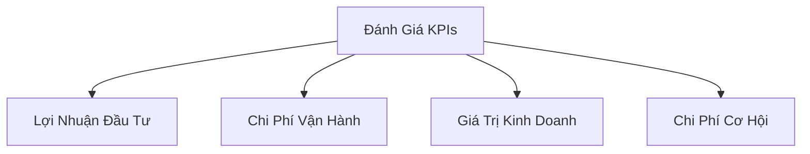

# Xác Định Mục Tiêu Kinh Doanh Trong Học Máy

## Nguyên Tắc Cơ Bản

### 1. Phát Triển Kỹ Năng & Trách Nhiệm

#### Yêu Cầu Chính
- Đào tạo chuyên sâu về AI
- Giao trách nhiệm rõ ràng
- Trao quyền cho nhóm phát triển

### 2. Khả Năng Giải Thích Mô Hình

#### Cân Bằng Kỹ Thuật
- Đánh giá mức độ minh bạch
- Cân nhắc đánh đổi giữa:
  - Độ phức tạp mô hình
  - Khả năng giải thích

#### Công Cụ Hỗ Trợ
- SageMaker Clarify
- SageMaker Experiments
- Phân tích ảnh hưởng từng đặc trưng

### 3. Tuân Thủ & Giám Sát

#### Chiến Lược Giám Sát
- Kiểm tra yêu cầu kinh doanh
- Theo dõi sự dịch chuyển mô hình
- Đánh giá giá trị kinh doanh liên tục

### 4. Xem Xét Dữ Liệu & Phần Mềm

#### Các Vấn Đề Quan Trọng
- Quyền sử dụng dữ liệu
- Tuân thủ bản quyền
- Đạo đức sử dụng
- Chi phí cấp phép

### 5. Chỉ Số Hiệu Suất (KPIs)

#### Phương Pháp Đánh Giá
- Định nghĩa KPIs kinh doanh
- Tính toán lợi nhuận đầu tư (ROI)
- So sánh chi phí và giá trị

### 6. Dịch Vụ Quản Lý

#### Chiến Lược Lựa Chọn
- Ưu tiên dịch vụ được quản lý
- Giảm chi phí tổng sở hữu (TCO)
- Đánh giá linh hoạt

### 7. Tác Động Môi Trường

#### Các Yếu Tố Cân Nhắc
- Tiêu thụ năng lượng
- Sử dụng tài nguyên
- Hiệu quả làm mát
- Tác động carbon

## Thực Hành Tốt Nhất

### Quy Trình Đánh Giá
- Phân tích chi tiết nhu cầu
- Đánh giá khả thi
- Cân nhắc các giải pháp thay thế
- Đảm bảo tính bền vững

## Kết Luận

Giai đoạn xác định mục tiêu kinh doanh là nền tảng then chốt để phát triển hệ thống học máy thành công, hiệu quả và có trách nhiệm.