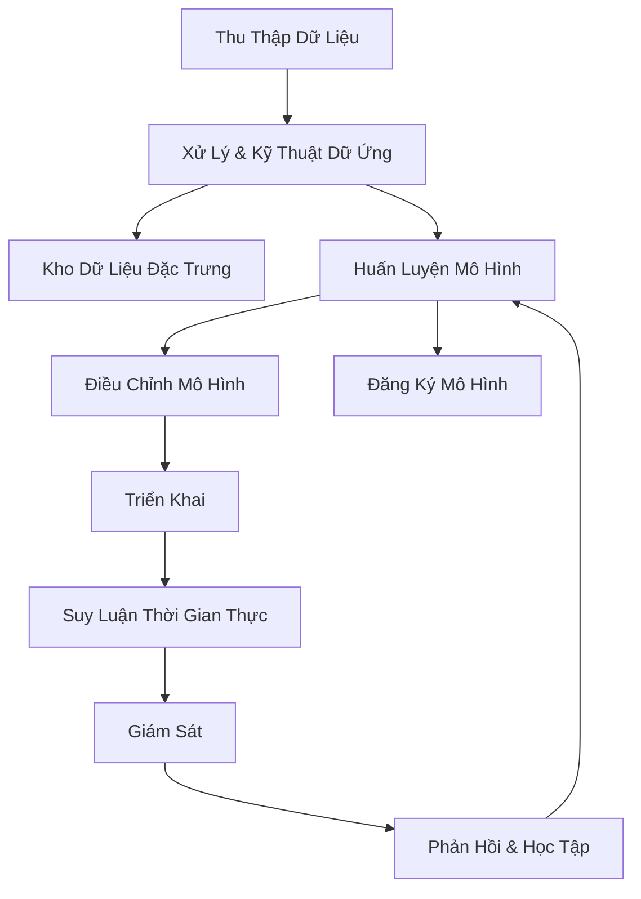

# Khung Hóa Vấn Đề Học Máy

## Vòng Đời Học Máy Chi Tiết

## Các Giai Đoạn Chi Tiết

### 1. Thu Thập Dữ Liệu
- Xác định nguồn dữ liệu
- Tập hợp dữ liệu thô
- Đảm bảo chất lượng và đại diện

### 2. Xử Lý & Kỹ Thuật Dữ Liệu
- Tiền xử lý dữ liệu
- Kỹ thuật đặc trưng
- Chuẩn hóa và mã hóa

#### Kho Dữ Liệu Đặc Trưng
- Kho trực tuyến
- Kho ngoại tuyến
- Theo dõi phiên bản đặc trưng

### 3. Huấn Luyện Mô Hình
- Chọn thuật toán
- Điều chỉnh siêu tham số
- Đánh giá hiệu suất

### 4. Triển Khai
- Suy luận thời gian thực
- Tích hợp ứng dụng
- Quản lý API

### 5. Giám Sát & Phản Hồi
- Theo dõi hiệu suất
- Phát hiện sự trôi lệch
- Học tập liên tục

## Các Nguyên Tắc Thực Hành

### Quản Lý Vai Trò
- Sử dụng SageMaker Role Manager
- Xác định trách nhiệm
- Hồ sơ mô hình

### Chiến Lược Cải Thiện Mô Hình
- SageMaker Experiments
- Tối ưu hóa siêu tham số tự động
- AutoML

### Theo Dõi Nguồn Gốc
- SageMaker Lineage Tracking
- Theo dõi các giai đoạn
- Quản lý phiên bản

## Vòng Lặp Phản Hồi

### Công Cụ Giám Sát
- SageMaker Model Monitor
- CloudWatch
- Amazon Augmented AI

### Đánh Giá & Cải Thiện
- Kiểm tra tính công bằng
- SageMaker Clarify
- Phát hiện và giảm thiểu độ chệch

## Bảo Mật & Quyền Riêng Tư

### Bảo Vệ Dữ Liệu
- Mã hóa
- AWS Glue DataBrew
- Che giấu thông tin cá nhân

## Chiến Lược Chi Phí

### Tối Ưu Hóa
- So sánh mô hình tùy chỉnh vs được đào tạo sẵn
- Sử dụng dịch vụ AI có sẵn
- Lựa chọn vùng bền vững

## Kết Luận

Khung hóa vấn đề học máy là quá trình phức tạp đòi hỏi chiến lược toàn diện, liên tục cải thiện và tối ưu hóa.