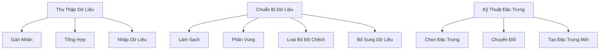

# Xử Lý Dữ Liệu Trong Học Máy

## Các Giai Đoạn Xử Lý Dữ Liệu

## Thu Thập Dữ Liệu

### Gán Nhãn
- Xác định nhu cầu gán nhãn
- Phương pháp gán nhãn:
  - Thủ công
  - Tự động
  - Kết hợp

### Chiến Lược Nhập
- Phương thức truyền:
  - Batch
  - Streaming
- Tổng hợp từ nhiều nguồn

## Chuẩn Bị Dữ Liệu

### Làm Sạch Dữ Liệu
- Xử lý dữ liệu thiếu
- Loại bỏ ngoại lai
- Xác định và sửa lỗi

### Phân Vùng Dữ Liệu
- Chiến lược phân vùng:
  - Theo ngày
  - Theo đặc trưng
- Hiệu quả truy xuất

### Giảm Thiểu Độ Chệch
- Phát hiện độ chệch
- Cân bằng dữ liệu
- Đảm bảo đại diện

### Bổ Sung Dữ Liệu
- Thêm nguồn dữ liệu
- Giải quyết hạn chế
- Tăng cường đa dạng

## Kỹ Thuật Đặc Trưng

### Chọn Đặc Trưng
- Đánh giá quan trọng
- Loại bỏ đặc trưng ít ảnh hưởng

### Chuyển Đổi
- Chuẩn hóa
- Mã hóa một nóng
- Điều chỉnh định dạng

### Tạo Đặc Trưng Mới
- Tích hợp đặc trưng
- Biến đổi toán học
- Trích xuất thông tin phức tạp

## Các Công Cụ AWS

### Thu Thập & Chuẩn Bị
- SageMaker Data Wrangler
- AWS Glue
- Amazon Athena
- Amazon Redshift

### Quản Lý & An Ninh
- IAM
- KMS
- Secrets Manager
- Amazon Macie

### Gán Nhãn
- Amazon Ground Truth

### Theo Dõi
- SageMaker Experiments
- SageMaker Lineage Tracker

## Thực Hành Tốt Nhất

### Chiến Lược An Ninh
- Nguyên tắc đặc quyền tối thiểu
- Mã hóa dữ liệu
- Kiểm soát truy cập

### Bền Vững
- Loại bỏ tài nguyên không sử dụng
- Chính sách vòng đời dữ liệu
- Lựa chọn lưu trữ hiệu quả

### Quản Lý Dữ Liệu
- Kiến trúc dữ liệu hiện đại
- Lưu trữ dữ liệu có mục đích
- Tái sử dụng đặc trưng

## Kết Luận

Xử lý dữ liệu là giai đoạn then chốt quyết định chất lượng và hiệu quả của mô hình học máy.