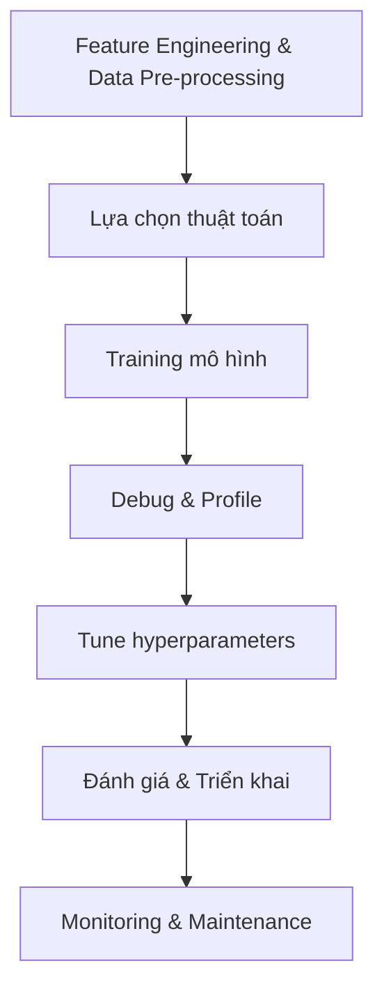

# Quy Trình và Thực Hành Tốt Nhất trong Phát Triển Mô Hình ML

## Mục lục
- [Tổng quan quy trình](#tổng-quan-quy-trình)
- [Các bước chính trong quá trình training](#các-bước-chính-trong-quá-trình-training)
- [Công cụ và framework](#công-cụ-và-framework)
- [Thực hành tốt nhất](#thực-hành-tốt-nhất)
- [Tối ưu hóa chi phí và hiệu suất](#tối-ưu-hóa-chi-phí-và-hiệu-suất)

## Tổng quan quy trình

## Các bước chính trong quá trình training

### 1. Chuẩn bị dữ liệu
- Xử lý features từ quá trình feature engineering
- Đảm bảo tính nhất quán của features giữa training và inference
- Sử dụng SageMaker Feature Store để quản lý features

### 2. Huấn luyện mô hình
- **Xử lý song song**:
  - Data Parallel: Chia nhỏ dữ liệu để training parallel
  - Model Parallel: Phân tán mô hình khi quá lớn cho 1 GPU

### 3. Debug và Profile
- Theo dõi metrics trong quá trình training
- Phát hiện và sửa lỗi
- Công cụ: SageMaker Debugger, CloudWatch

## Công cụ và framework

### 1. MLOps và CI/CD
- CloudFormation
- CDK
- SageMaker pipelines
- Amazon Step Functions

### 2. Monitoring và Bảo mật
- SageMaker Clarify: Phát hiện bias
- SageMaker Model Monitor
- Internode encryption
- EMR encryption in transit

### 3. Quản lý mô hình
- SageMaker Model Registry
- SageMaker Experiments
- SageMaker Feature Store

## Thực hành tốt nhất

### 1. Bảo mật và Quản trị
- Thiết lập môi trường ML an toàn
- Bảo vệ chống data poisoning
- Đảm bảo khả năng rollback nhanh chóng
- Kiểm soát truy cập package qua ECR/Codeartifact

### 2. Trade-offs cần cân nhắc
- Accuracy vs. Complexity
- Bias vs. Fairness
- Precision vs. Recall
- Chi phí tính toán vs. Hiệu suất

### 3. Tối ưu hóa quy trình
- Sử dụng AutoML khi có thể
- Thực hiện distributed training hiệu quả
- Lựa chọn instance type phù hợp
- Monitoring liên tục

## Tối ưu hóa chi phí và hiệu suất

### 1. Quản lý tài nguyên
- Thiết lập billing alarms
- Sử dụng AWS Budgets và Cost Explorer
- Tự động tắt resources không sử dụng
- Cấu hình auto-shutdown cho SageMaker Studio

### 2. Chiến lược training hiệu quả
- Bắt đầu với dataset nhỏ
- Sử dụng warm start và checkpointing
- Tối ưu hyperparameter tự động
- Đặt tiêu chí dừng sớm (early stopping)

### 3. Lưu trữ và dọn dẹp
- Xóa artifacts training không cần thiết
- Quản lý dữ liệu training hiệu quả
- Tổ chức experiments có hệ thống

## Kết luận
Phát triển mô hình ML là một quy trình phức tạp đòi hỏi cân bằng giữa nhiều yếu tố. Việc áp dụng các thực hành tốt nhất và sử dụng công cụ phù hợp sẽ giúp tối ưu hóa hiệu suất, chi phí và độ tin cậy của hệ thống.