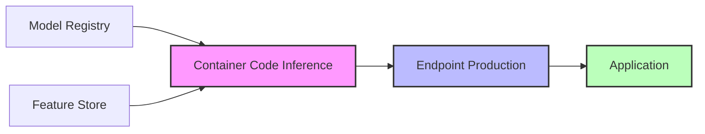

# Hướng Dẫn Triển Khai Mô Hình ML

## Mục lục
- [Kiến trúc triển khai](#kiến-trúc-triển-khai)
- [Chiến lược triển khai](#chiến-lược-triển-khai)
- [Tối ưu hóa hiệu suất](#tối-ưu-hóa-hiệu-suất)
- [Monitoring và bảo mật](#monitoring-và-bảo-mật)

## Kiến trúc triển khai

### Thành phần chính
1. **Container Inference**
   - Chứa code thực hiện inference
   - Kết nối với model registry để lấy artifacts
   - Đồng bộ features với feature store

2. **Endpoint Production**
   - Sử dụng inference code để tạo kết quả
   - Xử lý các yêu cầu từ ứng dụng
   - Trả về predictions hoặc responses

3. **Application Layer**
   - Tương tác với endpoint
   - Xử lý kết quả để tạo giá trị kinh doanh

## Chiến lược triển khai

### 1. Phương pháp triển khai
- **Blue-Green Deployment**
  - Triển khai song song phiên bản mới và cũ
  - Chuyển đổi traffic một cách an toàn
  
- **A/B Testing**
  - Test nhiều phiên bản mô hình
  - Đánh giá hiệu suất trong môi trường production

- **Canary Deployment**
  - Triển khai từng phần nhỏ
  - Giám sát ảnh hưởng trước khi scale

### 2. Môi trường triển khai
- **Cloud**
  - Real-time inference
  - Serverless deployment
  - Asynchronous processing
  - Batch processing

- **Edge Computing**
  - SageMaker Neo
  - IoT Greengrass
  - Phù hợp cho các ứng dụng cần độ trễ thấp
  - Hoạt động trong môi trường không ổn định internet

## Tối ưu hóa hiệu suất

### 1. Lựa chọn phần cứng
- **Instance types chuyên biệt**:
  - Inf1/Inf2 cho inference
  - Graviton3 cho CPU inference
  - Trn1 cho training

### 2. Tối ưu hóa mô hình
- Sử dụng công cụ:
  - Neo Tree Lite
  - Hugging Face Infinity
  - SageMaker Neo
- Multi-model endpoints
- Inference pipelines

### 3. Auto-scaling
- Tự động điều chỉnh fleet size
- SageMaker inference recommender
- Cân bằng chi phí và hiệu suất

## Monitoring và bảo mật

### 1. Metrics và Alerts
- CloudWatch monitoring
- EventBridge triggers
- SNS notifications
- SageMaker Model Monitor

### 2. Bảo mật
- Phát hiện và ngăn chặn tấn công
- Bảo vệ khỏi adversarial attacks
- Monitoring model drift

### 3. SLA và Sustainability
- Cân bằng latency và serverless
- Tối ưu hóa batch/async deployments
- Sử dụng hardware hiệu quả

## Tự động hóa quy trình

### 1. CI/CD Pipeline
- SageMaker Pipelines
- Tự động hóa endpoint changes
- Quy trình testing tự động

### 2. Infrastructure as Code
- CloudFormation templates
- AWS CDK
- Tự động hóa resource provisioning

## Kết luận
Triển khai mô hình ML đòi hỏi cân nhắc nhiều yếu tố từ kiến trúc, chiến lược triển khai đến tối ưu hóa hiệu suất và bảo mật. Việc lựa chọn đúng công cụ và phương pháp sẽ giúp đảm bảo hệ thống hoạt động hiệu quả, an toàn và tiết kiệm chi phí.